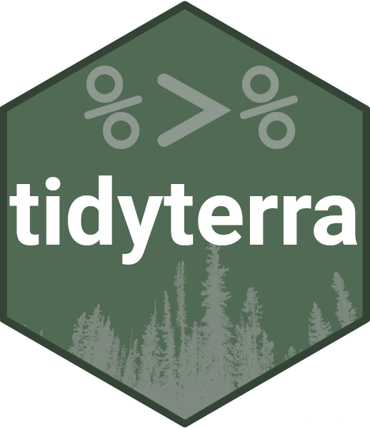

<!-- README.md is generated from README.Rmd. Please edit that file -->

```{r, include = FALSE}
knitr::opts_knit$set(
  progress = TRUE,
  base.url = "https://raw.githubusercontent.com/dieghernan/tidyterra/main/"
)
knitr::opts_chunk$set(
  collapse = TRUE,
  tidy = "styler",
  comment = "#>",
  fig.path = "img/README-",
  warning = FALSE,
  message = FALSE,
  dev = "ragg_png",
  dpi = 300,
  out.width = "100%"
)
```

# tidyterra <a href="https://dieghernan.github.io/tidyterra/"></a>

<!-- badges: start -->

[](https://CRAN.R-project.org/package=tidyterra)
[](https://cran.r-project.org/web/checks/check_results_tidyterra.html)
[](https://CRAN.R-project.org/package=tidyterra)
[](https://doi.org/10.21105/joss.05751)
[](https://github.com/dieghernan/tidyterra/actions/workflows/check-full.yaml)
[](https://app.codecov.io/gh/dieghernan/tidyterra)
[](https://www.codefactor.io/repository/github/dieghernan/tidyterra)
[](https://dieghernan.r-universe.dev/tidyterra)
[](https://www.repostatus.org/#active)
[](https://stackoverflow.com/questions/tagged/tidyterra)

<!-- badges: end -->

The goal of {tidyterra} is to provide common methods of the [tidyverse
packages](https://www.tidyverse.org/packages/) for objects created with the
[{terra}](https://CRAN.R-project.org/package=terra) package: SpatRaster and
SpatVector. It also provides geoms for plotting these objects with
[{ggplot2}](https://ggplot2.tidyverse.org/).

## Overview

```{r echo=FALSE, results='asis'}
tterra_v <- packageVersion("tidyterra")

l <- unlist(strsplit(as.character(tterra_v), ".", fixed = TRUE))

if (length(l) == 4) {
  cat(
    "You can have a look to the documentation of",
    "the dev version in <https://dieghernan.github.io/tidyterra/dev/>"
  )
}
```

{tidyverse} methods implemented on {tidyterra} works differently depending on
the type of Spat\* object:

-   SpatVector: the methods are implemented using `terra::as.data.frame()`
    coercion. Rows correspond to geometries and columns correspond to attributes
    of the geometry.

-   SpatRaster: The implementation on SpatRaster objects differs, since the
    methods could be applied to layers or to cells. {tidyterra} overall approach
    is to treat the layers as columns of a tibble and the cells as rows (i.e.
    `select(SpatRaster, 1)` would select the first layer of a SpatRaster).

The methods implemented return the same type of object used as input, unless the
expected behavior of the method is to return another type of object, (for
example, `as_tibble()` would return a tibble).

Current methods and functions provided by {tidyterra} are:

| tidyverse method                            | SpatVector                                    | SpatRaster                                                                                     |
|--------------------|--------------------|---------------------------------------|
| `tibble::as_tibble()`                       | ✔️                                            | ✔️                                                                                             |
| `dplyr::select()`                           | ✔️                                            | ✔️ Select layers                                                                               |
| `dplyr::mutate()`                           | ✔️                                            | ✔️ Create /modify layers                                                                       |
| `dplyr::transmute()`                        | ✔️                                            | ✔️                                                                                             |
| `dplyr::filter()`                           | ✔️                                            | ✔️ Modify cells values and (additionally) remove outer cells.                                  |
| `dplyr::slice()`                            | ✔️                                            | ✔️ Additional methods for slicing by row and column.                                           |
| `dplyr::pull()`                             | ✔️                                            | ✔️                                                                                             |
| `dplyr::rename()`                           | ✔️                                            | ✔️                                                                                             |
| `dplyr::relocate()`                         | ✔️                                            | ✔️                                                                                             |
| `dplyr::distinct()`                         | ✔️                                            |                                                                                                |
| `dplyr::arrange()`                          | ✔️                                            |                                                                                                |
| `dplyr::glimpse()`                          | ✔️                                            | ✔️                                                                                             |
| `dplyr::inner_join()` family                | ✔️                                            |                                                                                                |
| `dplyr::summarise()`                        | ✔️                                            |                                                                                                |
| `dplyr::group_by()` family                  | ✔️                                            |                                                                                                |
| `dplyr::rowwise()`                          | ✔️                                            |                                                                                                |
| `dplyr::count()`, `tally()`                 | ✔️                                            |                                                                                                |
| `dplyr::bind_cols()` / `dplyr::bind_rows()` | ✔️ as `bind_spat_cols()` / `bind_spat_rows()` |                                                                                                |
| `tidyr::drop_na()`                          | ✔️                                            | ✔️ Remove cell values with `NA` on any layer. Additionally, outer cells with `NA` are removed. |
| `tidyr::replace_na()`                       | ✔️                                            | ✔️                                                                                             |
| `ggplot2::autoplot()`                       | ✔️                                            | ✔️                                                                                             |
| `ggplot2::fortify()`                        | ✔️ to sf via `sf::st_as_sf()`                 | To a tibble with coordinates.                                                                  |
| `ggplot2::geom_*()`                         | ✔️ `geom_spatvector()`                        | ✔️ `geom_spatraster()` and `geom_spatraster_rgb()`.                                            |

## :exclamation: A note on performance

{tidyterra} is conceived as a user-friendly wrapper of {terra} using the
{tidyverse} methods and verbs. This approach therefore has a **cost in terms of
performance**.

If you are a **heavy user of {terra}** or you need to work with **big raster
files**, {terra} is much more focused on terms of performance. When possible,
each function of {tidyterra} references to its equivalent on {terra}.

As a rule of thumb if your raster has less than 10.000.000 data slots counting
cells and layers (i.e. `terra::ncell(your_rast)*terra::nlyr(your_rast) < 10e6`)
you are good to go with {tidyterra}.

When plotting rasters, resampling is performed automatically (as `terra::plot()`
does, see the help page). You can adjust this with the `maxcell` parameter.

## Installation

Install {tidyterra} from
[**CRAN**](https://CRAN.R-project.org/package=tidyterra):

```{r, eval=FALSE}
install.packages("tidyterra")
```

You can install the development version of {tidyterra} like so:

```{r, eval=FALSE }
remotes::install_github("dieghernan/tidyterra")
```

Alternatively, you can install {tidyterra} using the
[r-universe](https://dieghernan.r-universe.dev/tidyterra):

```{r, eval=FALSE}
# Enable this universe
options(repos = c(
  dieghernan = "https://dieghernan.r-universe.dev",
  CRAN = "https://cloud.r-project.org"
))
install.packages("tidyterra")
```

## Example

### SpatRasters

This is a basic example which shows you how to manipulate and plot SpatRaster
objects:

```{r example-temp}
library(tidyterra)
library(terra)

# Temperatures
rastertemp <- rast(system.file("extdata/cyl_temp.tif", package = "tidyterra"))

rastertemp

# Rename
rastertemp <- rastertemp %>%
  rename(April = tavg_04, May = tavg_05, June = tavg_06)

# Facet all layers
library(ggplot2)

ggplot() +
  geom_spatraster(data = rastertemp) +
  facet_wrap(~lyr, ncol = 2) +
  scale_fill_whitebox_c(
    palette = "muted",
    labels = scales::label_number(suffix = "º"),
    n.breaks = 12,
    guide = guide_legend(reverse = TRUE)
  ) +
  labs(
    fill = "",
    title = "Average temperature in Castille and Leon (Spain)",
    subtitle = "Months of April, May and June"
  )

# Create maximum differences of two months
variation <- rastertemp %>%
  mutate(diff = June - May) %>%
  select(variation = diff)

# Add also a overlay of a SpatVector
prov <- vect(system.file("extdata/cyl.gpkg", package = "tidyterra"))

ggplot(prov) +
  geom_spatraster(data = variation) +
  geom_spatvector(fill = NA) +
  scale_fill_whitebox_c(
    palette = "deep", direction = -1,
    labels = scales::label_number(suffix = "º"),
    n.breaks = 5
  ) +
  theme_minimal() +
  coord_sf(crs = 25830) +
  labs(
    fill = "variation",
    title = "Variation of temperature in Castille and Leon (Spain)",
    subtitle = "Average temperatures in June vs. May"
  )
```

{tidyterra} also provide a geom for plotting RGB SpatRaster tiles with {ggplot2}

```{r example-tile}
rgb_tile <- rast(system.file("extdata/cyl_tile.tif", package = "tidyterra"))

plot <- ggplot(prov) +
  geom_spatraster_rgb(data = rgb_tile) +
  geom_spatvector(fill = NA) +
  theme_light()

plot

# Recognizes coord_sf()
plot +
  # Change crs and datum (for relabeling graticules)
  coord_sf(crs = 3857, datum = 3857)
```

{tidyterra} provides specific scales for plotting hypsometric maps with
{ggplot2}:

```{r hypso, fig.asp=0.65}
asia <- rast(system.file("extdata/asia.tif", package = "tidyterra"))

terra::plot(asia)

ggplot() +
  geom_spatraster(data = asia) +
  scale_fill_hypso_tint_c(
    palette = "gmt_globe",
    labels = scales::label_number(),
    # Further refinements
    breaks = c(-10000, -5000, 0, 2000, 5000, 8000),
    guide = guide_colorbar(
      direction = "horizontal",
      nrow = 1,
      title.position = "top",
      barwidth = 20,
      ticks.colour = "black",
      ticks.linewidth = 0.3
    )
  ) +
  labs(
    fill = "elevation (m)",
    title = "Hypsometric map of Asia"
  ) +
  theme(legend.position = "bottom")
```

### SpatVectors

This is a basic example which shows you how to manipulate and plot SpatVector
objects:

```{r spatvec }
vect(system.file("ex/lux.shp", package = "terra")) %>%
  mutate(pop_dens = POP / AREA) %>%
  glimpse() %>%
  autoplot(aes(fill = pop_dens)) +
  scale_fill_whitebox_c(palette = "pi_y_g") +
  labs(
    fill = "population per km2",
    title = "Population density of Luxembourg",
    subtitle = "By canton"
  )
```

## I need your feedback

{tidyterra} is currently on development mode. Please leave your feedback or open
an issue on <https://github.com/dieghernan/tidyterra/issues>.

## Need help?

Check our [FAQs](https://dieghernan.github.io/tidyterra/articles/faqs.html) or
open a new [issue](https://github.com/dieghernan/tidyterra/issues)!

You can also ask in [Stack Overflow](https://stackoverflow.com/) using the tag
[`tidyterra`](https://stackoverflow.com/questions/tagged/tidyterra).

## Citation

If you use this software, please cite our article in the [Journal of Open Source
Software](https://joss.theoj.org/):

> Hernangómez, D., (2023). Using the tidyverse with terra objects: the tidyterra
> package. *Journal of Open Source Software*, *8*(91), 5751,
> <https://doi.org/10.21105/joss.05751>.

A BibTeX entry for LaTeX users is

```{r echo=FALSE, comment=""}
toBibtex(citation("tidyterra"))
```

## Acknowledgement

{tidyterra} ggplot2 geoms are based on
[{ggspatial}](https://github.com/paleolimbot/ggspatial) implementation, by
[Dewey Dunnington](https://github.com/paleolimbot) and [ggspatial
contributors](https://github.com/paleolimbot/ggspatial/graphs/contributors).
