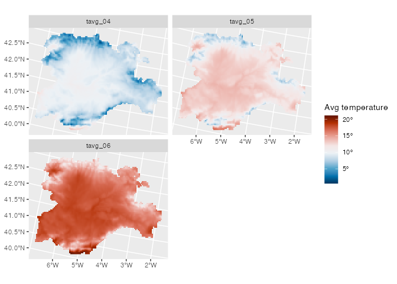
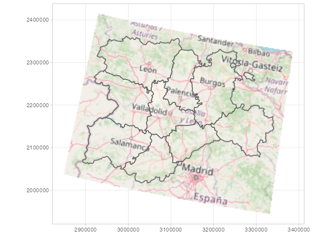

<!-- README.md is generated from README.Rmd. Please edit that file -->

# tidyterra <a href="https://dieghernan.github.io/tidyterra/"></a>

<!-- badges: start -->

[](https://CRAN.R-project.org/package=tidyterra)
[](https://cran.r-project.org/web/checks/check_results_tidyterra.html)
[](https://CRAN.R-project.org/package=tidyterra)
[](https://github.com/dieghernan/tidyterra/actions/workflows/check-full.yaml)
[](https://app.codecov.io/gh/dieghernan/tidyterra)
[](https://dieghernan.r-universe.dev/)
[](https://doi.org/10.5281/zenodo.6572471)
[](https://www.repostatus.org/#active)

<!-- badges: end -->

The goal of {tidyterra} is to provide common methods of the [tidyverse
packages](https://www.tidyverse.org/packages/) for objects created with
the [{terra}](https://CRAN.R-project.org/package=terra) package:
SpatRaster and SpatVector. It also provides geoms for plotting these
objects with [{ggplot2}](https://ggplot2.tidyverse.org/).

## Overview

{tidyverse} methods implemented on {tidyterra} works differently
depending on the type of Spat\* object:

-   SpatVector: the methods are implemented taking advantage of the
    tidyverse implementation on {sf}. The SpatVector object is converted
    first to sf via `sf::st_as_sf()`, then the method (or function) is
    applied and finally the object is converted back to SpatVector with
    `terra::vect()`. Hence, rows correspond to geometries and columns
    correspond to attributes of the geometry.

-   SpatRaster: The implementation on SpatRaster objects differs, since
    the methods could be applied to layers or to cells. {tidyterra}
    overall approach is to treat the layers as columns of a tibble and
    the cells as rows (i.e. `select(SpatRaster, 1)` would select the
    first layer of a SpatRaster).

The methods implemented return the same type of object used as input,
unless the expected behavior of the method is to return another type of
object, (for example, `as_tibble()` would return a tibble).

Current methods and functions provided by {tidyterra} are:

| tidyverse method      | SpatVector                             | SpatRaster                                                                                                     |
|-----------------------|----------------------------------------|----------------------------------------------------------------------------------------------------------------|
| `tibble::as_tibble()` | :heavy_check_mark:                     | :heavy_check_mark:                                                                                             |
| `dplyr::select()`     | :heavy_check_mark:                     | :heavy_check_mark: Select layers                                                                               |
| `dplyr::mutate()`     | :heavy_check_mark:                     | :heavy_check_mark: Create /modify layers                                                                       |
| `dplyr::transmute()`  | :heavy_check_mark:                     | :heavy_check_mark:                                                                                             |
| `dplyr::filter()`     | :heavy_check_mark:                     | :heavy_check_mark: Modify cells values and (additionally) remove outer cells.                                  |
| `dplyr::slice()`      | :heavy_check_mark:                     | :heavy_check_mark: Additional methods for slicing by row and column.                                           |
| `dplyr::pull()`       | :heavy_check_mark:                     | :heavy_check_mark:                                                                                             |
| `dplyr::rename()`     | :heavy_check_mark:                     | :heavy_check_mark:                                                                                             |
| `dplyr::relocate()`   | :heavy_check_mark:                     | :heavy_check_mark:                                                                                             |
| `tidyr::drop_na()`    | :heavy_check_mark:                     | :heavy_check_mark: Remove cell values with `NA` on any layer. Additionally, outer cells with `NA` are removed. |
| `tidyr::replace_na()` | :heavy_check_mark:                     | :heavy_check_mark:                                                                                             |
| `ggplot2::geom_*()`   | :heavy_check_mark: `geom_spatvector()` | :heavy_check_mark: `geom_spatraster()` and `geom_spatraster_rgb()`.                                            |

## :exclamation: A note on performance

{tidyterra} is conceived as a user-friendly wrapper of {terra} using the
{tidyverse} methods and verbs. This approach therefore has a **cost in
terms of performance**.

If you are a **heavy user of {terra}** or you need to work with **big
raster files**, {terra} is much more focused on terms of performance.
When possible, each function of {tidyterra} references to its equivalent
on {terra}.

As a rule of thumb if your raster has less than 10.000.000 data slots
counting cells and layers
(i.e. `terra::ncell(your_rast)*terra::nlyr(your_rast) < 10e6`) you are
good to go with {tidyterra}.

When plotting rasters, resampling is performed automatically (as
`terra::plot()` does, see the help page). You can adjust this with the
`maxcell` parameter.

## Installation

Install {tidyterra} from
[**CRAN**](https://CRAN.R-project.org/package=tidyterra):

``` r
install.packages("tidyterra")
```

You can install the development version of {tidyterra} like so:

``` r
remotes::install_github("dieghernan/tidyterra")
```

Alternatively, you can install {tidyterra} using the
[r-universe](https://dieghernan.r-universe.dev/ui#builds):

``` r
# Enable this universe
options(repos = c(
  dieghernan = "https://dieghernan.r-universe.dev",
  CRAN = "https://cloud.r-project.org"
))
install.packages("tidyterra")
```

## Example

This is a basic example which shows you how to manipulate and plot
SpatRaster objects:

``` r
library(tidyterra)
#> ── Attaching packages ─────────────────────────────────────── tidyterra 0.1.0 ──
#> 
#> Suppress this startup message by setting Sys.setenv(tidyterra.quiet = TRUE)
#> ✔ tibble 3.1.7     ✔ dplyr  1.0.9
#> ✔ tidyr  1.2.0

library(terra)
#> terra 1.5.21
#> 
#> Attaching package: 'terra'
#> The following object is masked from 'package:dplyr':
#> 
#>     src
#> The following object is masked from 'package:tidyr':
#> 
#>     extract


# Temperatures
f <- system.file("extdata/cyl_temp.tif", package = "tidyterra")

rastertemp <- rast(f)

library(ggplot2)
#> 
#> Attaching package: 'ggplot2'
#> The following object is masked from 'package:terra':
#> 
#>     arrow

# Facet all layers

ggplot() +
  geom_spatraster(data = rastertemp) +
  facet_wrap(~lyr, ncol = 2) +
  scale_fill_terrain_c(labels = scales::label_number(suffix = "º")) +
  labs(fill = "Avg temperature")
```



``` r

# Create maximum differences

variation <- rastertemp %>%
  mutate(
    diff = tavg_06 - tavg_04
  ) %>%
  select(var_apr_jun = diff)

# Add also a overlay of a SpatVector
f_vect <- system.file("extdata/cyl.gpkg", package = "tidyterra")

prov <- vect(f_vect)

ggplot() +
  geom_spatraster(data = variation) +
  geom_spatvector(data = prov, fill = NA) +
  scale_fill_gradientn(
    colors = hcl.colors(10, "RdBu", rev = TRUE),
    na.value = NA,
    labels = scales::label_number(suffix = "º")
  ) +
  theme_minimal() +
  coord_sf(crs = 25830) +
  labs(
    fill = "Difference",
    title = "Variation of temperature in Castille and Leon (Spain)",
    subtitle = "(Average) temperatures in June vs. April"
  )
```


{tidyterra} also provide a geom for plotting RGB SpatRaster tiles with
{ggplot2}

``` r
f_tile <- system.file("extdata/cyl_tile.tif", package = "tidyterra")

rgb_tile <- rast(f_tile)


ggplot() +
  geom_spatraster_rgb(data = rgb_tile) +
  geom_spatvector(data = prov, fill = NA) +
  theme_light()
```


``` r
# Recognizes coord_sf()

ggplot() +
  geom_spatraster_rgb(data = rgb_tile) +
  geom_spatvector(data = prov, fill = NA) +
  theme_light() +
  # Change crs and datum (for relabeling graticules)
  coord_sf(crs = 3035, datum = 3035)
```



## I need your feedback

{tidyterra} is currently on development mode. Please leave your feedback
or open an issue on <https://github.com/dieghernan/tidyterra/issues>.

## Citation

To cite ‘tidyterra’ in publications use:

Hernangomez D (2022). *tidyterra: tidyverse Methods and ggplot2 Utils
for terra Objects*. <https://doi.org/10.5281/zenodo.6572471>,
<https://dieghernan.github.io/tidyterra/>

A BibTeX entry for LaTeX users is

    @Manual{R-tidyterra,
      title = {{tidyterra}: tidyverse Methods and ggplot2 Utils for terra Objects},
      doi = {10.5281/zenodo.6572471},
      author = {Diego Hernangómez},
      year = {2022},
      version = {0.1.0},
      url = {https://dieghernan.github.io/tidyterra/},
      abstract = {Extension of the tidyverse for SpatRaster and SpatVector objects of the terra package. It includes also new geom_ functions that provide a convenient way of visualizing terra objects with ggplot2.},
    }

## Acknowledgements

{tidyterra} ggplot2 geoms are based on
[{ggspatial}](https://github.com/paleolimbot/ggspatial) implementation,
by [Dewey Dunnington](https://github.com/paleolimbot) and [ggspatial
contributors](https://github.com/paleolimbot/ggspatial/graphs/contributors).
