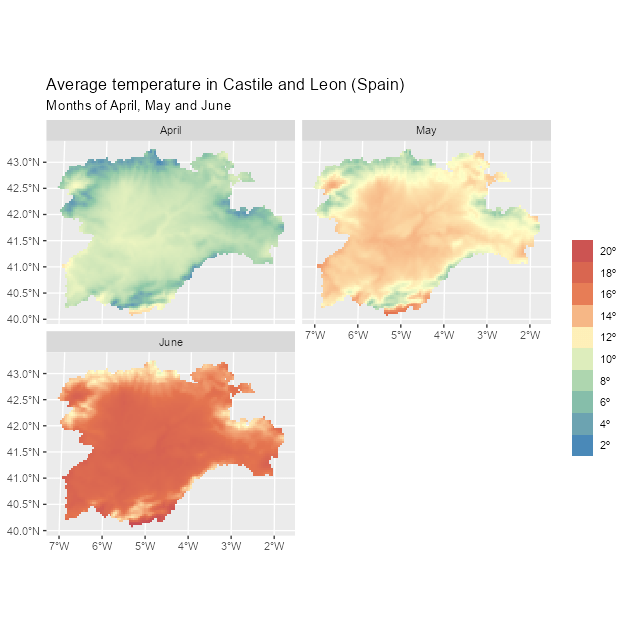

# Using the tidyverse with terra objects: the tidyterra package

[](https://doi.org/10.21105/joss.05751)

## Summary

**tidyterra** is an **R** ([R Core Team 2023](#ref-r-project)) package
that lets users manipulate `SpatRaster` and `SpatVector` objects
provided by **terra** ([Hijmans 2023](#ref-R-terra)), using verbs from
packages in the **tidyverse** ([Wickham et al. 2019](#ref-R-tidyverse)),
such as **dplyr** ([Wickham, François, et al. 2023](#ref-R-dplyr)),
**tidyr** ([Wickham, Vaughan, et al. 2023](#ref-R-tidyr)) or **tibble**
([Müller and Wickham 2023](#ref-R-tibble)). This makes spatial data
manipulation and analysis more approachable for users already familiar
with the **tidyverse**.

**tidyterra** also extends **ggplot2** ([Wickham 2016](#ref-R-ggplot2))
by providing additional geoms and stats,[^1] such as
[`geom_spatraster()`](https://dieghernan.github.io/tidyterra/reference/geom_spatraster.md)
and
[`geom_spatvector()`](https://dieghernan.github.io/tidyterra/reference/ggspatvector.md),
as well as carefully chosen scales and color palettes for map
production.

**tidyterra** can manipulate the following classes of **terra** objects:

1.  `SpatVector` objects, which represent vector data such as points,
    lines or polygon geometries.

2.  `SpatRaster` objects, which represent raster data in the form of a
    grid consisting of equally sized cells. Each cell can contain one or
    more values.

The first stable version of **tidyterra** was released on **CRAN** on
April 24, 2022. Since then, it has been actively used by other packages,
such as **ebvcube** ([Quoss et al. 2021](#ref-R-ebvcube)), **biomod2**
([Thuiller et al. 2023](#ref-R-biomod2)), **inlabru** ([Bachl et al.
2019](#ref-R-inlabru)), **RCzechia** ([Lacko 2023](#ref-R-rczechia)) and
**sparrpowR** ([Buller et al. 2021](#ref-R-sparrpowr)). It has also been
cited in academic research and publications (Bahlburg et al.
([2023](#ref-bahlburg2023)), Moraga ([2024](#ref-moraga2023)), Leonardi
et al. ([2023](#ref-Leonardi2023)), Meister et al.
([2023](#ref-meister2023))).

## Statement of need

The [**tidyverse**](https://tidyverse.org/) is a collection of **R**
packages that share an underlying design philosophy, grammar and data
structures. The packages within the tidyverse are widely used by **R**
users for tidying, transforming and plotting data.

The **tidyverse** is designed to work with tidy data (*“every column is
a variable, every row is an observation, every cell is a single
value”*), represented in the form of data frames or **tibbles**.
However, it is possible to extend the functionality of **tidyverse**
packages to work with new **R** object classes by registering the
corresponding S3 methods ([Wickham 2019](#ref-wickham_s32019)). This
means that
[`dplyr::mutate()`](https://dplyr.tidyverse.org/reference/mutate.html)
can be adapted to work with any object of class `foo` by creating the
corresponding S3 method `mutate.foo()`.

While other popular packages designed for spatial data handling, such as
**sf** ([Pebesma 2018](#ref-R-sf)) or **stars** ([Pebesma and Bivand
2023](#ref-R-stars)), already provide integration with the **tidyverse**
as part of their infrastructure, **terra** objects lack this integration
natively. Although **terra** offers a wide range of functions for
transforming and plotting `SpatRaster` and `SpatVector` objects, some
users who are not familiar with this package may need extra time to
learn that syntax. This can make their first steps in spatial analysis
more difficult.

The **tidyterra** package was developed to address this integration gap.
By providing the corresponding S3 methods, users can apply familiar
syntax and functions for rectangular data to objects provided by
**terra**. This makes spatial data analysis more approachable for users
who are new to the field.

In addition, **tidyterra** offers functions for plotting **terra**
objects using the **ggplot2** syntax. Although packages like
**rasterVis** ([Perpiñán and Hijmans 2023](#ref-R-rastervis)) and
**ggspatial** ([Dunnington 2023](#ref-R-ggspatial)) already support
plotting `SpatRaster` objects with **ggplot2**, **tidyterra** functions
provide additional support for advanced mapping. This support includes
faceted maps, contours and automatic conversion of spatial layers to the
same CRS[^2] through
[`ggplot2::coord_sf()`](https://ggplot2.tidyverse.org/reference/ggsf.html).
**tidyterra** also provides support for `SpatVector` objects, similar to
the native support of **sf** objects in **ggplot2**.

Finally, **tidyterra** provides a collection of color palettes
specifically designed for representing spatial phenomena ([Lindsay
2018](#ref-whitebox)). It also implements the cross-blended hypsometric
tints described by Patterson and Jenny
([2011](#ref-Patterson_Jenny_2011)).

## A note on performance

The development philosophy of **tidyterra** is to adapt **terra**
objects to data frame-like structures while performing data
transformations, which can affect performance.

When manipulating large `SpatRaster` objects, such as objects with more
than 10,000,000 data slots, use native **terra** syntax, which is
designed for this type of data. For plotting, the geoms resample
`SpatRaster` objects with more than 500,000 cells by default to speed up
rendering, as
[`terra::plot()`](https://rspatial.github.io/terra/reference/plot.html)
does. You can override this upper limit with the geom’s `maxcell`
argument.

When possible, each **tidyterra** help page references its equivalent
**terra** function.

## Example of use

**tidyterra** is available on
[**CRAN**](https://CRAN.R-project.org/package=tidyterra) and can be
installed easily from **R** with:

``` r

install.packages("tidyterra")
```

The latest development version is hosted on
[GitHub](https://github.com/dieghernan/tidyterra) and can be installed
from **R** with:

``` r

remotes::install_github("dieghernan/tidyterra")
```

The following example demonstrates how to manipulate a `SpatRaster`
object with **dplyr** syntax. It also shows how to plot a `SpatRaster`
object with **ggplot2** using
[`geom_spatraster()`](https://dieghernan.github.io/tidyterra/reference/geom_spatraster.md):

``` r

library(tidyterra)
library(tidyverse) # Load all tidyverse packages at once.
library(scales) # Additional package for labels.

# Temperatures in Castile and Leon (selected months).
rastertemp <- terra::rast(system.file(
  "extdata/cyl_temp.tif",
  package = "tidyterra"
))

# Rename with the tidyverse.
rastertemp <- rastertemp |>
  rename(April = tavg_04, May = tavg_05, June = tavg_06)

# Plot with facets.
ggplot() +
  geom_spatraster(data = rastertemp) +
  facet_wrap(~lyr, ncol = 2) +
  scale_fill_whitebox_c(
    palette = "muted",
    labels = label_number(suffix = "º"),
    n.breaks = 12,
    guide = guide_legend(reverse = TRUE)
  ) +
  labs(
    fill = "",
    title = "Average temperature in Castile and Leon (Spain)",
    subtitle = "Months of April, May and June"
  )
```



Faceted map with a multi-layer SpatRaster object.

In the following example, we combine a common **dplyr** workflow
([`mutate()`](https://dplyr.tidyverse.org/reference/mutate.html) +
[`select()`](https://dplyr.tidyverse.org/reference/select.html)) and
plot the result. In this case, the plot is a contour plot of the
original `SpatRaster` using
[`geom_spatraster_contour_filled()`](https://dieghernan.github.io/tidyterra/reference/geom_spat_contour.md)
and includes an overlay of a `SpatVector` for reference:

``` r

# Compute the variation between April and June and apply a different palette.
incr_temp <- rastertemp |>
  mutate(var = June - April) |>
  select(Variation = var)

# Overlay a SpatVector.
cyl_vect <- terra::vect(system.file("extdata/cyl.gpkg", package = "tidyterra"))

# Contour map with overlay.
ggplot() +
  geom_spatraster_contour_filled(data = incr_temp) +
  geom_spatvector(data = cyl_vect, fill = NA) +
  scale_fill_whitebox_d(palette = "bl_yl_rd") +
  theme_grey() +
  labs(
    fill = "º Celsius",
    title = "Temperature variation in Castile and Leon (Spain)",
    subtitle = "Difference between April and June"
  )
```


Contour map of temperature variation with a SpatVector overlay.

## Additional materials

The package includes extensive documentation available online at
<https://dieghernan.github.io/tidyterra/> including:

- Details on each function, including the equivalent **terra** function
  when available, for users who prefer to include those functions in
  their workflows.
- Working examples that use the functions and create plots.
- Additional articles and vignettes, including a complete demo of the
  color palettes included in the package (see
  [Palettes](https://dieghernan.github.io/tidyterra/articles/palettes.html)).

## Acknowledgements

I would like to thank [Robert J. Hijmans](https://github.com/rhijmans)
for his advice and support in adapting some of the methods and for the
suggestions that helped us improve the package features. I am also
thankful to [Dewey Dunnington](https://dewey.dunnington.ca/), Brent
Thorne and the rest of the contributors to the **ggspatial** package,
which served as a key reference during the initial stages of the
development of **tidyterra**.

**tidyterra** also incorporates some pieces of code adapted from
**ggplot2** for computing contours, which relies on the package
**isoband** ([Wickham et al. 2022](#ref-R-isoband)) developed by [Claus
O. Wilke](https://clauswilke.com/).

## References

Bachl, Fabian E., Finn Lindgren, David L. Borchers, and Janine B.
Illian. 2019. “inlabru: An R Package for Bayesian Spatial Modelling from
Ecological Survey Data.” *Methods in Ecology and Evolution* 10: 760–66.
<https://doi.org/10.1111/2041-210X.13168>.

Bahlburg, Dominik, Sally E. Thorpe, Bettina Meyer, Uta Berger, and
Eugene J. Murphy. 2023. “An Intercomparison of Models Predicting Growth
of Antarctic Krill (Euphausia superba): The Importance of Recognizing
Model Specificity.” *PLOS ONE* 18 (7): 1–29.
<https://doi.org/10.1371/journal.pone.0286036>.

Buller, I. D., D. W. Brown, T. A. Myers, R. R. Jones, and M. J.
Machiela. 2021. “sparrpowR: A Flexible R Package to Estimate Statistical
Power to Identify Spatial Clustering of Two Groups and Its Application.”
*International Journal of Health Geographics* 20 (1): 1–7.
<https://doi.org/10.1186/s12942-021-00267-z>.

Dunnington, Dewey. 2023. *ggspatial: Spatial Data Framework for
ggplot2*. <https://CRAN.R-project.org/package=ggspatial>.

Hijmans, Robert J. 2023. *terra: Spatial Data Analysis*.
<https://rspatial.org/>.

Lacko, Jindra. 2023. “RCzechia: Spatial Objects of the Czech Republic.”
*Journal of Open Source Software* 8 (83).
<https://doi.org/10.21105/joss.05082>.

Leonardi, Michela, Margherita Colucci, and Andrea Manica. 2023.
“tidysdm: Leveraging the Flexibility of tidymodels for Species
Distribution Modelling in R.” *bioRxiv*, ahead of print.
<https://doi.org/10.1101/2023.07.24.550358>.

Lindsay, John. 2018. *Whitebox-Tools*. GitHub repository.
<https://github.com/jblindsay/whitebox-tools>.

Meister, Nadja, Tom J. Langbehn, Øystein Varpe, and Christian Jørgensen.
2023. “Blue Mussels in Western Norway Have Vanished Where in Reach of
Crawling Predators.” *Marine Ecology Progress Series* 721 (October):
85–101. <https://doi.org/10.3354/meps14416>.

Moraga, Paula. 2024. *Spatial Statistics for Data Science: Theory and
Practice with R*. First edition. CRC Press.
<https://www.paulamoraga.com/book-spatial/>.

Müller, Kirill, and Hadley Wickham. 2023. *tibble: Simple Data Frames*.
Version 3.2.1. <https://tibble.tidyverse.org/>.

Patterson, Tom, and Bernhard Jenny. 2011. “The Development and Rationale
of Cross-Blended Hypsometric Tints.” *Cartographic Perspectives*, no. 69
(June): 31–46. <https://doi.org/10.14714/CP69.20>.

Pebesma, Edzer. 2018. “Simple Features for R: Standardized Support for
Spatial Vector Data.” *The R Journal* 10 (1): 439–46.
<https://doi.org/10.32614/RJ-2018-009>.

Pebesma, Edzer, and Roger Bivand. 2023. *Spatial Data Science: With
applications in R*. Chapman and Hall/CRC.
<https://doi.org/10.1201/9780429459016>.

Perpiñán, Oscar, and Robert Hijmans. 2023. *rasterVis*.
<https://oscarperpinan.github.io/rastervis/>.

Quoss, Luise, Nestor Fernandez, Christian Langer, Jose Valdez, and
Henrique Miguel Pereira. 2021. *ebvcube: Working with netCDF for
Essential Biodiversity Variables*. German Centre for Integrative
Biodiversity Research (iDiv) Halle-Jena-Leipzig.
<https://github.com/EBVcube/ebvcube>.

R Core Team. 2023. *R: A Language and Environment for Statistical
Computing*. R Foundation for Statistical Computing.
<https://www.R-project.org/>.

Thuiller, Wilfried, Damien Georges, Maya Gueguen, et al. 2023. *biomod2:
Ensemble Platform for Species Distribution Modeling*.

Wickham, Hadley. 2016. *ggplot2: Elegant Graphics for Data Analysis*.
Springer-Verlag New York. <https://ggplot2.tidyverse.org>.

Wickham, Hadley. 2019. “S3.” Chap. 13 in *Advanced R*, 2nd ed. Chapman
and Hall/CRC. <https://doi.org/10.1201/9781351201315>.

Wickham, Hadley, Mara Averick, Jennifer Bryan, et al. 2019. “Welcome to
the tidyverse.” *Journal of Open Source Software* 4 (43): 1686.
<https://doi.org/10.21105/joss.01686>.

Wickham, Hadley, Romain François, Lionel Henry, Kirill Müller, and Davis
Vaughan. 2023. *dplyr: A Grammar of Data Manipulation*. Version 1.1.2.
<https://dplyr.tidyverse.org>.

Wickham, Hadley, Davis Vaughan, and Maximilian Girlich. 2023. *tidyr:
Tidy Messy Data*. Version 1.3.0. <https://tidyr.tidyverse.org>.

Wickham, Hadley, Claus O. Wilke, and Thomas Lin Pedersen. 2022.
*isoband: Generate Isolines and Isobands from Regularly Spaced Elevation
Grids*. <https://CRAN.R-project.org/package=isoband>.

[^1]: The term geoms refers to geometric objects and stats refers to
    statistical transformations, following **ggplot2** naming
    conventions.

[^2]: CRS stands for coordinate reference system.
