# tidyterra FAQs

This is a compendium of [questions that have
arisen](https://github.com/dieghernan/tidyterra/discussions) on the use
of the **tidyterra** package and the potential solutions to them (mostly
related to the use of **terra** and **ggplot2** at this stage). You can
ask for help or search previous questions in the following links.

You can also ask in [Stack Overflow](https://stackoverflow.com/) using
the tag
[`tidyterra`](https://stackoverflow.com/questions/tagged/tidyterra).

- Report a Bug
  \[[link](https://github.com/dieghernan/tidyterra/issues)\].
- Ask a question
  \[[link](https://github.com/dieghernan/tidyterra/discussions)\].

### Example data

#### Source

This article uses a sample of **LiDAR for Scotland Phase 5 - DSM**
provided by [The Scottish Remote Sensing
Portal](https://remotesensingdata.gov.scot/). This data is made
available under the [Open Government Licence
v3](http://www.nationalarchives.gov.uk/doc/open-government-licence/version/3/).

#### About the file

The file `holyroodpark.tif` represents the DEM[¹](#fn1) of [Holyrood
Park, Edinburgh
(Scotland)](https://en.wikipedia.org/wiki/Holyrood_Park), including
[Arthur’s Seat](https://en.wikipedia.org/wiki/Arthur%27s_Seat), an
extinct volcano, pretty much as the famous [Maungawhau / Mount
Eden](https://en.wikipedia.org/wiki/Maungawhau_/_Mount_Eden) volcano
represented in
[`datasets::volcano`](https://rdrr.io/r/datasets/volcano.html).

The original file has been cropped and down-sampled for demo purposes,
`holyroodpark.tif` is available online in
<https://github.com/dieghernan/tidyterra/tree/main/data-raw> folder.

## `NA` values are shown in gray color

This is the default behavior produced by the **ggplot2** package.
**tidyterra** color scales (i.e.,
[`scale_fill_whitebox_c()`](https://dieghernan.github.io/tidyterra/dev/reference/scale_whitebox.md),
etc.), have by default the argument `na.value` set to `"transparent"`,
that prevents `NA` values to be filled[²](#fn2).

``` r
library(terra)
library(tidyterra)
library(ggplot2)

# Get a raster data from Holyrood Park, Edinburgh
holyrood <- "holyroodpark.tif"

r <- holyrood |>
  rast() |>
  filter(elevation > 80 & elevation < 180)

# Default
def <- ggplot() +
  geom_spatraster(data = r)

def +
  labs(
    title = "Default on ggplot2",
    subtitle = "NA values in grey"
  )
```

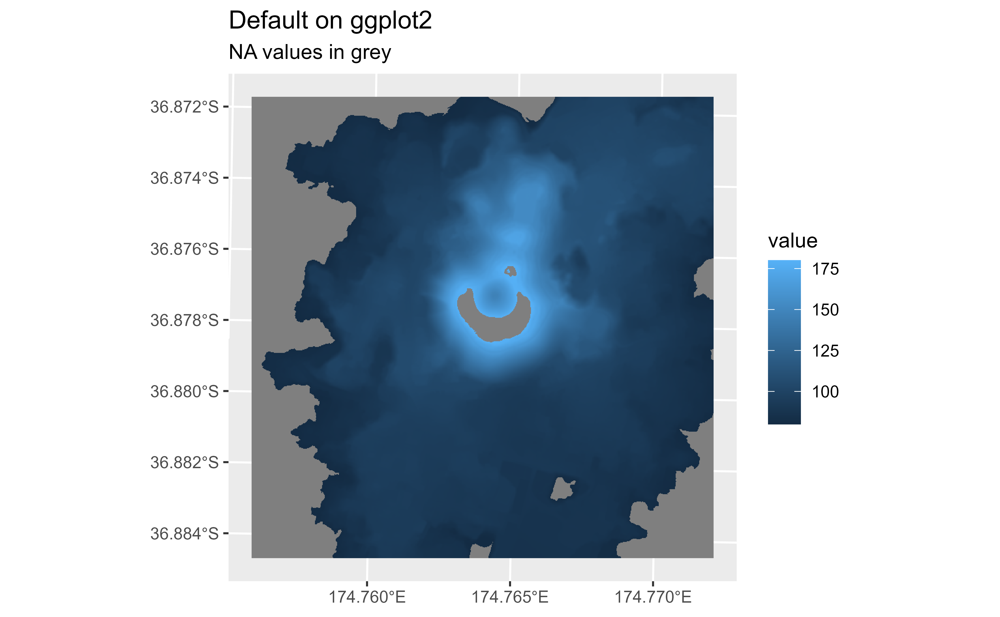

``` r

# Modify with scales
def +
  scale_fill_continuous(na.value = "transparent") +
  labs(
    title = "Default colors on ggplot2",
    subtitle = "But NAs are not plotted"
  )
```

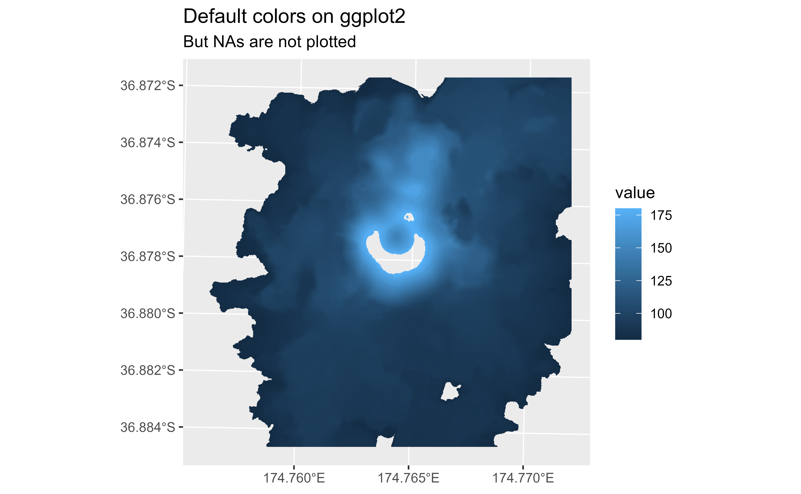

``` r

# Use a different scale provided by ggplot2
def +
  scale_fill_viridis_c(na.value = "orange") +
  labs(
    title = "Use any fill_* scale of ggplot2",
    subtitle = "Note that na.value = 'orange'"
  )
```

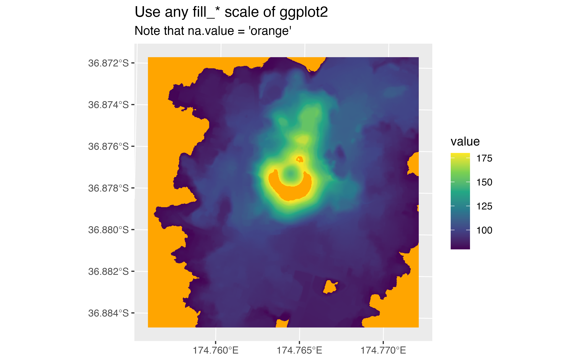

## Labeling contours

Use
[`geom_spatraster_contour_text()`](https://dieghernan.github.io/tidyterra/dev/reference/geom_spat_contour.md)
[](https://lifecycle.r-lib.org/articles/stages.html#experimental):

``` r
library(terra)
library(tidyterra)
library(ggplot2)

holyrood <- "holyroodpark.tif"

r <- rast(holyrood)

ggplot() +
  geom_spatraster_contour_text(data = r) +
  labs(title = "Labelling contours")
```

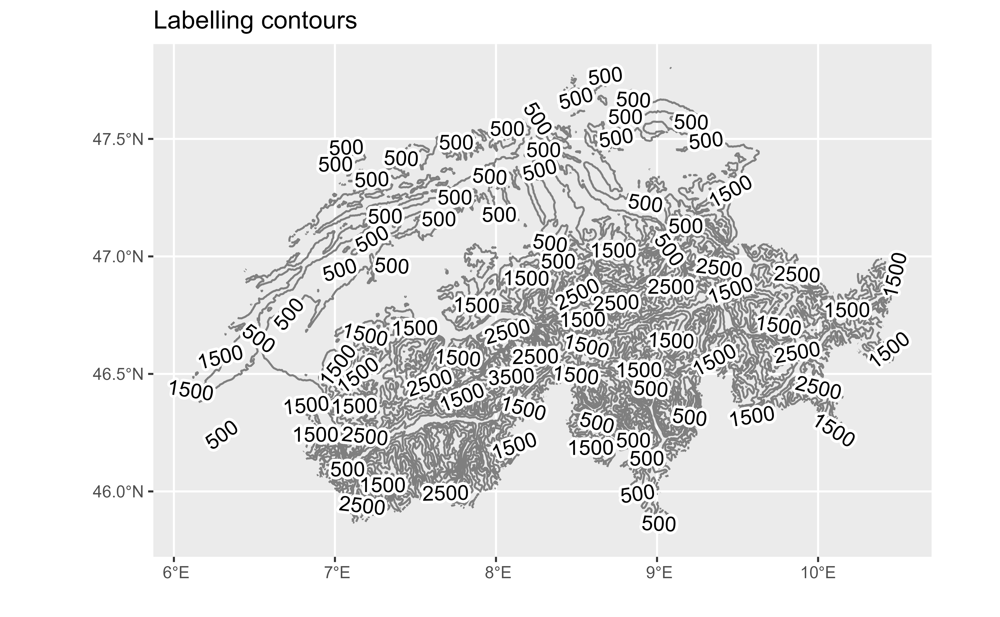

``` r


# With options and aes

# Use a labeller function so only selected breaks are labelled
labeller <- function(labs) {
  # Must return a function
  function(x) {
    x[!x %in% labs] <- NA
    scales::label_comma(suffix = " m.")(x)
  }
}

# Common labels across ggplot

labs <- c(100, 140, 180, 220)

ggplot(r) +
  geom_spatraster_contour_text(
    data = r,
    aes(
      linewidth = after_stat(level),
      size = after_stat(level),
      color = after_stat(level)
    ),
    breaks = seq(100, 250, 10),
    # Just label some isolines
    label_format = labeller(labs = labs),
    family = "mono",
    fontface = "bold"
  ) +
  scale_linewidth_continuous(range = c(0.1, 0.5), breaks = labs) +
  scale_color_gradient(low = "grey50", high = "grey10", breaks = labs) +
  scale_size_continuous(range = c(2, 3), breaks = labs) +
  # Integrate scales
  guides(
    linewidth = guide_legend("meters"),
    size = guide_legend("meters"),
    color = guide_legend("meters")
  ) +
  # Theme and titles
  theme_bw() +
  theme(text = element_text(family = "mono")) +
  labs(
    title = "Labelling contours",
    subtitle = "With options: b/w plot"
  )
```

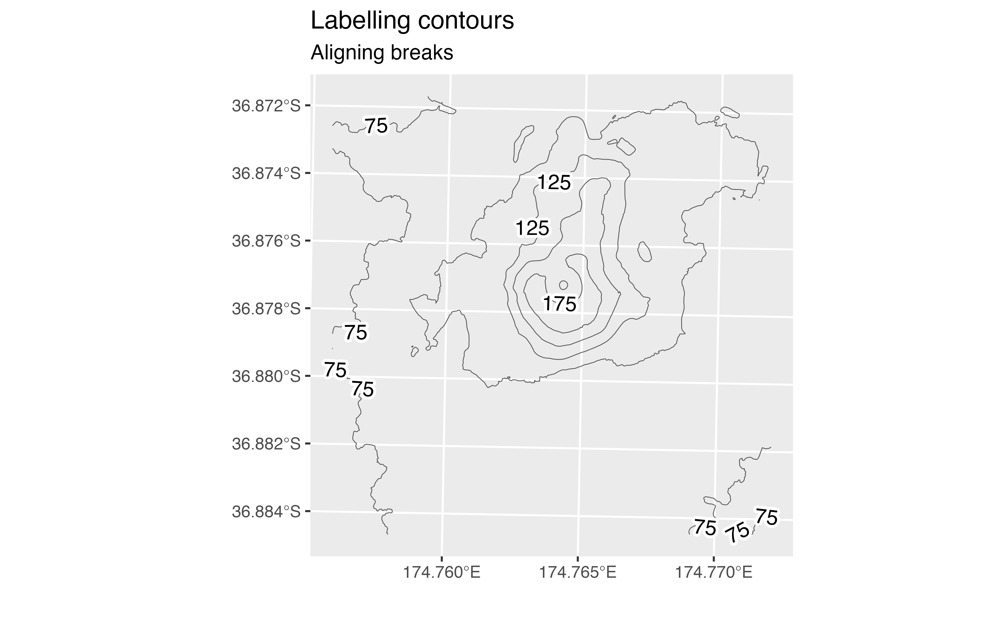

### Other alternatives

Thanks to
[`fortify.SpatRaster()`](https://dieghernan.github.io/tidyterra/dev/reference/fortify.Spat.md)
you can use your `SpatRaster` straight away with the **metR** package
(see [Hexagonal grids and other geoms](#fort)). Use the argument(s)
`bins/binwidth/breaks` to align both labels and lines:

``` r
library(metR)
br <- seq(100, 250, 10)
labs <- c(100, 140, 180, 220)

# Replicate previous map with tidyterra + metR strategy
ggplot(r, aes(x, y)) +
  geom_spatraster_contour(
    data = r,
    aes(
      linewidth = after_stat(level),
      color = after_stat(level)
    ),
    breaks = br,
    # Don't inherit fortified aes
    inherit.aes = FALSE
  ) +
  geom_text_contour(
    aes(
      z = elevation,
      color = after_stat(level),
      size = after_stat(level)
    ),
    breaks = br,
    # Text options
    check_overlap = TRUE,
    label.placer = label_placer_minmax(),
    stroke = 0.3,
    stroke.colour = "white",
    family = "mono",
    fontface = "bold",
    key_glyph = "path"
  ) +
  scale_linewidth_continuous(range = c(0.1, 0.5), breaks = labs) +
  scale_color_gradient(low = "grey50", high = "grey10", breaks = labs) +
  scale_size_continuous(range = c(2, 3), breaks = labs) +
  # Integrate scales
  guides(
    linewidth = guide_legend("meters"),
    size = guide_legend("meters"),
    color = guide_legend("meters")
  ) +
  # Theme and titles
  theme_bw() +
  theme(text = element_text(family = "mono")) +
  labs(
    title = "Labelling contours",
    subtitle = "tidyterra and metR: b/w plot",
    x = "",
    y = ""
  )
```

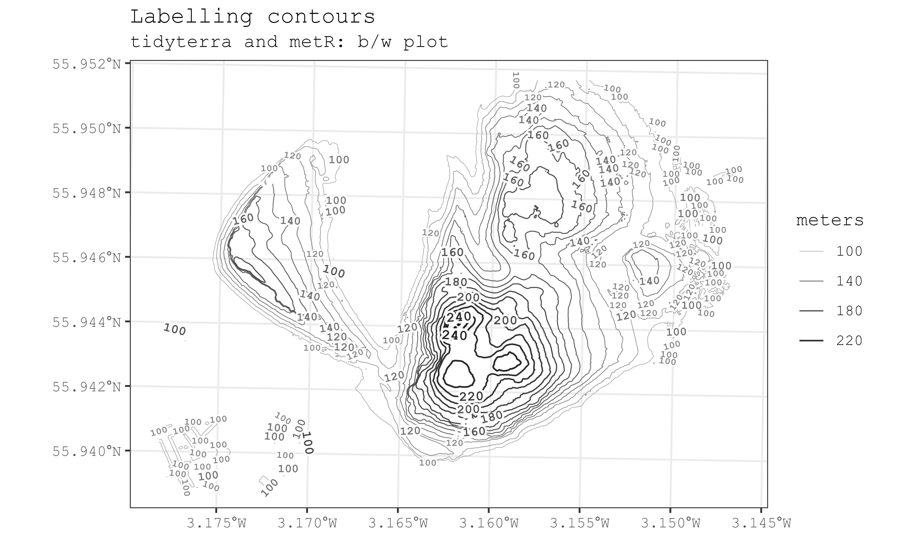

## Using a different color scale

Since **tidyterra** leverages on **ggplot2**, please refer to
**ggplot2** use of scales:

``` r
library(terra)
library(tidyterra)
library(ggplot2)

holyrood <- "holyroodpark.tif"

r <- rast(holyrood)

# Hillshade with grey colors
slope <- terrain(r, "slope", unit = "radians")
aspect <- terrain(r, "aspect", unit = "radians")
hill <- shade(slope, aspect, 10, 340)

ggplot() +
  geom_spatraster(data = hill, show.legend = FALSE) +
  # Note the scale, grey colours
  scale_fill_gradientn(
    colours = grey(0:100 / 100),
    na.value = "transparent"
  ) +
  labs(title = "A hillshade plot with grey colors")
```

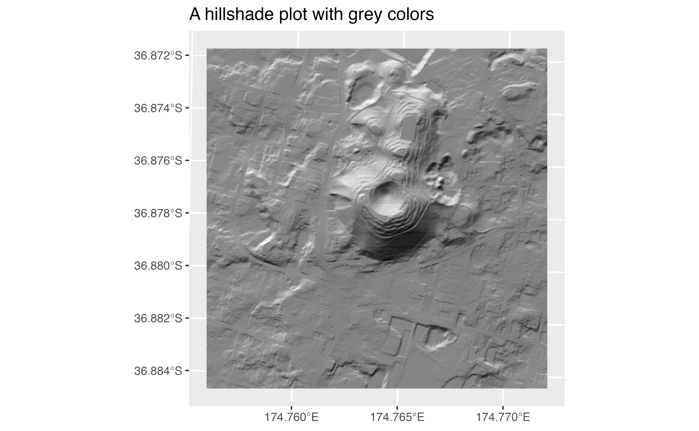

## Can I change the default palette of my maps?

Yes, use `options("ggplot2.continuous.fill")` to modify the default
colors in your session.

``` r
library(terra)
library(tidyterra)
library(ggplot2)

holyrood <- "holyroodpark.tif"

r <- rast(holyrood)

p <- ggplot() +
  geom_spatraster(data = r)


# Set options
tmp <- getOption("ggplot2.continuous.fill") # store current setting
options(ggplot2.continuous.fill = scale_fill_grass_c)

p
```

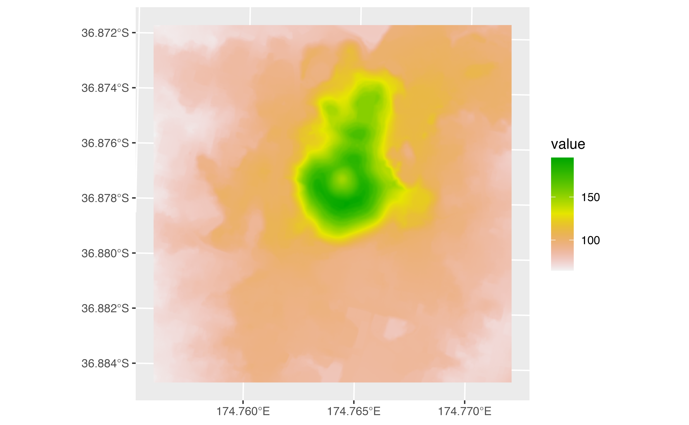

``` r

# restore previous setting
options(ggplot2.continuous.fill = tmp)


p
```

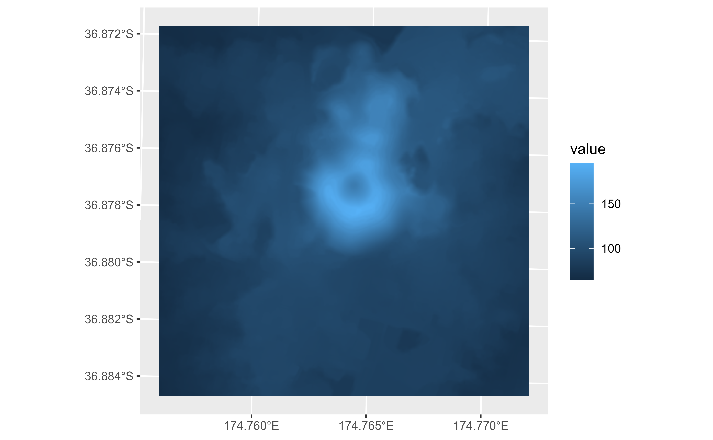

## My map tiles are blurry

This is probably related to the tile itself rather than the package.
Most base tiles are provided in **EPSG:3857**, so check first if your
tile has this CRS and not a different one. Not having **EPSG:3857** may
be an indication that the tile has been reprojected, implying some sort
of sampling that causes the blurriness on your data. Also, modify the
argument `maxcell` to avoid resampling and force the **ggplot2** map to
be on **EPSG:3857** with `ggplot2::coord_sf(crs = 3857)`:

``` r
library(terra)
library(tidyterra)
library(ggplot2)
library(sf)
library(maptiles)

# Get a tile from a point on sf format
p <- st_point(c(-3.166011, 55.945235)) |>
  st_sfc(crs = 4326) |>
  st_buffer(500)

tile1 <- get_tiles(
  p,
  provider = "OpenStreetMap",
  zoom = 14,
  cachedir = ".",
  crop = TRUE
)

ggplot() +
  geom_spatraster_rgb(data = tile1) +
  labs(title = "This is a bit blurry...") +
  theme_void()

st_crs(tile1)$epsg
#> [1] 4326

# The tile was in EPSG 4326

# get tile in 3857
p2 <- st_transform(p, 3857)


tile2 <- get_tiles(
  p2,
  provider = "OpenStreetMap",
  zoom = 14,
  cachedir = ".",
  crop = TRUE
)

st_crs(tile2)$epsg
#> [1] 3857

# Now the tile is EPSG:3857

ggplot() +
  geom_spatraster_rgb(data = tile2, maxcell = Inf) +
  # Force crs to be 3857
  coord_sf(crs = 3857) +
  labs(title = "...compared with this one") +
  theme_void()
```

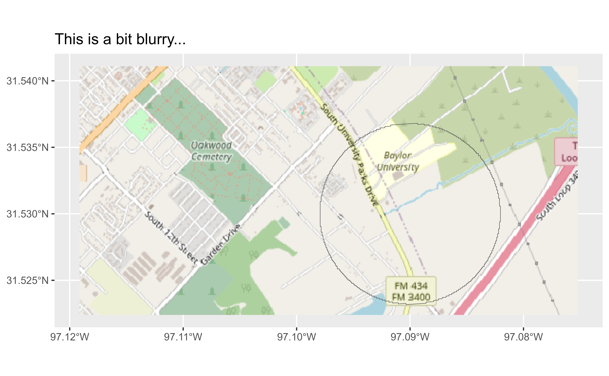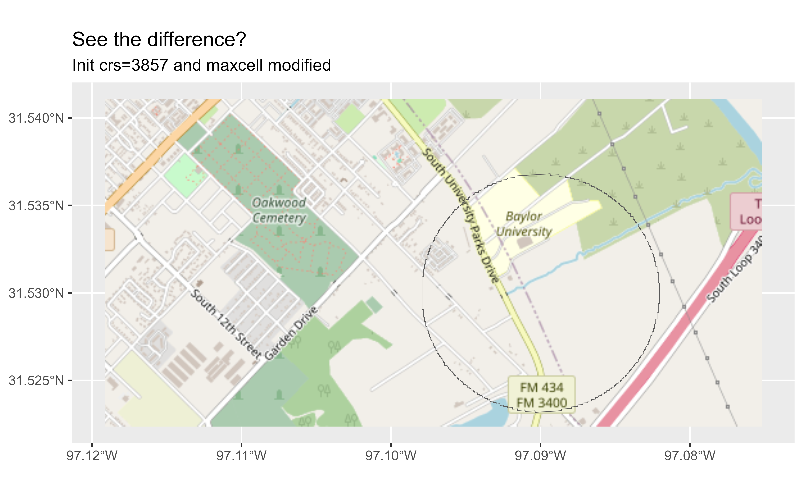

## Avoid degrees labeling on axis

Again, this is the **ggplot2** default, but can be modified with
`ggplot2::coord_sf(datum)` argument:

``` r
library(terra)
library(tidyterra)
library(ggplot2)
library(sf)

holyrood <- "holyroodpark.tif"

r <- rast(holyrood)

ggplot() +
  geom_spatraster(data = r) +
  labs(
    title = "Axis auto-converted to lon/lat",
    subtitle = paste("But SpatRaster is EPSG:", st_crs(r)$epsg)
  )
```

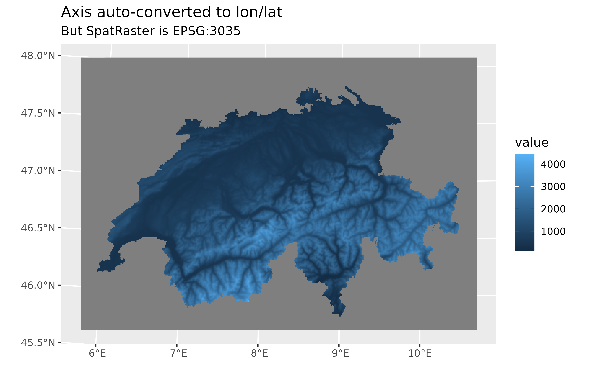

``` r


# Use datum

ggplot() +
  geom_spatraster(data = r) +
  coord_sf(datum = pull_crs(r)) +
  labs(
    title = "Axis on the units of the SpatRaster",
    subtitle = paste("EPSG:", st_crs(r)$epsg)
  )
```

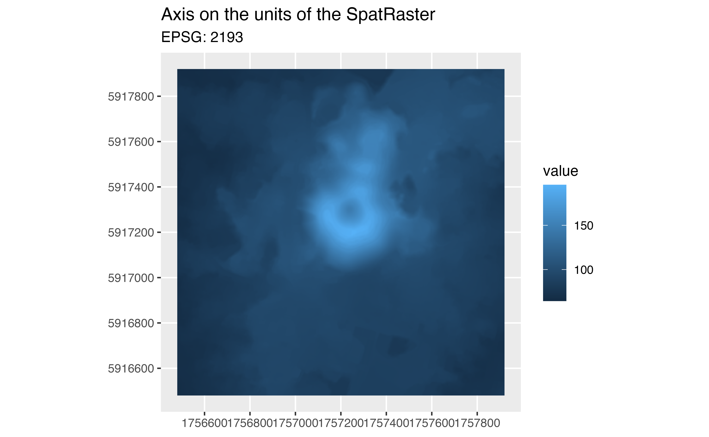

## Modifying the number of breaks on axis

This is a long-standing issue in **ggplot2** with no satisfactory
solution so far. Please see
[ggplot2/issues/4622](https://github.com/tidyverse/ggplot2/issues/4622)
(and maybe consider opening a new issue). You can try something like
this:

``` r
packageVersion("ggplot2")
#> [1] '4.0.1'

library(terra)
library(tidyterra)
library(ggplot2)
library(sf)

holyrood <- "holyroodpark.tif"

r <- rast(holyrood)

ggplot() +
  geom_spatraster(data = r) +
  labs(title = "Default axis breaks")
```

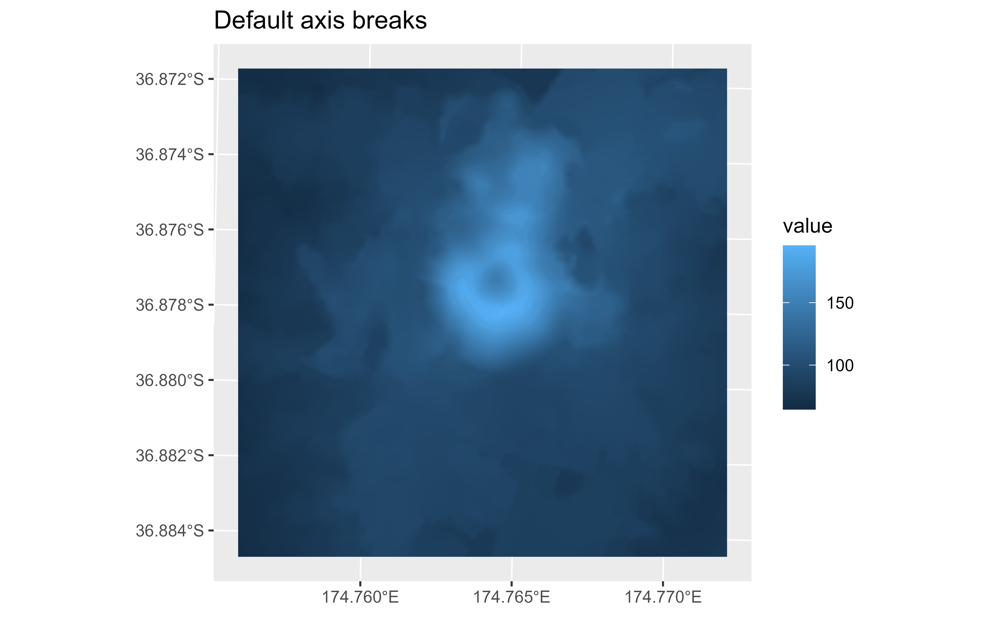

``` r

# Modify breaks on x and y

# Need to be in EPSG:4326, but don't know why...
extent <- r |>
  project("EPSG:4326") |>
  ext() |>
  as.vector()
y_br <- pretty(c(extent[c("ymin", "ymax")]), n = 3)
x_br <- pretty(c(extent[c("xmin", "xmax")]), n = 3)


ggplot() +
  geom_spatraster(data = r) +
  scale_y_continuous(breaks = y_br) +
  scale_x_continuous(breaks = x_br) +
  labs(title = "Three breaks in x and y axis")
```

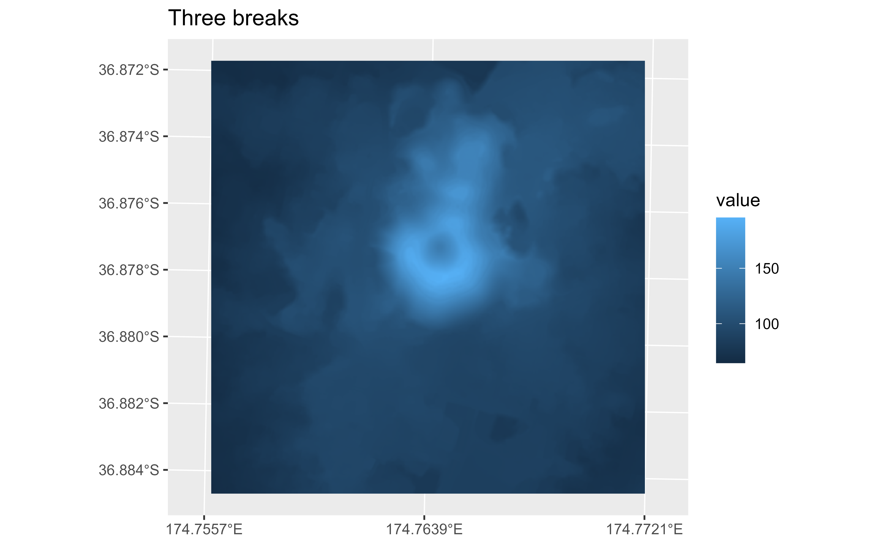

## Plotting a `SpatRaster` with color tables

**tidyterra** has several ways to handle these `SpatRaster` objects. We
use the file `clc_edinburgh.tif`, available online in
<https://github.com/dieghernan/tidyterra/tree/main/data-raw> folder,
representing the information from the Corine Land Cover Dataset (2018)
for the city of Edinburgh[³](#fn3).

``` r
library(terra)
library(tidyterra)
library(ggplot2)

# Get a SpatRaster with coltab
r_coltab <- rast("clc_edinburgh.tif")

has.colors(r_coltab)
#> [1] TRUE

r_coltab
#> class       : SpatRaster 
#> size        : 196, 311, 1  (nrow, ncol, nlyr)
#> resolution  : 178.8719, 177.9949  (x, y)
#> extent      : -380397.3, -324768.1, 7533021, 7567908  (xmin, xmax, ymin, ymax)
#> coord. ref. : WGS 84 / Pseudo-Mercator (EPSG:3857) 
#> source      : clc_edinburgh.tif 
#> color table : 1 
#> categories  : label 
#> name        :                   label 
#> min value   : Continuous urban fabric 
#> max value   :           Sea and ocean

# Native handling by terra packages
plot(r_coltab)
```

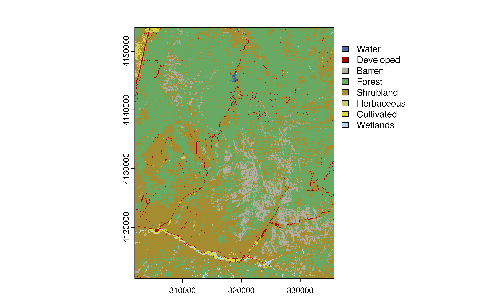

``` r


# A. autoplot

autoplot(r_coltab, maxcell = Inf) +
  guides(fill = guide_legend(ncol = 1)) +
  ggtitle("autoplot method")
```

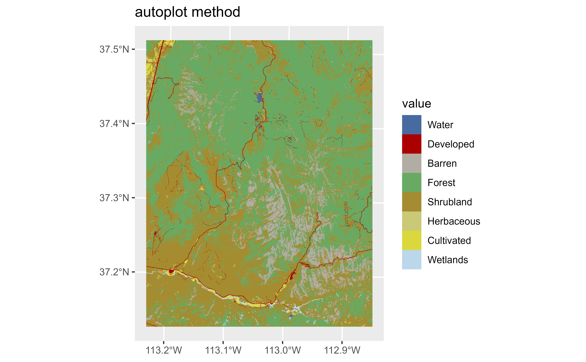

``` r

# B. geom_spatraster
ggplot() +
  geom_spatraster(data = r_coltab, maxcell = Inf) +
  guides(fill = guide_legend(ncol = 1)) +
  ggtitle("geom_spatraster method")
```

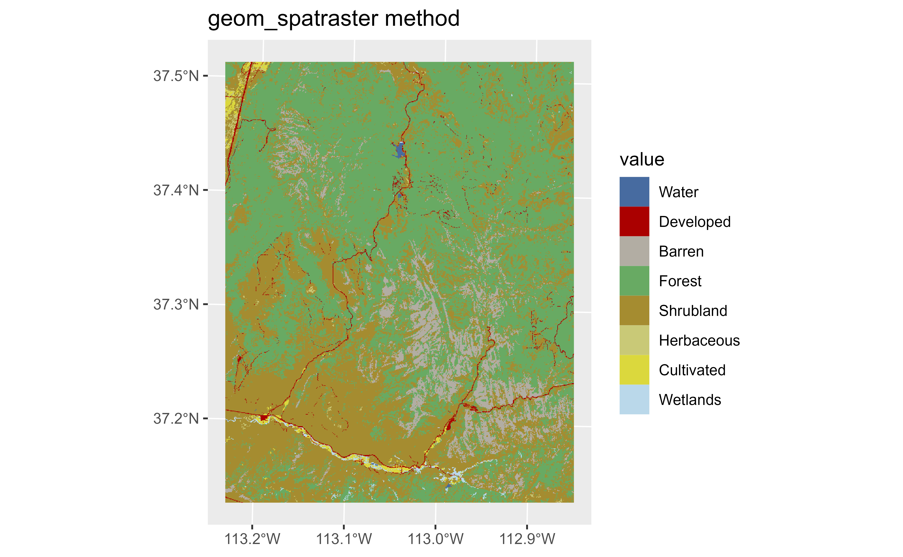

``` r

# C. Using scale_fill_coltab

g <- ggplot() +
  geom_spatraster(data = r_coltab, use_coltab = FALSE, maxcell = Inf) +
  guides(fill = guide_legend(ncol = 1))


g
```


``` r

# But...
g +
  scale_fill_coltab(data = r_coltab) +
  ggtitle("scale_fill_coltab method")
```


``` r

# D. Extract named colors and scale_fill_manual

cols <- get_coltab_pal(r_coltab)

cols
#>                    Continuous urban fabric 
#>                                  "#E6004D" 
#>                 Discontinuous urban fabric 
#>                                  "#FF0000" 
#>             Industrial or commercial units 
#>                                  "#CC4DF2" 
#> Road and rail networks and associated land 
#>                                  "#CC0000" 
#>                                 Port areas 
#>                                  "#E6CCCC" 
#>                                   Airports 
#>                                  "#E6CCE6" 
#>                   Mineral extraction sites 
#>                                  "#A600CC" 
#>                                 Dump sites 
#>                                  "#A64D00" 
#>                         Construction sites 
#>                                  "#FF4DFF" 
#>                          Green urban areas 
#>                                  "#FFA6FF" 
#>               Sport and leisure facilities 
#>                                  "#FFE6FF" 
#>                  Non-irrigated arable land 
#>                                  "#FFFFA8" 
#>                                   Pastures 
#>                                  "#E6E64D" 
#>                        Broad-leaved forest 
#>                                  "#80FF00" 
#>                          Coniferous forest 
#>                                  "#00A600" 
#>                               Mixed forest 
#>                                  "#4DFF00" 
#>                         Natural grasslands 
#>                                  "#CCF24D" 
#>                        Moors and heathland 
#>                                  "#A6FF80" 
#>                                 Bare rocks 
#>                                  "#CCCCCC" 
#>                           Intertidal flats 
#>                                  "#A6A6E6" 
#>                               Water bodies 
#>                                  "#80F2E6" 
#>                                  Estuaries 
#>                                  "#A6FFE6" 
#>                              Sea and ocean 
#>                                  "#E6F2FF"

scales::show_col(cols)
```

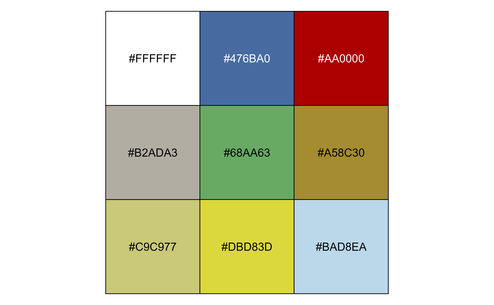

``` r

# And now

g +
  scale_fill_manual(
    values = cols,
    na.value = "transparent",
    na.translate = FALSE
  ) +
  ggtitle("scale_fill_manual method")
```


## Use with gganimate

Sure! See an example (thanks [@frzambra](https://github.com/frzambra)):

``` r
library(gganimate)
library(tidyterra)
library(geodata)
library(ggplot2)

temp <- worldclim_country("che", "tavg", path = ".")

che_cont <- gadm("che", level = 0, path = ".")


temp_m <- crop(temp, che_cont, mask = TRUE)
names(temp_m) <- month.name

anim <- ggplot() +
  geom_spatraster(data = temp_m) +
  scale_fill_viridis_c(
    option = "inferno",
    na.value = "transparent",
    labels = scales::label_number(suffix = "º C")
  ) +
  transition_manual(lyr) +
  theme_bw() +
  theme(
    axis.text = element_blank(),
    axis.ticks = element_blank()
  ) +
  labs(
    title = "Avg temp Switzerland: {current_frame}",
    fill = ""
  )

gganimate::animate(anim, duration = 12, device = "ragg_png")
```

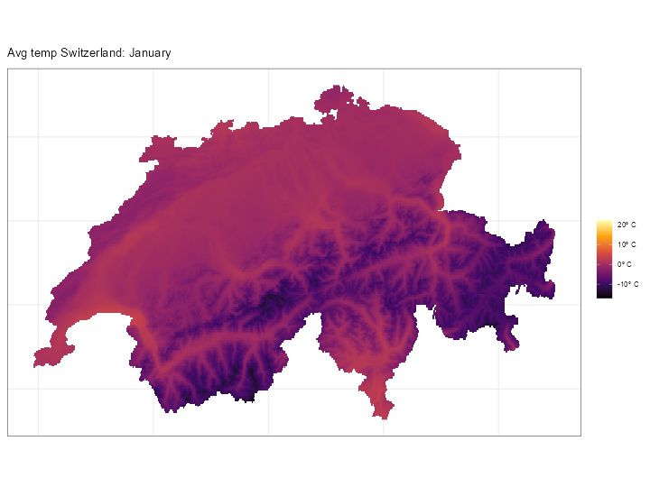

## North arrows and scale bar

**tidyterra** does not provide these graphical objects for **ggplot2**
plots. However, you can use **ggspatial** functions
([`ggspatial::annotation_north_arrow()`](https://paleolimbot.github.io/ggspatial/reference/annotation_north_arrow.html)
and
[`ggspatial::annotation_scale()`](https://paleolimbot.github.io/ggspatial/reference/annotation_scale.html)):

``` r
library(terra)
library(tidyterra)
library(ggplot2)
library(ggspatial)

holyrood <- "holyroodpark.tif"

r <- rast(holyrood)

autoplot(r) +
  annotation_north_arrow(
    which_north = TRUE,
    pad_x = unit(0.8, "npc"),
    pad_y = unit(0.75, "npc"),
    style = north_arrow_fancy_orienteering()
  ) +
  annotation_scale(
    height = unit(0.015, "npc"),
    width_hint = 0.5,
    pad_x = unit(0.07, "npc"),
    pad_y = unit(0.07, "npc"),
    text_cex = .8
  )
```

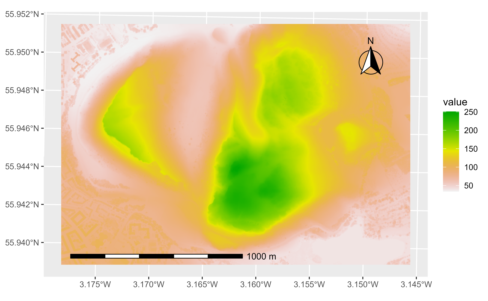

## How to overlay a `SpatRaster` over a RGB tile

This is quite straightforward, just use
[`geom_spatraster_rgb()`](https://dieghernan.github.io/tidyterra/dev/reference/geom_spatraster_rgb.md)
and after that, just create your layer:

``` r
library(terra)
library(tidyterra)
library(ggplot2)
library(sf)
# Get example data
library(maptiles)
library(geodata)


# Area of interest
aoi <- gadm(country = "CHE", path = ".", level = 0) |>
  project("EPSG:3857")

# Tile
rgb_tile <- get_tiles(
  aoi,
  crop = TRUE,
  provider = "Esri.WorldShadedRelief",
  zoom = 8,
  project = FALSE,
  cachedir = "."
)

# Clim (mean prec)
clim <- worldclim_country("CHE", var = "prec", path = ".") |>
  project(rgb_tile) |>
  mask(aoi) |>
  terra::mean()

# Labels
cap_lab <- paste0(
  c(
    "Tiles © Esri - Source: Esri",
    "Data: © Copyright 2020-2022, worldclim.org."
  ),
  collapse = "\n"
)
tit_lab <- "Average precipitation in Switzerland"

ggplot(aoi) +
  geom_spatraster_rgb(data = rgb_tile, alpha = 1) +
  geom_spatraster(data = clim) +
  geom_spatvector(fill = NA) +
  scale_fill_whitebox_c(
    palette = "deep",
    alpha = 0.5,
    labels = scales::label_number(suffix = " mm.")
  ) +
  coord_sf(expand = FALSE) +
  labs(
    title = tit_lab,
    subtitle = "With continuous overlay",
    fill = "Precipitation",
    caption = cap_lab
  )
```


We can create other variations with binned legends and filled contours
(see
[`geom_spatraster_contour_filled()`](https://dieghernan.github.io/tidyterra/dev/reference/geom_spat_contour.md)):

``` r
# Binned
ggplot(aoi) +
  geom_spatraster_rgb(data = rgb_tile, alpha = 1) +
  geom_spatraster(data = clim) +
  geom_spatvector(fill = NA) +
  scale_fill_whitebox_b(
    palette = "deep",
    alpha = 0.5,
    n.breaks = 4,
    labels = scales::label_number(suffix = " mm.")
  ) +
  coord_sf(expand = FALSE) +
  labs(
    title = tit_lab,
    subtitle = "With overlay: binned legend",
    fill = "Precipitation",
    caption = cap_lab
  )
```


``` r

# Filled contour
ggplot(aoi) +
  geom_spatraster_rgb(data = rgb_tile, alpha = 1) +
  geom_spatraster_contour_filled(data = clim, bins = 4) +
  geom_spatvector(fill = NA) +
  coord_sf(expand = FALSE) +
  scale_fill_whitebox_d(
    palette = "deep",
    alpha = 0.5,
    guide = guide_legend(reverse = TRUE)
  ) +
  labs(
    title = tit_lab,
    subtitle = "With overlay and filled contour",
    fill = "Precipitation (mm.)",
    caption = cap_lab
  )
```


## Hexagonal grids (and other `geoms`)

Conceptually, the cells of a `SpatRaster` are rectangular, so it is not
possible to create a `SpatRaster` with i.e. hexagonal cells.

But it is possible to create a plot with hexagonal cells thanks to
[`fortify.SpatRaster()`](https://dieghernan.github.io/tidyterra/dev/reference/fortify.Spat.md)
and
[`stat_summary_hex()`](https://ggplot2.tidyverse.org/reference/stat_summary_2d.html).
Additional work is needed to adjust the final plot, specifically, it is
also needed to use
[`coord_sf()`](https://ggplot2.tidyverse.org/reference/ggsf.html):

``` r
library(terra)
library(tidyterra)
library(ggplot2)

holyrood <- "holyroodpark.tif"

r <- rast(holyrood)

# With hex grid
ggplot(r, aes(x, y, z = elevation)) +
  stat_summary_hex(
    fun = mean,
    color = NA,
    linewidth = 0,
    # Bins size determines the number of cells displayed
    bins = 30
  ) +
  coord_sf(crs = pull_crs(r)) +
  labs(
    title = "Hexagonal SpatRaster",
    subtitle = "Using fortify (implicit) and stat_summary_hex",
    x = NULL,
    y = NULL
  )
```


Note that there is no need to make a direct call to
[`fortify.SpatRaster()`](https://dieghernan.github.io/tidyterra/dev/reference/fortify.Spat.md),
since this function is implicitly invoked by **ggplot2** when using
`ggplot(data = a_spatraster)`.

Thanks to this extension mechanism, it is possible to use additional
`geoms` and `stats` provided by **ggplot2**:

``` r
# Point plot
ggplot(r, aes(x, y, z = elevation), maxcell = 1000) +
  geom_point(
    aes(size = elevation, alpha = elevation),
    fill = "darkblue",
    color = "grey50",
    shape = 21
  ) +
  coord_sf(crs = pull_crs(r)) +
  scale_radius(range = c(1, 5)) +
  scale_alpha(range = c(0.01, 1)) +
  labs(
    title = "SpatRaster as points",
    subtitle = "Using fortify (implicit)",
    x = NULL,
    y = NULL
  )
```


### tidyterra and metR

**metR** is a package that also provides **ggplot2** extensions, mainly
focused on the analysis of meteorological fields. As shown previously
(see [Labeling contours](#label-contour)) it is possible to use both
packages to provide rich plots.

``` r
# load libraries and files
library(terra)
library(tidyterra)
library(ggplot2)
library(metR)

holyrood <- "holyroodpark.tif"

r <- rast(holyrood)
```

``` r
ggplot(r, aes(x, y)) +
  geom_relief(aes(z = elevation)) +
  geom_spatraster(
    data = r,
    inherit.aes = FALSE,
    aes(alpha = after_stat(value))
  ) +
  scale_fill_cross_blended_c(breaks = seq(0, 250, 25)) +
  scale_alpha(range = c(1, 0.25)) +
  guides(alpha = "none", fill = guide_legend(reverse = TRUE)) +
  labs(x = "", y = "", title = "tidyterra and metR: reliefs")
```


## Session info

Details

    #> ─ Session info ───────────────────────────────────────────────────────────────
    #>  setting  value
    #>  version  R version 4.5.2 (2025-10-31 ucrt)
    #>  os       Windows Server 2022 x64 (build 26100)
    #>  system   x86_64, mingw32
    #>  ui       RTerm
    #>  language en
    #>  collate  English_United States.utf8
    #>  ctype    English_United States.utf8
    #>  tz       UTC
    #>  date     2026-02-03
    #>  pandoc   3.1.11 @ C:/HOSTED~1/windows/pandoc/31F387~1.11/x64/PANDOC~1.11/ (via rmarkdown)
    #>  quarto   NA
    #> 
    #> ─ Packages ───────────────────────────────────────────────────────────────────
    #>  package      * version    date (UTC) lib source
    #>  backports      1.5.0      2024-05-23 [1] RSPM
    #>  bslib          0.10.0     2026-01-26 [1] RSPM
    #>  cachem         1.1.0      2024-05-16 [1] RSPM
    #>  checkmate      2.3.3      2025-08-18 [1] RSPM
    #>  class          7.3-23     2025-01-01 [3] CRAN (R 4.5.2)
    #>  classInt       0.4-11     2025-01-08 [1] RSPM
    #>  cli            3.6.5      2025-04-23 [1] RSPM
    #>  codetools      0.2-20     2024-03-31 [3] CRAN (R 4.5.2)
    #>  data.table     1.18.2.1   2026-01-27 [1] RSPM
    #>  DBI            1.2.3      2024-06-02 [1] RSPM
    #>  desc           1.4.3      2023-12-10 [1] RSPM
    #>  digest         0.6.39     2025-11-19 [1] RSPM
    #>  dplyr          1.2.0      2026-02-03 [1] CRAN (R 4.5.2)
    #>  e1071          1.7-17     2025-12-18 [1] RSPM
    #>  evaluate       1.0.5      2025-08-27 [1] RSPM
    #>  farver         2.1.2      2024-05-13 [1] RSPM
    #>  fastmap        1.2.0      2024-05-15 [1] RSPM
    #>  fs             1.6.6      2025-04-12 [1] RSPM
    #>  generics       0.1.4      2025-05-09 [1] RSPM
    #>  geodata      * 0.6-6      2025-09-30 [1] RSPM
    #>  ggplot2      * 4.0.1      2025-11-14 [1] RSPM
    #>  ggspatial    * 1.1.10     2025-08-24 [1] RSPM
    #>  glue           1.8.0      2024-09-30 [1] RSPM
    #>  gtable         0.3.6      2024-10-25 [1] RSPM
    #>  hexbin         1.28.5     2024-11-13 [1] RSPM
    #>  htmltools      0.5.9      2025-12-04 [1] RSPM
    #>  htmlwidgets    1.6.4      2023-12-06 [1] RSPM
    #>  isoband        0.3.0      2025-12-07 [1] RSPM
    #>  jquerylib      0.1.4      2021-04-26 [1] RSPM
    #>  jsonlite       2.0.0      2025-03-27 [1] RSPM
    #>  KernSmooth     2.23-26    2025-01-01 [3] CRAN (R 4.5.2)
    #>  knitr          1.51       2025-12-20 [1] RSPM
    #>  labeling       0.4.3      2023-08-29 [1] RSPM
    #>  lattice        0.22-7     2025-04-02 [3] CRAN (R 4.5.2)
    #>  lifecycle      1.0.5      2026-01-08 [1] RSPM
    #>  magrittr       2.0.4      2025-09-12 [1] RSPM
    #>  maptiles     * 0.11.0     2025-12-12 [1] RSPM
    #>  memoise        2.0.1      2021-11-26 [1] RSPM
    #>  metR         * 0.18.3     2025-12-09 [1] RSPM
    #>  otel           0.2.0      2025-08-29 [1] RSPM
    #>  pillar         1.11.1     2025-09-17 [1] RSPM
    #>  pkgconfig      2.0.3      2019-09-22 [1] RSPM
    #>  pkgdown        2.2.0      2025-11-06 [1] RSPM
    #>  plyr           1.8.9      2023-10-02 [1] RSPM
    #>  proxy          0.4-29     2025-12-29 [1] RSPM
    #>  purrr          1.2.1      2026-01-09 [1] RSPM
    #>  R.cache        0.17.0     2025-05-02 [1] RSPM
    #>  R.methodsS3    1.8.2      2022-06-13 [1] RSPM
    #>  R.oo           1.27.1     2025-05-02 [1] RSPM
    #>  R.utils        2.13.0     2025-02-24 [1] RSPM
    #>  R6             2.6.1      2025-02-15 [1] RSPM
    #>  ragg           1.5.0      2025-09-02 [1] RSPM
    #>  rappdirs       0.3.4      2026-01-17 [1] RSPM
    #>  RColorBrewer   1.1-3      2022-04-03 [1] RSPM
    #>  Rcpp           1.1.1      2026-01-10 [1] RSPM
    #>  rlang          1.1.7      2026-01-09 [1] RSPM
    #>  rmarkdown      2.30       2025-09-28 [1] RSPM
    #>  s2             1.1.9      2025-05-23 [1] RSPM
    #>  S7             0.2.1      2025-11-14 [1] RSPM
    #>  sass           0.4.10     2025-04-11 [1] RSPM
    #>  scales         1.4.0      2025-04-24 [1] RSPM
    #>  sessioninfo  * 1.2.3      2025-02-05 [1] any (@1.2.3)
    #>  sf           * 1.0-24     2026-01-13 [1] RSPM
    #>  styler         1.11.0     2025-10-13 [1] RSPM
    #>  systemfonts    1.3.1      2025-10-01 [1] RSPM
    #>  terra        * 1.8-93     2026-01-12 [1] RSPM
    #>  textshaping    1.0.4      2025-10-10 [1] RSPM
    #>  tibble         3.3.1      2026-01-11 [1] RSPM
    #>  tidyr          1.3.2      2025-12-19 [1] RSPM
    #>  tidyselect     1.2.1      2024-03-11 [1] RSPM
    #>  tidyterra    * 1.0.0.9000 2026-02-03 [1] local
    #>  units          1.0-0      2025-10-09 [1] RSPM
    #>  vctrs          0.7.1      2026-01-23 [1] RSPM
    #>  viridisLite    0.4.2      2023-05-02 [1] RSPM
    #>  withr          3.0.2      2024-10-28 [1] RSPM
    #>  wk             0.9.5      2025-12-18 [1] RSPM
    #>  xfun           0.56       2026-01-18 [1] RSPM
    #>  yaml           2.3.12     2025-12-10 [1] RSPM
    #> 
    #>  [1] D:/a/_temp/Library
    #>  [2] C:/R/site-library
    #>  [3] C:/R/library
    #>  * ── Packages attached to the search path.
    #> 
    #> ──────────────────────────────────────────────────────────────────────────────

------------------------------------------------------------------------

1.  Digital Elevation Model, representing the elevation of the
    corresponding area.

2.  `na.value = NA` could be used as well for the same purpose in most
    of the cases, However, when the proportion of non-`NA`s is small it
    can produce undesired results, see
    [\#120](https://github.com/dieghernan/tidyterra/issues/120).

3.  The original file has been cropped, the numeric values have been
    converted to their corresponding labels and factors, and it has been
    added the corresponding color table as of
    <https://collections.sentinel-hub.com/corine-land-cover/readme.html>.
