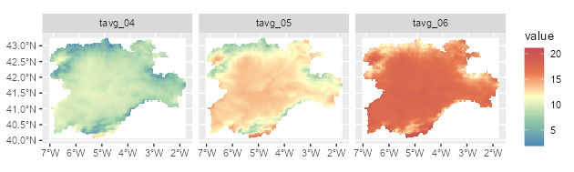
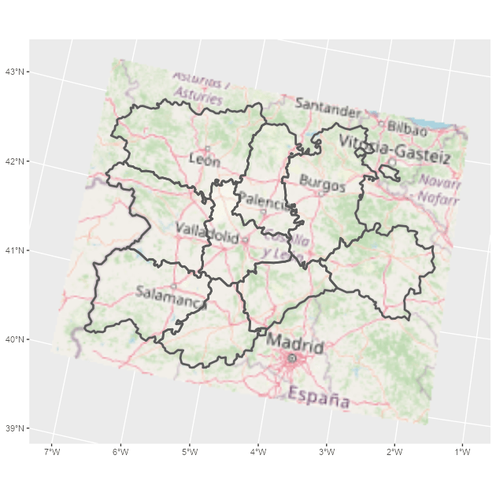

# Welcome to tidyterra

## The tidyterra package

**tidyterra** adds common tidyverse methods for `SpatRaster` and
`SpatVector` objects from the
[**terra**](https://CRAN.R-project.org/package=terra) package, and
provides `geom_spat*()` geoms for plotting these objects with
[**ggplot2**](https://ggplot2.tidyverse.org/).

### Why tidyterra?

`Spat*` objects differ from regular data frames: they are S4 objects
with their own syntax and computational methods (implemented in
**terra**). By providing tidyverse verbs—especially `dplyr` and `tidyr`
methods—**tidyterra** lets users manipulate `Spat*` objects in a style
similar to working with tabular data.

Note: **terra** is generally more performant. Learning some **terra**
syntax is recommended because **tidyterra** functions call, where
possible, the corresponding **terra** equivalents.

## A note for advanced terra users

**tidyterra** is not optimized for performance. Operations such as
[`filter()`](https://dplyr.tidyverse.org/reference/filter.html) and
[`mutate()`](https://dplyr.tidyverse.org/reference/mutate.html) can be
slower than their **terra** counterparts.

As a rule of thumb, **tidyterra** is most suitable for objects with
fewer than 1e7 “slots” (i.e.,
`terra::ncell(a_rast) * terra::nlyr(a_rast) < 1e7`).

## Get started with tidyterra

Load **tidyterra** together with core tidyverse packages:

``` r
library(tidyterra)
library(dplyr)
library(tidyr)
```

Currently, the following methods are available:

| tidyverse method                                                                                                                                            | `SpatVector`                                                                                                                                                                                                  | `SpatRaster`                                                                                                                                                                                                  |
|-------------------------------------------------------------------------------------------------------------------------------------------------------------|---------------------------------------------------------------------------------------------------------------------------------------------------------------------------------------------------------------|---------------------------------------------------------------------------------------------------------------------------------------------------------------------------------------------------------------|
| [`tibble::as_tibble()`](https://tibble.tidyverse.org/reference/as_tibble.html)                                                                              | ✔️                                                                                                                                                                                                            | ✔️                                                                                                                                                                                                            |
| [`dplyr::select()`](https://dplyr.tidyverse.org/reference/select.html)                                                                                      | ✔️                                                                                                                                                                                                            | ✔️ Select layers                                                                                                                                                                                              |
| [`dplyr::mutate()`](https://dplyr.tidyverse.org/reference/mutate.html)                                                                                      | ✔️                                                                                                                                                                                                            | ✔️ Create/modify layers                                                                                                                                                                                       |
| [`dplyr::transmute()`](https://dplyr.tidyverse.org/reference/transmute.html)                                                                                | ✔️                                                                                                                                                                                                            | ✔️                                                                                                                                                                                                            |
| [`dplyr::filter()`](https://dplyr.tidyverse.org/reference/filter.html)                                                                                      | ✔️                                                                                                                                                                                                            | ✔️ Modify cell values and (optionally) remove outer cells.                                                                                                                                                    |
| [`dplyr::filter_out()`](https://dplyr.tidyverse.org/reference/filter.html)                                                                                  | ✔️                                                                                                                                                                                                            |                                                                                                                                                                                                               |
| [`dplyr::slice()`](https://dplyr.tidyverse.org/reference/slice.html)                                                                                        | ✔️                                                                                                                                                                                                            | ✔️ Additional methods for slicing by row and column.                                                                                                                                                          |
| [`dplyr::pull()`](https://dplyr.tidyverse.org/reference/pull.html)                                                                                          | ✔️                                                                                                                                                                                                            | ✔️                                                                                                                                                                                                            |
| [`dplyr::rename()`](https://dplyr.tidyverse.org/reference/rename.html)                                                                                      | ✔️                                                                                                                                                                                                            | ✔️                                                                                                                                                                                                            |
| [`dplyr::relocate()`](https://dplyr.tidyverse.org/reference/relocate.html)                                                                                  | ✔️                                                                                                                                                                                                            | ✔️                                                                                                                                                                                                            |
| [`dplyr::distinct()`](https://dplyr.tidyverse.org/reference/distinct.html)                                                                                  | ✔️                                                                                                                                                                                                            |                                                                                                                                                                                                               |
| [`dplyr::arrange()`](https://dplyr.tidyverse.org/reference/arrange.html)                                                                                    | ✔️                                                                                                                                                                                                            |                                                                                                                                                                                                               |
| [`dplyr::glimpse()`](https://pillar.r-lib.org/reference/glimpse.html)                                                                                       | ✔️                                                                                                                                                                                                            | ✔️                                                                                                                                                                                                            |
| [`dplyr::inner_join()`](https://dplyr.tidyverse.org/reference/mutate-joins.html) family                                                                     | ✔️                                                                                                                                                                                                            |                                                                                                                                                                                                               |
| [`dplyr::summarise()`](https://dplyr.tidyverse.org/reference/summarise.html)                                                                                | ✔️                                                                                                                                                                                                            |                                                                                                                                                                                                               |
| [`dplyr::group_by()`](https://dplyr.tidyverse.org/reference/group_by.html) family                                                                           | ✔️                                                                                                                                                                                                            |                                                                                                                                                                                                               |
| [`dplyr::rowwise()`](https://dplyr.tidyverse.org/reference/rowwise.html)                                                                                    | ✔️                                                                                                                                                                                                            |                                                                                                                                                                                                               |
| [`dplyr::count()`](https://dplyr.tidyverse.org/reference/count.html), [`tally()`](https://dplyr.tidyverse.org/reference/count.html)                         | ✔️                                                                                                                                                                                                            |                                                                                                                                                                                                               |
| [`dplyr::add_count()`](https://dplyr.tidyverse.org/reference/count.html)                                                                                    | ✔️                                                                                                                                                                                                            |                                                                                                                                                                                                               |
| [`dplyr::bind_cols()`](https://dplyr.tidyverse.org/reference/bind_cols.html) / [`dplyr::bind_rows()`](https://dplyr.tidyverse.org/reference/bind_rows.html) | ✔️ as [`bind_spat_cols()`](https://dieghernan.github.io/tidyterra/dev/reference/bind_cols.SpatVector.md) / [`bind_spat_rows()`](https://dieghernan.github.io/tidyterra/dev/reference/bind_rows.SpatVector.md) |                                                                                                                                                                                                               |
| [`tidyr::drop_na()`](https://tidyr.tidyverse.org/reference/drop_na.html)                                                                                    | ✔️                                                                                                                                                                                                            | ✔️ Remove cell values with `NA` on any layer. Additionally, outer cells with `NA` are removed.                                                                                                                |
| [`tidyr::replace_na()`](https://tidyr.tidyverse.org/reference/replace_na.html)                                                                              | ✔️                                                                                                                                                                                                            | ✔️                                                                                                                                                                                                            |
| [`tidyr::fill()`](https://tidyr.tidyverse.org/reference/fill.html)                                                                                          | ✔️                                                                                                                                                                                                            |                                                                                                                                                                                                               |
| [`tidyr::pivot_longer()`](https://tidyr.tidyverse.org/reference/pivot_longer.html)                                                                          | ✔️                                                                                                                                                                                                            |                                                                                                                                                                                                               |
| [`tidyr::pivot_wider()`](https://tidyr.tidyverse.org/reference/pivot_wider.html)                                                                            | ✔️                                                                                                                                                                                                            |                                                                                                                                                                                                               |
| [`ggplot2::autoplot()`](https://ggplot2.tidyverse.org/reference/autoplot.html)                                                                              | ✔️                                                                                                                                                                                                            | ✔️                                                                                                                                                                                                            |
| [`ggplot2::fortify()`](https://ggplot2.tidyverse.org/reference/fortify.html)                                                                                | ✔️ to **sf** via [`sf::st_as_sf()`](https://r-spatial.github.io/sf/reference/st_as_sf.html)                                                                                                                   | To a **tibble** with coordinates.                                                                                                                                                                             |
| `ggplot2::geom_*()`                                                                                                                                         | ✔️ [`geom_spatvector()`](https://dieghernan.github.io/tidyterra/dev/reference/ggspatvector.md)                                                                                                                | ✔️ [`geom_spatraster()`](https://dieghernan.github.io/tidyterra/dev/reference/geom_spatraster.md) and [`geom_spatraster_rgb()`](https://dieghernan.github.io/tidyterra/dev/reference/geom_spatraster_rgb.md). |
| [`generics::tidy()`](https://generics.r-lib.org/reference/tidy.html)                                                                                        | ✔️                                                                                                                                                                                                            | ✔️                                                                                                                                                                                                            |
| [`generics::glance()`](https://generics.r-lib.org/reference/glance.html)                                                                                    | ✔️                                                                                                                                                                                                            | ✔️                                                                                                                                                                                                            |
| [`generics::required_pkgs()`](https://generics.r-lib.org/reference/required_pkgs.html)                                                                      | ✔️                                                                                                                                                                                                            | ✔️                                                                                                                                                                                                            |

Let’s see some of these methods in action.

### `SpatRasters`

Example using a `SpatRaster`:

``` r
library(terra)
f <- system.file("extdata/cyl_temp.tif", package = "tidyterra")

temp <- rast(f)

temp
#> class       : SpatRaster 
#> size        : 87, 118, 3  (nrow, ncol, nlyr)
#> resolution  : 3881.255, 3881.255  (x, y)
#> extent      : -612335.4, -154347.3, 4283018, 4620687  (xmin, xmax, ymin, ymax)
#> coord. ref. : World_Robinson 
#> source      : cyl_temp.tif 
#> names       :   tavg_04,   tavg_05,  tavg_06 
#> min values  :  1.885463,  5.817587, 10.46338 
#> max values  : 13.283829, 16.740898, 21.11378

mod <- temp |>
  select(-1) |>
  mutate(newcol = tavg_06 - tavg_05) |>
  relocate(newcol, .before = 1) |>
  replace_na(list(newcol = 3)) |>
  rename(difference = newcol)

mod
#> class       : SpatRaster 
#> size        : 87, 118, 3  (nrow, ncol, nlyr)
#> resolution  : 3881.255, 3881.255  (x, y)
#> extent      : -612335.4, -154347.3, 4283018, 4620687  (xmin, xmax, ymin, ymax)
#> coord. ref. : World_Robinson 
#> source(s)   : memory
#> names       : difference,   tavg_05,  tavg_06 
#> min values  :   2.817647,  5.817587, 10.46338 
#> max values  :   5.307511, 16.740898, 21.11378
```

In this example we:

- Removed the first layer (`tavg_04`).
- Created a new layer `newcol` as the difference between `tavg_06` and
  `tavg_05`.
- Relocated `newcol` to be the first layer.
- Replaced `NA` values in `newcol` with `3`.
- Renamed `newcol` to `difference`.

Throughout these steps, core properties of the `SpatRaster` (number of
cells, rows and columns, extent, resolution, and CRS) remain unchanged.
Other verbs such as
[`filter()`](https://dplyr.tidyverse.org/reference/filter.html),
[`slice()`](https://dplyr.tidyverse.org/reference/slice.html), or
[`drop_na()`](https://tidyr.tidyverse.org/reference/drop_na.html) may
alter these properties in a manner analogous to how row operations
affect data frames.

### `SpatVectors`

Since **tidyterra** 0.4.0, most `dplyr` and `tidyr` verbs work with
`SpatVector` objects, so you can arrange, group, and summarise their
attributes.

``` r
lux <- system.file("ex/lux.shp", package = "terra")

v_lux <- vect(lux)

v_lux |>
  # Create categories
  mutate(gr = cut(POP / 1000, 5)) |>
  group_by(gr) |>
  # Summary
  summarise(
    n = n(),
    tot_pop = sum(POP),
    mean_area = mean(AREA)
  ) |>
  # Arrange
  arrange(desc(gr))
#>  class       : SpatVector 
#>  geometry    : polygons 
#>  dimensions  : 3, 4  (geometries, attributes)
#>  extent      : 5.74414, 6.528252, 49.44781, 50.18162  (xmin, xmax, ymin, ymax)
#>  coord. ref. : lon/lat WGS 84 (EPSG:4326) 
#>  names       :          gr     n   tot_pop mean_area
#>  type        :      <fact> <int>     <num>     <num>
#>  values      :   (147,183]     2 3.594e+05       244
#>                (40.7,76.1]     1 4.819e+04       185
#>                (4.99,40.7]     9 1.944e+05     209.8
```

As with `SpatRaster`, essential properties such as geometry and CRS are
preserved during these operations.

## Plotting with ggplot2

### `SpatRasters`

When a `SpatRaster` has a CRS defined (`terra::crs(a_rast) != ""`), the
geom uses
[`ggplot2::coord_sf()`](https://ggplot2.tidyverse.org/reference/ggsf.html)
and can be reprojected to match other spatial layers.

``` r
library(ggplot2)

# A faceted SpatRaster

ggplot() +
  geom_spatraster(data = temp) +
  facet_wrap(~lyr) +
  scale_fill_whitebox_c(
    palette = "muted",
    na.value = "white"
  )
```



A faceted map using SpatRaster

``` r
# Contour lines for a specific layer

f_volcano <- system.file("extdata/volcano2.tif", package = "tidyterra")
volcano2 <- rast(f_volcano)

ggplot() +
  geom_spatraster(data = volcano2) +
  geom_spatraster_contour(data = volcano2, breaks = seq(80, 200, 5)) +
  scale_fill_whitebox_c() +
  coord_sf(expand = FALSE) +
  labs(fill = "elevation")
```


Contour lines plot for a SpatRaster

``` r
# Contour filled

ggplot() +
  geom_spatraster_contour_filled(data = volcano2) +
  scale_fill_whitebox_d(palette = "atlas") +
  labs(fill = "elevation")
```


Contour filled plot for a SpatRaster

tidyterra also supports RGB `SpatRasters` for imagery:

``` r
# Read a vector

f_v <- system.file("extdata/cyl.gpkg", package = "tidyterra")
v <- vect(f_v)

# Read a tile
f_rgb <- system.file("extdata/cyl_tile.tif", package = "tidyterra")

r_rgb <- rast(f_rgb)

rgb_plot <- ggplot(v) +
  geom_spatraster_rgb(data = r_rgb) +
  geom_spatvector(fill = NA, size = 1)

rgb_plot
```



A map combining a RGB SpatRaster and a SpatVector

**tidyterra** includes color scales suitable for hypsometric and
bathymetric maps:

``` r
asia <- rast(system.file("extdata/asia.tif", package = "tidyterra"))

asia
#> class       : SpatRaster 
#> size        : 164, 306, 1  (nrow, ncol, nlyr)
#> resolution  : 31836.23, 31847.57  (x, y)
#> extent      : 7619120, 17361007, -1304745, 3918256  (xmin, xmax, ymin, ymax)
#> coord. ref. : WGS 84 / Pseudo-Mercator (EPSG:3857) 
#> source      : asia.tif 
#> name        : file44bc291153f2 
#> min value   :        -9558.468 
#> max value   :         5801.927

ggplot() +
  geom_spatraster(data = asia) +
  scale_fill_hypso_tint_c(
    palette = "gmt_globe",
    labels = scales::label_number(),
    # Further refinements
    breaks = c(-10000, -5000, 0, 2000, 5000, 8000),
    guide = guide_colorbar(reverse = TRUE)
  ) +
  labs(
    fill = "elevation (m)",
    title = "Hypsometric map of Asia"
  ) +
  theme(
    legend.position = "bottom",
    legend.title.position = "top",
    legend.key.width = rel(3),
    legend.ticks = element_line(colour = "black", linewidth = 0.3),
    legend.direction = "horizontal"
  )
```


Map of Asia including hypsometric tints

### `SpatVectors`

Plot `SpatVectors` with
[`geom_spatvector()`](https://dieghernan.github.io/tidyterra/dev/reference/ggspatvector.md):

``` r
lux <- system.file("ex/lux.shp", package = "terra")

v_lux <- terra::vect(lux)

ggplot(v_lux) +
  geom_spatvector(aes(fill = POP), color = "white") +
  geom_spatvector_text(aes(label = NAME_2), color = "grey90") +
  scale_fill_binned(labels = scales::number_format()) +
  coord_sf(crs = 3857)
```


Choropleth map with a SpatVector object

Implementation-wise, **tidyterra** converts
[`terra::vect()`](https://rspatial.github.io/terra/reference/vect.html)
output to **sf** via
[`sf::st_as_sf()`](https://r-spatial.github.io/sf/reference/st_as_sf.html)
and then uses
[`ggplot2::geom_sf()`](https://ggplot2.tidyverse.org/reference/ggsf.html)
to render the layer.

You can also aggregate `SpatVectors` easily:

``` r
# Dissolving
v_lux |>
  # Create categories
  mutate(gr = cut(POP / 1000, 5)) |>
  group_by(gr) |>
  # Summary
  summarise(
    n = n(),
    tot_pop = sum(POP),
    mean_area = mean(AREA)
  ) |>
  ggplot() +
  geom_spatvector(aes(fill = tot_pop), color = "black") +
  geom_spatvector_label(aes(label = gr)) +
  coord_sf(crs = 3857)
```


Dissolving SpatVectors by group

``` r

# Same but keeping internal boundaries
v_lux |>
  # Create categories
  mutate(gr = cut(POP / 1000, 5)) |>
  group_by(gr) |>
  # Summary without dissolving
  summarise(
    n = n(),
    tot_pop = sum(POP),
    mean_area = mean(AREA),
    .dissolve = FALSE
  ) |>
  ggplot() +
  geom_spatvector(aes(fill = tot_pop), color = "black") +
  geom_spatvector_label(aes(label = gr)) +
  coord_sf(crs = 3857)
```


Dissolving SpatVectors by group (keeping internal boundaries)
