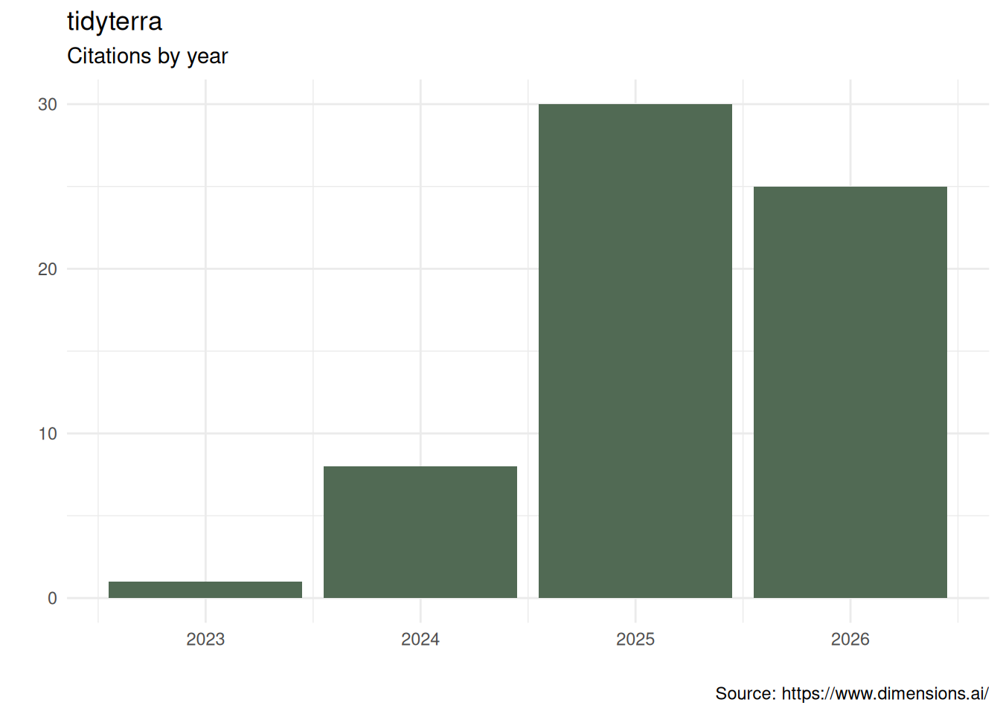

# tidyterra in the wild

Please cite **tidyterra** as:

Hernangómez, D. (2023). Using the tidyverse with terra objects: the
tidyterra package. *Journal of Open Source Software*, *8*(91), 5751,
<https://doi.org/10.21105/joss.05751>.

A BibTeX entry for LaTeX users is:

``` bib
@article{Hernangómez2023,
  doi = {10.21105/joss.05751},
  url = {https://doi.org/10.21105/joss.05751},
  year = {2023},
  publisher = {The Open Journal},
  volume = {8},
  number = {91},
  pages = {5751},
  author = {Diego Hernangómez},
  title = {Using the {tidyverse} with {terra} objects: the {tidyterra} package},
  journal = {Journal of Open Source Software}
}
```



## Publications

Aramburu, Ana, Núria Beltran-Sanz, José Raggio, et al. 2026. “Islands of
Biodiversity: Characterization of Lichen Flora in Antarctic Nunataks.”
*Journal of Fungi* 12 (5): 314. <https://doi.org/10.3390/jof12050314>.

Bahlburg, Dominik, Sebastian Menze, Bjørn A. Krafft, Andy D. Lowther,
and Bettina Meyer. 2025. “Mapping Encounters Between Antarctic Krill
Fishing Vessels and Air-Breathing Krill Predators Using Acoustic Data
from the Fishery.” *Proceedings of the National Academy of Sciences* 122
(25): e2417203122. <https://doi.org/10.1073/pnas.2417203122>.

Bausilio, Giuseppe, Diego Di Martire, Vincenzo Allocca, et al. 2026.
“Integrated Analysis for a Resilient Urban Planning Using Ensemble
Modeling and Machine Learning Algorithms.” *International Journal of
Disaster Risk Reduction* 138 (May): 106124.
<https://doi.org/10.1016/j.ijdrr.2026.106124>.

Bionda, Arianna, Alessio Negro, Silverio Grande, and Paola Crepaldi.
2025. “Mapping Risks and Landscapes: Conservation Insights for Italian
Small Ruminant Populations.” *Pastoralism: Research, Policy and
Practice* 15 (September): 14997.
<https://doi.org/10.3389/past.2025.14997>.

Buma, Brian. 2024. “Including Non-Growing Season Emissions of N\_2O in
US Maize Could Raise Net CO\_2e Emissions by 31% Annually.”
*Agricultural & Environmental Letters* 9 (2): e20146.
<https://doi.org/10.1002/ael2.20146>.

Coffey, Matthew L., and Andrew M. Simons. 2025. “The Spatial
Distribution of a Hummingbird-Pollinated Plant Is Not Strongly
Influenced by Hummingbird Abundance.” *American Journal of Botany* 112
(5): e70034. <https://doi.org/10.1002/ajb2.70034>.

Copot, Ovidiu, and Asko Lõhmus. 2026. “Assessment of Multiple Outcomes
of Habitat Models Can Significantly Affect Conservation Decisions for
Threatened Species.” *Scientific Reports* 16 (1): 5860.
<https://doi.org/10.1038/s41598-026-35987-4>.

Corak, Keo, Chaney Courtney, Bryan Ellerbrock, et al. 2026. “GeoNav:
Enhancing Field Phenotyping with High-Precision Global Navigation
Systems Integration in the Field Book Mobile Application.” *Crop
Science* 66 (2): e70254. <https://doi.org/10.1002/csc2.70254>.

Cordero, Elvin, Roy Ruiz Vélez, Víctor Huérfano Moreno, and Clark
Sherman. 2025. “Enhancing Tsunami Evacuation Strategies in Puerto Rico
Using Open-Source Least-Cost Path Analysis.” *Journal of Disaster
Science and Management* 1 (1): 18.
<https://doi.org/10.1007/s44367-025-00018-y>.

Di Fabio, Alessandro, Samuel Aspalter, Debojyoti Chakraborty, et al.
2026. “Growth Performance Is Driven by Site Conditions and Moderated by
Functional Trait Plasticity in *Quercus Robur* and *Prunus Avium*.”
*Ecology and Evolution* 16 (2): e72978.
<https://doi.org/10.1002/ece3.72978>.

Di Fabio, Alessandro, Valentina Buttò, Debojyoti Chakraborty, Gregory A.
O’Neill, Silvio Schueler, and Juergen Kreyling. 2024. “Climatic
Conditions at Provenance Origin Influence Growth Stability to Changes in
Climate in Two Major Tree Species.” *Frontiers in Forests and Global
Change* 7 (July): 1422165. <https://doi.org/10.3389/ffgc.2024.1422165>.

Drozdova, Polina, Zhanna Shatilina, Ekaterina Telnes, et al. 2025.
“Prezygotic and Postzygotic Reproductive Incompatibilities Complement
Each Other in the Formation of a Cryptic Amphipod Species: The Example
of a Lake Baikal Species Complex *Eulimnogammarus Verrucosus*.”
*Diversity* 17 (11): 781. <https://doi.org/10.3390/d17110781>.

Elio Medina, Javier, Frida Vermina Plathner, Elsa Pastor, and Nieves
Fernandez-Anez. 2025. “How to Approach the Definition of WUI in Northern
Europe.” *Fire and Materials* 49 (5): 787–804.
<https://doi.org/10.1002/fam.3264>.

Fard, Pedram, Jonas Hügel, Risto Conte Keivabu, et al. 2025. “Developing
a Spatiotemporal Repository of Extreme Heat and Cold Exposure in the
United States for Precision Public Health Research.” *Environmental
Science & Technology* 59 (37): 19872–84.
<https://doi.org/10.1021/acs.est.5c03658>.

Fu, Fengyu, Shuai Wang, Xutong Wu, et al. 2025. “Integrating
Hydrological Impacts for Cost-Effective Dryland Ecological Restoration.”
*Communications Earth & Environment* 6 (1): 667.
<https://doi.org/10.1038/s43247-025-02649-8>.

Gao, Yan, Nestor Añez, and Luis Fernando Chaves. 2026. “High Spatial
Resolution Ensemble Species Distribution Modeling of Rhodnius prolixus,
Vector of Chagas Disease, in Western Venezuela.” *GeoHealth* 10 (5):
e2025GH001628. <https://doi.org/10.1029/2025GH001628>.

García-Alvarado, Juan José, Miguel Pestano-González, Cristina
González-Montelongo, Agustín Naranjo-Cigala, and José Ramón Arévalo.
2025. “Assessing the Potential Risk of Invasion of the Neophyte *Pluchea
Ovalis* (Pers.) DC. (Asteraceae) in the Canarian Archipelago Using an
Ensemble of Species Distribution Modelling.” *Diversity* 17 (3): 195.
<https://doi.org/10.3390/d17030195>.

Hallet, Madeline E., Richard A. Phillips, Ian J. Maywar, and Lesley H.
Thorne. 2026. “Wind, Waves, Wing Loading and the Flight Energetics of
Giant Petrels.” *Functional Ecology* 40 (7): 1979–93.
<https://doi.org/10.1111/1365-2435.70352>.

Hattendorf, Carolin, and Renke Lühken. 2025. “Vectors, Host Range, and
Spatial Distribution of *Dirofilaria Immitis* and *D. repens* in Europe:
A Systematic Review.” *Infectious Diseases of Poverty* 14 (1): 58.
<https://doi.org/10.1186/s40249-025-01328-2>.

Herrera-Lopera, Jorge Mario, Mirco Solé, and Carlos A. Cultid-Medina.
2025. “Mapping the Missing: Assessing Amphibian Sampling Completeness
and Overlap with Global Protected Areas.” *Ecology and Evolution* 15
(5): e71137. <https://doi.org/10.1002/ece3.71137>.

Hinckley, Arlo, Gonzalo E. Pinilla-Buitrago, Jesús E. Maldonado, et al.
2025. “Pliocene Forest Fragmentation Shaped Speciation in Tropical
Asia’s Giant Squirrels (*Ratufa*).” *Molecular Ecology* 34 (24): e70179.
<https://doi.org/10.1111/mec.70179>.

Jones, Max D., Ryan J. Almeida, Rachel Boratto, et al. 2026. “Long
Lives, Short Futures: Freshwater Turtle and Tortoise Imports to the
United States Highlight Global Trade and Conservation Challenges.”
*Biological Conservation* 321 (September): 111966.
<https://doi.org/10.1016/j.biocon.2026.111966>.

Jones, Max Dolton. 2025. “Saur and Decline: Patterns in Lizard Imports
to the US (2000-2022).” *PLOS ONE* 20 (10): e0333746.
<https://doi.org/10.1371/journal.pone.0333746>.

Kassim, Yussif Baba, Francisco Pinto, Dilys S. MacCarthy, et al. 2025.
“Can Drone Images Predict Within-Field Variability in Soil Fertility? A
Case Study in the Northern Region of Ghana.” *Frontiers in Soil Science*
5 (June): 1548645. <https://doi.org/10.3389/fsoil.2025.1548645>.

Kiel, Nathan G., David A. Watts, Amanda B. Young, and Mark Vellend.
2025. “Snowmelt Timing Alters the Phenology but Not the Performance of
an Understory Spring Ephemeral Plant.” *Journal of Ecology* 113 (9):
2289–300. <https://doi.org/10.1111/1365-2745.70099>.

Kiziridis, Diogenis A., Ilias Karmiris, and Dimitrios Fotakis. 2026.
“Agroforestry Optimisation for Climate Policy: Mapping Silvopastoral
Carbon Sequestration Trade-Offs in the Mediterranean.” *Sustainability*
18 (1): 439. <https://doi.org/10.3390/su18010439>.

Kutza, Alex D., Zoe L. Hert, and Leonie C. Moyle. 2026. “Endemic and
Invasion Dynamics of Wild Tomato Species on the Galápagos Islands,
Across Two Centuries of Collection Records.” *New Phytologist* 251 (2):
737–51. <https://doi.org/10.1111/nph.70321>.

Larocca Conte, Gabriele, Lucia Zuvela, Rachel Cruz-Pérez, et al. 2026.
“Lowland Tropical Forests Remain a Methane Sink Under Warming and
Long-Term Hurricane Disturbance Recovery.” *Agricultural and Forest
Meteorology* 386 (July): 111225.
<https://doi.org/10.1016/j.agrformet.2026.111225>.

Lebron, Inma, Christopher J. Feeney, Sabine Reinsch, et al. 2025.
“Patterns and Thresholds for Soil pH Across Europe in Relation to Soil
Health and Degradation.” *CATENA* 260 (December): 109454.
<https://doi.org/10.1016/j.catena.2025.109454>.

Lee, Finnbar, Ian A. K. Kusabs, George L. W. Perry, and Calum MacNeil.
2025. “Identifying Refugia from the Synergistic Threats of Climate
Change and Invasive Species.” *Web Ecology* 25 (2): 221–39.
<https://doi.org/10.5194/we-25-221-2025>.

Lindgren, Finn, Fabian Bachl, Janine Illian, Man Ho Suen, Håvard Rue,
and Andrew E. Seaton. 2024. *inlabru: Software for Fitting Latent
Gaussian Models with Non-Linear Predictors*.
<https://doi.org/10.48550/arXiv.2407.00791>.

Lühken, Renke, Leif Rauhöft, Björn Pluskota, et al. 2024. “High Vector
Competence for Chikungunya Virus but Heavily Reduced Locomotor Activity
of *Aedes Albopictus* from Germany at Low Temperatures.” *Parasites &
Vectors* 17 (1): 502. <https://doi.org/10.1186/s13071-024-06594-x>.

Macey, John N., Jane M. Kunberger, Kellene Collins, et al. 2026.
“Miniaturized Light-Level Geolocators Provide Novel Insight into the
Migration Ecology of an Endangered Songbird.” *Movement Ecology* 14 (1):
13. <https://doi.org/10.1186/s40462-026-00626-0>.

Maitner, Brian S., Robert L. Richards, Ben S. Carlson, John M. Drake,
and Cory Merow. 2026. “Flexible Methods for Species Distribution
Modeling with Small Samples.” *Ecography* 2026 (2): e08112.
<https://doi.org/10.1002/ecog.08112>.

Mallory, Mark L., Seth MacLean, Julia E. Baak, et al. 2025. “Mercury in
Eastern Coyotes from Nova Scotia, Canada: Effects of Geography and
Trophic Position.” *Science of The Total Environment* 974 (April):
179186. <https://doi.org/10.1016/j.scitotenv.2025.179186>.

Maravall-López, Javier, Josefina M. B. Motti, Nicolás Pastor, et al.
2026. “Eight Millennia of Continuity of a Previously Unknown Lineage in
Argentina.” *Nature* 649 (8097): 647–56.
<https://doi.org/10.1038/s41586-025-09731-3>.

Masson, Simon, Matteo Chialva, Davide Bongiovanni, Martino Adamo, Irene
Stefanini, and Luisa Lanfranco. 2025. “A Systematic Scoping Review
Reveals That Geographic and Taxonomic Patterns Influence the Scientific
and Societal Interest in Urban Soil Microbial Diversity.” *Environmental
Microbiome* 20 (1): 17. <https://doi.org/10.1186/s40793-025-00677-7>.

Merlin, Morgane, Barry Gardiner, and Svein Solberg. 2026. “Predicting
the Risk of Individual Tree Fall Along Powerlines in Norway with a
Mechanistic Wind Risk Model and Machine Learning.” *Natural Hazards and
Earth System Sciences* 26 (5): 2461–85.
<https://doi.org/10.5194/nhess-26-2461-2026>.

Merlin, Morgane, Tommaso Locatelli, Barry Gardiner, and Rasmus Astrup.
2025. “Large-Scale Modelling Wind Damage Vulnerability Through
Combination of High-Resolution Forest Resources Maps and ForestGALES.”
*Forest Ecosystems* 14 (December): 100361.
<https://doi.org/10.1016/j.fecs.2025.100361>.

Mohammed, Ibrahim. 2024. *NASAaccess: Downloading and Reformatting Tool
for NASA Earth Observation Data Products*. National Aeronautics; Space
Administration, Goddard Space Flight Center.
<https://github.com/nasa/NASAaccess>.

Moreira, Hadassa, Sharon D. Janssen, Koen J. J. Kuipers, et al. 2026.
“Combined Threats of Land Use, Climate Change and Nitrogen Deposition to
Global Vascular Plant Diversity.” *Global Ecology and Conservation* 69
(September): e04307. <https://doi.org/10.1016/j.gecco.2026.e04307>.

Moulatlet, Gabriel M., Cory Merow, Brian Maitner, et al. 2025. “General
Laws of Biodiversity: Climatic Niches Predict Plant Range Size and
Ecological Dominance Globally.” *Proceedings of the National Academy of
Sciences* 122 (46): e2517585122.
<https://doi.org/10.1073/pnas.2517585122>.

Nityagovsky, Nikolay N., Alexey A. Ananev, Andrey R. Suprun, et al.
2024. “Distribution of *Plasmopara Viticola* Causing Downy Mildew in
Russian Far East Grapevines.” *Horticulturae* 10 (4): 326.
<https://doi.org/10.3390/horticulturae10040326>.

Pérez-Girón, José Carlos, José Vicente López-Bao, Emilio Díaz-Varela,
and Pedro Álvarez-Álvarez. 2025. “Predicting Climate-Related
Compositional Shifts in Nut-Producing Species That Are Important for
Bears During Hyperphagia.” *Frontiers in Forests and Global Change* 8
(August): 1624612. <https://doi.org/10.3389/ffgc.2025.1624612>.

Read, Freya R., Rachel J. Warmington, and Colin M. Beale. 2026.
“Assessing Protected Areas as Climate Refugia for Threatened Plant
Species in Britain.” *PLOS ONE* 21 (1): e0332485.
<https://doi.org/10.1371/journal.pone.0332485>.

Riley, Andrew C., Michael Wright, Teresita M. Porter, V. Carley
Maitland, Donald J. Baird, and Mehrdad Hajibabaei. 2025. “Biomonitoring
2.0 Refined: Observing Local Change Through Metaphylogeography Using a
Community-Based eDNA Metabarcoding Monitoring Network.” *BMC Biology* 23
(1): 187. <https://doi.org/10.1186/s12915-025-02284-x>.

Rock, Linnea A., William W. Fetzer, Lindsay S. Patterson, et al. 2025.
“Spatiotemporal Drivers of Water Quality and Phytoplankton Communities
in a Cyanobacteria-Dominated Reservoir Provide Management Insights.”
*Environmental Monitoring and Assessment* 197 (7): 795.
<https://doi.org/10.1007/s10661-025-14258-1>.

Salvador Baiges, Guillem. 2024. “Clima, Orografia i Dinàmiques de
Poblament Al Pirineu Central. Arqueologia, SIG i Modelització Espacial
Del Patró d’ocupació Del Territori Durant El Neolı́tic (5700–2100 Cal
ANE).” PhD thesis, Universitat Autònoma de Barcelona.
<https://ddd.uab.cat/record/301073>.

Santiago-Sarmiento, Aura Pamela, Citlalli Edith Esparza-Estrada, Carlos
Alberto Yáñez-Arenas, Luis Enrique Ángeles-González, and Lucas Jardim.
2026. “Ecological Niche Conservatism and Evolutionary Dynamics in
Octopodidae: A Phylogenetic Comparative Approach.” *Journal of
Biogeography* 53 (4): e70222. <https://doi.org/10.1111/jbi.70222>.

Schmidt, Jonathan, Shideh Dashti, and Cristina Torres-Machi. 2026.
“Next-Generation Probabilistic Liquefaction Model Building at the
Regional Scale.” *Earthquake Spectra* 42 (1): e70013.
<https://doi.org/10.1002/esp4.70013>.

Simons, David, Christina Harden, Natalie Imirzian, et al. 2026. “Local
Heterogeneity in Lassa Fever Serology in Rural Nigeria: Implications for
Vaccine Trial Site Selection.” *PLOS Neglected Tropical Diseases* 20
(5): e0014379. <https://doi.org/10.1371/journal.pntd.0014379>.

Smoot, Emily E., Rebecca L. Flitcroft, Samuel S. Chan, Braeden Van
Deynze, Sean Ewen, and Sunny L. Jardine. 2026. “Projected Temperature
and Precipitation Expand Modeled Distributions of *Reynoutria* spp.
While Modeled Distribution Changes for *Ludwigia* spp. Are
Scenario-Dependent at Watershed Scales in the Pacific Northwest, USA.”
*River Research and Applications* 42 (6): 1411–24.
<https://doi.org/10.1002/rra.70141>.

Su, Xingyuan, Nicolas Popescu, Chadabhorn Insuk, Cori Lausen, and
Jianping Xu. 2025. “High Diversity and Low Genetic Differentiation Among
Geographic Populations of *Myotis Yumanensis* in Western Canada.”
*Animals* 15 (4): 578. <https://doi.org/10.3390/ani15040578>.

Sun, Yanchen, Bryan D. James, Katelyn R. Houston, et al. 2025.
“Temperature Controls the Lifetimes and Microbial Communities Degrading
Cellulose Diacetate in the Coastal Ocean.” *Environmental Science &
Technology* 59 (36): 19468–78.
<https://doi.org/10.1021/acs.est.5c05334>.

Tanaka, Emi. 2026. “Examining the Interface Design of Tidyverse.”
*Australian & New Zealand Journal of Statistics* 68 (1): e70031.
<https://doi.org/10.1111/anzs.70031>.

Tribbia, Dana Z., Pedro H. Lebre, Xabier Vázquez-Campos, et al. 2026.
“Trace Gas Oxidation Supports Sub-Surface Microbial Communities Across
Namib Desert Fog and Aridity Gradients.” *Applied and Environmental
Microbiology*, July 10, e00265–26.
<https://doi.org/10.1128/aem.00265-26>.

Varma, Varun, Jonathan R. Mosedale, José Antonio Guzmán Alvarez, and
Daniel P. Bebber. 2025. “Socio-Economic Factors Constrain Climate Change
Adaptation in a Tropical Export Crop.” *Nature Food* 6 (4): 343–52.
<https://doi.org/10.1038/s43016-025-01130-1>.

Wang, Guangyu, Xiaofeng Tang, Qingwei Zhang, Bingcong Li, and Ming Li.
2025. “The Relationship Between Soil Organic Matter Composition and Soil
Enzyme Activities in Various Land Use Types in the Upper Watershed of
Danjiangkou Reservoir in China.” *Land Degradation & Development* 36
(8): 2557–70. <https://doi.org/10.1002/ldr.5516>.

Wieczorkowski, Jakub D., Landy R. Rajaovelona, Johan Hermans, et al.
2026. “Orchids in the Open: Understanding Biodiversity Beyond
Madagascar’s Forests.” *Diversity and Distributions* 32 (3): e70172.
<https://doi.org/10.1111/ddi.70172>.

Wiethase, Joris Hendrik. 2023. “Advancing Ecosystem Understanding:
Identifying the Drivers of Habitat Degradation, Species Distributions
and Species Vulnerabilities in East African Grasslands.” PhD thesis,
University of York. <https://etheses.whiterose.ac.uk/id/eprint/34736/>.

Williams, Jake, and Nathalie Pettorelli. 2025. “Ecosystem Condition
Emerges from an Ecological Equation of State Applied to North American
Tree Communities.” *Current Biology* 35 (7): 1672–1679.e3.
<https://doi.org/10.1016/j.cub.2025.02.062>.

Williams, Jake, Christopher J. Sandom, and Nathalie Pettorelli. 2024.
“Active Management Is Required to Regenerate the Caledonian Forest:
Alladale as a Case Study.” *Ecological Solutions and Evidence* 5 (1):
e12315. <https://doi.org/10.1002/2688-8319.12315>.

Wong, Christopher Y. S., Micah C. Wright, Phillip J. van Mantgem, Andrew
M. Latimer, and Derek J. N. Young. 2025. “Sentinel Imagery Detects the
Presence of Live Trees Following Large Wildfires in California.”
*Environmental Research: Ecology* 4 (2): 025006.
<https://doi.org/10.1088/2752-664X/add5fd>.

Zhou, Yixin, Suliya MA, Wenjun LI, et al. 2026. “Vascular Plant
Diversity and Distribution Pattern in Tajikistan: A Global Hotspot of
Diversity.” *Regional Sustainability* 7 (1): 100294.
<https://doi.org/10.1016/j.regsus.2026.100294>.
