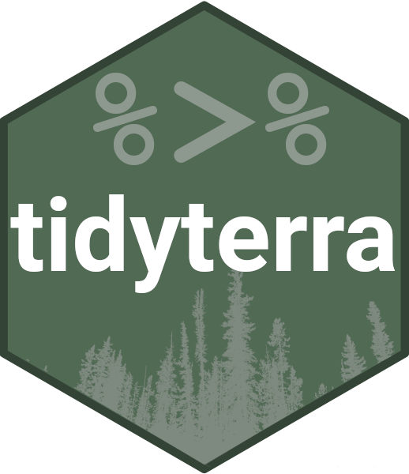

<!-- index.md is generated from index.qmd. Please edit that file -->

# tidyterra <a href="https://dieghernan.github.io/tidyterra/"></a>

<!-- badges: start -->

[](https://CRAN.R-project.org/package=tidyterra)
[](https://cran.r-project.org/web/checks/check_results_tidyterra.html)
[](https://CRAN.R-project.org/package=tidyterra)
[](https://doi.org/10.21105/joss.05751)
[](https://github.com/dieghernan/tidyterra/actions/workflows/check-full.yaml)
[](https://app.codecov.io/gh/dieghernan/tidyterra)
[](https://www.codefactor.io/repository/github/dieghernan/tidyterra)
[](https://dieghernan.r-universe.dev/tidyterra)
[](https://www.repostatus.org/#active)
[](https://stackoverflow.com/questions/tagged/tidyterra)
[](https://github.com/dieghernan/tidyterra/actions/workflows/check-terra-devel.yaml)
[](https://github.com/dieghernan/tidyterra/actions/workflows/check-sf-devel.yaml)
[](https://github.com/dieghernan/tidyterra/actions/workflows/check-ggplot2-devel.yaml)
[](https://github.com/dieghernan/tidyterra/actions/workflows/check-dplyr-readr.yaml)

<!-- badges: end -->

The goal of **tidyterra** is to provide methods from
[**tidyverse**](https://tidyverse.org/packages/) packages for
`SpatRaster` and `SpatVector` objects created with
[**terra**](https://CRAN.R-project.org/package=terra). It also provides
[**ggplot2**](https://ggplot2.tidyverse.org/) geoms and scales for
plotting those objects.

Please cite **tidyterra** as:

Hernangómez, D. (2023). Using the tidyverse with terra objects: the
tidyterra package. *Journal of Open Source Software*, *8*(91), 5751,
<https://doi.org/10.21105/joss.05751>.

A BibTeX entry for LaTeX users is:

``` bib
@article{Hernangómez2023,
  doi = {10.21105/joss.05751},
  url = {https://doi.org/10.21105/joss.05751},
  year = {2023},
  publisher = {The Open Journal},
  volume = {8},
  number = {91},
  pages = {5751},
  author = {Diego Hernangómez},
  title = {Using the {tidyverse} with {terra} objects: the {tidyterra} package},
  journal = {Journal of Open Source Software}
}
```

## Overview

The full manual for the latest release of **tidyterra** on **CRAN** is
online: <https://dieghernan.github.io/tidyterra/>

Methods implemented in **tidyterra** work differently depending on the
type of `Spat*` object:

- `SpatVector`: Methods are implemented using `terra::as.data.frame()`
  coercion. Rows correspond to geometries and columns correspond to
  attributes of each geometry.

- `SpatRaster`: Methods can be applied to layers or cells.
  **tidyterra**’s overall approach is to treat the layers as columns of
  a tibble and the cells as rows. For example, `select(SpatRaster, 1)`
  selects the first layer of a `SpatRaster`.

Implemented methods return the same type of object as the input, unless
the method is expected to return another type of object. For example,
`as_tibble()` returns a tibble.

Current methods and functions provided by **tidyterra** are:

| tidyverse method | `SpatVector` | `SpatRaster` |
|----|----|----|
| `tibble::as_tibble()` | ✔️ | ✔️ |
| `dplyr::select()` | ✔️ | ✔️ Select layers |
| `dplyr::mutate()` | ✔️ | ✔️ Create or modify layers |
| `dplyr::transmute()` | ✔️ | ✔️ |
| `dplyr::filter()` | ✔️ | ✔️ Modify cell values and optionally remove outer cells. |
| `dplyr::filter_out()` | ✔️ |  |
| `dplyr::slice()` | ✔️ | ✔️ Additional methods for slicing by row and column. |
| `dplyr::pull()` | ✔️ | ✔️ |
| `dplyr::rename()` | ✔️ | ✔️ |
| `dplyr::relocate()` | ✔️ | ✔️ |
| `dplyr::distinct()` | ✔️ |  |
| `dplyr::arrange()` | ✔️ |  |
| `dplyr::glimpse()` | ✔️ | ✔️ |
| `dplyr::inner_join()` family | ✔️ |  |
| `dplyr::nest_join()` | ✔️ |  |
| `dplyr::cross_join()` | ✔️ |  |
| `dplyr::summarise()` | ✔️ |  |
| `dplyr::reframe()` | ✔️ |  |
| `dplyr::group_by()` family | ✔️ |  |
| `dplyr::rowwise()` | ✔️ |  |
| `dplyr::count()`, `tally()` | ✔️ |  |
| `dplyr::add_count()` | ✔️ |  |
| `dplyr::rows_*()` | ✔️ |  |
| `dplyr::bind_cols()` / `dplyr::bind_rows()` | ✔️ as `bind_spat_cols()` / `bind_spat_rows()` |  |
| `tidyr::drop_na()` | ✔️ | ✔️ Remove cell values with `NA` on any layer and outer cells with `NA`. |
| `tidyr::complete()` | ✔️ |  |
| `tidyr::expand()` | ✔️ |  |
| `tidyr::replace_na()` | ✔️ | ✔️ |
| `tidyr::fill()` | ✔️ |  |
| `tidyr::nest()` | ✔️ |  |
| `tidyr::pivot_longer()` | ✔️ |  |
| `tidyr::pivot_wider()` | ✔️ |  |
| `tidyr::uncount()` | ✔️ |  |
| `tidyr::unite()` | ✔️ | ✔️ Create a categorical layer. |
| `ggplot2::autoplot()` | ✔️ | ✔️ |
| `ggplot2::fortify()` | ✔️ to **sf** through `sf::st_as_sf()` | To a **tibble** with coordinates. |
| `ggplot2::geom_*()` | ✔️ `geom_spatvector()` | ✔️ `geom_spatraster()` and `geom_spatraster_rgb()`. |
| `generics::tidy()` | ✔️ | ✔️ |
| `generics::glance()` | ✔️ | ✔️ |
| `generics::required_pkgs()` | ✔️ | ✔️ |

<div class="callout callout-style-default callout-important callout-titled">
<div class="callout-header d-flex align-content-center">
<div class="callout-icon-container"><i class="callout-icon"></i></div>
<div class="callout-title-container flex-fill">A note on performance</div></div>
<div class="callout-body-container callout-body">

**tidyterra** is a user-friendly wrapper around **terra** that provides
tidyverse-style methods and verbs. This approach has a **performance
cost**.

If you frequently use **terra** or work with large `SpatRaster` objects,
**terra** is usually much faster. Whenever possible, each **tidyterra**
function refers to its equivalent on **terra**.

As a rule of thumb, if your raster has fewer than 10,000,000 data slots,
for example `terra::ncell(your_rast) * terra::nlyr(your_rast) < 1e7`,
**tidyterra** is a good fit.

When plotting rasters, resampling is performed automatically (as
`terra::plot()` does, see the help page). You can adjust this with the
`maxcell` argument.

</div>
</div>

## Installation

<div class="pkgdown-release">

Install **tidyterra** from
[**CRAN**](https://CRAN.R-project.org/package=tidyterra):

``` r
install.packages("tidyterra")
```

</div>

<div class="pkgdown-devel">

Check the documentation for the development version at
<https://dieghernan.github.io/tidyterra/dev/>

You can install the development version of **tidyterra** with:

``` r
# install.packages("pak")
pak::pak("dieghernan/tidyterra")
```

Alternatively, you can install **tidyterra** using
[r-universe](https://dieghernan.r-universe.dev/tidyterra):

``` r
# Enable this universe
install.packages(
  "tidyterra",
  repos = c(
    "https://dieghernan.r-universe.dev",
    "https://cloud.r-project.org"
  )
)
```

</div>

## Examples

### `SpatRaster` objects

This basic example shows how to manipulate and plot `SpatRaster`
objects:

``` r
library(tidyterra)
library(terra)

# Temperatures
rastertemp <- rast(system.file("extdata/cyl_temp.tif", package = "tidyterra"))

rastertemp
#> class       : SpatRaster
#> size        : 87, 118, 3  (nrow, ncol, nlyr)
#> resolution  : 3881.255, 3881.255  (x, y)
#> extent      : -612335.4, -154347.3, 4283018, 4620687  (xmin, xmax, ymin, ymax)
#> coord. ref. : World_Robinson (ESRI:54030)
#> source      : cyl_temp.tif
#> names       :   tavg_04,   tavg_05,   tavg_06
#> min values  :  1.885463,  5.817587, 10.463377
#> max values  : 13.283829, 16.740898, 21.113781

# Rename
rastertemp <- rastertemp |>
  rename(April = tavg_04, May = tavg_05, June = tavg_06)

# Facet all layers
library(ggplot2)

ggplot() +
  geom_spatraster(data = rastertemp) +
  facet_wrap(~lyr, ncol = 2) +
  scale_fill_whitebox_c(
    palette = "muted",
    labels = scales::label_number(suffix = "º"),
    n.breaks = 12,
    guide = guide_legend(reverse = TRUE)
  ) +
  labs(
    fill = "",
    title = "Average temperature in Castile and Leon (Spain)",
    subtitle = "Months of April, May and June"
  )
```


``` r
# Create the difference between two months.
variation <- rastertemp |>
  mutate(diff = June - May) |>
  select(variation = diff)

# Add a SpatVector overlay.
prov <- vect(system.file("extdata/cyl.gpkg", package = "tidyterra"))

ggplot(prov) +
  geom_spatraster(data = variation) +
  geom_spatvector(fill = NA) +
  scale_fill_whitebox_c(
    palette = "deep",
    direction = -1,
    labels = scales::label_number(suffix = "º"),
    n.breaks = 5
  ) +
  theme_minimal() +
  coord_sf(crs = 25830) +
  labs(
    fill = "Variation",
    title = "Temperature variation in Castile and Leon (Spain)",
    subtitle = "Average temperatures: June vs. May"
  )
```


**tidyterra** also provides a geom for plotting RGB `SpatRaster`
objects, such as map tiles, with **ggplot2**:

``` r
rgb_tile <- rast(system.file("extdata/cyl_tile.tif", package = "tidyterra"))

ggplot(prov) +
  geom_spatraster_rgb(data = rgb_tile) +
  geom_spatvector(fill = NA) +
  theme_light() +
  # Change the CRS and datum (useful for relabeling graticules).
  coord_sf(crs = 3857, datum = 3857)
```


**tidyterra** provides **ggplot2** scales for plotting maps with
hypsometric tints:

``` r
asia <- rast(system.file("extdata/asia.tif", package = "tidyterra"))

ggplot() +
  geom_spatraster(data = asia) +
  scale_fill_hypso_tint_c(
    palette = "gmt_globe",
    labels = scales::label_number(),
    # Further refinements
    breaks = c(-10000, -5000, 0, 2000, 5000, 8000),
    guide = guide_colorbar(reverse = TRUE)
  ) +
  labs(
    fill = "elevation (m)",
    title = "Hypsometric map of Asia"
  ) +
  theme(
    legend.position = "bottom",
    legend.title.position = "top",
    legend.key.width = rel(3),
    legend.ticks = element_line(colour = "black", linewidth = 0.3),
    legend.direction = "horizontal"
  )
```


### `SpatVector` objects

This basic example shows how to manipulate and plot `SpatVector`
objects:

``` r
vect(system.file("ex/lux.shp", package = "terra")) |>
  mutate(pop_dens = POP / AREA) |>
  glimpse() |>
  autoplot(aes(fill = pop_dens)) +
  scale_fill_whitebox_c(palette = "pi_y_g") +
  labs(
    fill = "population per km2",
    title = "Population density of Luxembourg",
    subtitle = "By canton"
  )
#> #  A SpatVector 12 x 7
#> #  Geometry type: Polygons
#> #  Geodetic CRS: lon/lat WGS 84 (EPSG:4326)
#> #  Extent (x / y): ([5° 44' 38.9" E / 6° 31' 41.71" E] , [49° 26' 52.11" N / 50° 10' 53.84" N])
#> 
#> $ ID_1     <dbl> 1, 1, 1, 1, 1, 2, 2, 2, 3, 3, 3, 3
#> $ NAME_1   <chr> "Diekirch", "Diekirch", "Diekirch", "Diekirch", "Diekirch", "…
#> $ ID_2     <dbl> 1, 2, 3, 4, 5, 6, 7, 12, 8, 9, 10, 11
#> $ NAME_2   <chr> "Clervaux", "Diekirch", "Redange", "Vianden", "Wiltz", "Echte…
#> $ AREA     <dbl> 312, 218, 259, 76, 263, 188, 129, 210, 185, 251, 237, 233
#> $ POP      <dbl> 18081, 32543, 18664, 5163, 16735, 18899, 22366, 29828, 48187,…
#> $ pop_dens <dbl> 57.95192, 149.27982, 72.06178, 67.93421, 63.63118, 100.52660,…
```


## Feedback

Please leave your feedback or open an issue on
<https://github.com/dieghernan/tidyterra/issues>.

## Need help?

Check the
[FAQs](https://dieghernan.github.io/tidyterra/articles/faqs.html) or
open a new [issue](https://github.com/dieghernan/tidyterra/issues).

You can also ask in [Stack Overflow](https://stackoverflow.com/) using
the tag
[\[tidyterra\]](https://stackoverflow.com/questions/tagged/tidyterra).

## Acknowledgements

**tidyterra**’s **ggplot2** geoms are based on the
[**ggspatial**](https://github.com/paleolimbot/ggspatial) implementation
by [Dewey Dunnington](https://github.com/paleolimbot) and [**ggspatial**
contributors](https://github.com/paleolimbot/ggspatial/graphs/contributors).
