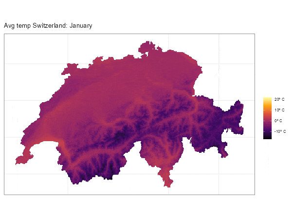

```{r setup, include = FALSE}
knitr::opts_chunk$set(
  collapse = TRUE,
  comment = "#>",
  warning = FALSE,
  message = FALSE,
  dpi = 300,
  cache = FALSE,
  dev = "ragg_png",
  tidy = "styler",
  out.width = "100%"
)

pak::pak("tidyverse/ggplot2")
```

This is a compendium of [questions
arisen](https://github.com/dieghernan/tidyterra/discussions) on the use of the
**tidyterra** package and the potential solutions to it (mostly related with the
use of **terra** and **ggplot2** at this stage). You can ask for help or search
previous questions in the following links.

You can also ask in [Stack Overflow](https://stackoverflow.com/) using the tag
[`tidyterra`](https://stackoverflow.com/questions/tagged/tidyterra).

-   Report a Bug [[link](https://github.com/dieghernan/tidyterra/issues)].
-   Ask a question
    [[link](https://github.com/dieghernan/tidyterra/discussions)].

### Example data

#### Source

This article uses a sample of **LiDAR for Scotland Phase 5 - DSM** provided by
[The Scottish Remote Sensing Portal](https://remotesensingdata.gov.scot/). This
data is made available under the [Open Government Licence
v3](http://www.nationalarchives.gov.uk/doc/open-government-licence/version/3/).

#### About the file

The file `holyroodpark.tif` represents the DEM[^1] of [Holyrood Park, Edinburgh
(Scotland)](https://en.wikipedia.org/wiki/Holyrood_Park), including [Arthur's
Seat](https://en.wikipedia.org/wiki/Arthur%27s_Seat), an extinct volcano, pretty
much as the famous [Maungawhau / Mount
Eden](https://en.wikipedia.org/wiki/Maungawhau_/_Mount_Eden) volcano represented
in `datasets::volcano`.

[^1]: Digital Elevation Model, representing the elevation of the corresponding
    area.

The original file has been cropped and down-sampled for demo purposes,
`holyroodpark.tif` is available online in
<https://github.com/dieghernan/tidyterra/tree/main/data-raw> folder.

## `NA` values are shown in gray color {#nas-remove}

This is the default behavior produced by the **ggplot2** package. **tidyterra**
color scales (i.e., `scale_fill_whitebox_c()`, etc.), has by default the
parameter `na.value` set to `"transparent"`, that prevents `NA` values to be
filled[^2].

[^2]: `na.value = NA` could be used as well for the same purpose in most of the
    cases, however when the proportion of non-`NA`s is small it can produce
    undesired results, see
    [#120](https://github.com/dieghernan/tidyterra/issues/120).

```{r remove-nas}
library(terra)
library(tidyterra)
library(ggplot2)

# Get a raster data from Holyrood Park, Edinburgh
holyrood <- "holyroodpark.tif"

r <- holyrood %>%
  rast() %>%
  filter(elevation > 80 & elevation < 180)

# Default
def <- ggplot() +
  geom_spatraster(data = r)

def +
  labs(
    title = "Default on ggplot2",
    subtitle = "NA values in grey"
  )

# Modify with scales
def +
  scale_fill_continuous(na.value = "transparent") +
  labs(
    title = "Default colors on ggplot2",
    subtitle = "But NAs are not plotted"
  )

# Use a different scale provided by ggplot2
def +
  scale_fill_viridis_c(na.value = "orange") +
  labs(
    title = "Use any fill_* scale of ggplot2",
    subtitle = "Note that na.value = 'orange'"
  )
```

## Labeling contours {#label-contour}

Use `geom_spatraster_contour_text()`
[](https://lifecycle.r-lib.org/articles/stages.html#experimental):

```{r text-contour}
library(terra)
library(tidyterra)
library(ggplot2)

holyrood <- "holyroodpark.tif"

r <- rast(holyrood)

ggplot() +
  geom_spatraster_contour_text(data = r) +
  labs(title = "Labelling contours")


# With options and aes

# Use a labeller function so only selected breaks are labelled
labeller <- function(labs) {
  # Must return a function
  function(x) {
    x[!x %in% labs] <- NA
    scales::label_comma(suffix = " m.")(x)
  }
}

# Common labels across ggplot

labs <- c(100, 140, 180, 220)

ggplot(r) +
  geom_spatraster_contour_text(
    data = r, aes(
      linewidth = after_stat(level),
      size = after_stat(level),
      color = after_stat(level)
    ),
    breaks = seq(100, 250, 10),
    # Just label some isolines
    label_format = labeller(labs = labs),
    family = "mono",
    fontface = "bold"
  ) +
  scale_linewidth_continuous(range = c(0.1, 0.5), breaks = labs) +
  scale_color_gradient(low = "grey50", high = "grey10", breaks = labs) +
  scale_size_continuous(range = c(2, 3), breaks = labs) +
  # Integrate scales
  guides(
    linewidth = guide_legend("meters"),
    size = guide_legend("meters"),
    color = guide_legend("meters")
  ) +
  # Theme and titles
  theme_bw() +
  theme(text = element_text(family = "mono")) +
  labs(
    title = "Labelling contours",
    subtitle = "With options: b/w plot"
  )
```

### Other alternatives

Thanks to `fortify.SpatRaster()` you can use your `SpatRaster` straight away
with the **metR** package (see [Hexagonal grids and other geoms](#fort)). Use
the parameter(s) `bins/binwidth/breaks` to align both labels and lines:

```{r metr}
library(metR)
br <- seq(100, 250, 10)
labs <- c(100, 140, 180, 220)

# Replicate previous map with tidyterra + metR strategy
ggplot(r, aes(x, y)) +
  geom_spatraster_contour(
    data = r,
    aes(
      linewidth = after_stat(level),
      color = after_stat(level)
    ),
    breaks = br,
    # Don't inherit fortified aes
    inherit.aes = FALSE
  ) +
  geom_text_contour(
    aes(
      z = elevation, color = after_stat(level),
      size = after_stat(level)
    ),
    breaks = br,
    # Text options
    check_overlap = TRUE,
    label.placer = label_placer_minmax(),
    stroke = 0.3,
    stroke.colour = "white",
    family = "mono",
    fontface = "bold",
    key_glyph = "path"
  ) +
  scale_linewidth_continuous(range = c(0.1, 0.5), breaks = labs) +
  scale_color_gradient(low = "grey50", high = "grey10", breaks = labs) +
  scale_size_continuous(range = c(2, 3), breaks = labs) +
  # Integrate scales
  guides(
    linewidth = guide_legend("meters"),
    size = guide_legend("meters"),
    color = guide_legend("meters")
  ) +
  # Theme and titles
  theme_bw() +
  theme(text = element_text(family = "mono")) +
  labs(
    title = "Labelling contours",
    subtitle = "tidyterra and metR: b/w plot",
    x = "",
    y = ""
  )
```

## Using a different color scale {#use-scale}

Since **tidyterra** leverages on **ggplot2**, please refer to **ggplot2** use of
scales:

```{r greys}
library(terra)
library(tidyterra)
library(ggplot2)

holyrood <- "holyroodpark.tif"

r <- rast(holyrood)

# Hillshade with grey colors
slope <- terrain(r, "slope", unit = "radians")
aspect <- terrain(r, "aspect", unit = "radians")
hill <- shade(slope, aspect, 10, 340)

ggplot() +
  geom_spatraster(data = hill, show.legend = FALSE) +
  # Note the scale, grey colours
  scale_fill_gradientn(
    colours = grey(0:100 / 100),
    na.value = "transparent"
  ) +
  labs(title = "A hillshade plot with grey colors")
```

## Can I change the default palette of my maps?

Yes, use `options("ggplot2.continuous.fill")` to modify the default colors on
your session.

```{r default}
library(terra)
library(tidyterra)
library(ggplot2)

holyrood <- "holyroodpark.tif"

r <- rast(holyrood)

p <- ggplot() +
  geom_spatraster(data = r)


# Set options
tmp <- getOption("ggplot2.continuous.fill") # store current setting
options(ggplot2.continuous.fill = scale_fill_grass_c)

p

# restore previous setting
options(ggplot2.continuous.fill = tmp)


p
```

## My map tiles are blurry {#blurry-tiles}

This is probably related with the tile itself rather than the package. Most base
tiles are provided in **EPSG:3857**, so check first if your tile has this CRS
and not a different one. Not having **EPSG:3857** may be an indication that the
tile has been reprojected, implied some sort of sampling that causes the
blurriness on your data. Also, modify the parameter `maxcell` to avoid
resampling and force the **ggplot2** map to be on **EPSG:3857** with
`ggplot2::coord_sf(crs = 3857)`:

```{r blurry-tile, fig.show='hold', out.width="50%"}
library(terra)
library(tidyterra)
library(ggplot2)
library(sf)
library(maptiles)

# Get a tile from a point on sf format
p <- st_point(c(-3.166011, 55.945235)) %>%
  st_sfc(crs = 4326) %>%
  st_buffer(500)

tile1 <- get_tiles(p,
  provider = "OpenStreetMap", zoom = 14, cachedir = ".",
  crop = TRUE
)

ggplot() +
  geom_spatraster_rgb(data = tile1) +
  labs(title = "This is a bit blurry...") +
  theme_void()

st_crs(tile1)$epsg

# The tile was in EPSG 4326

# get tile in 3857
p2 <- st_transform(p, 3857)


tile2 <- get_tiles(p2,
  provider = "OpenStreetMap", zoom = 14, cachedir = ".",
  crop = TRUE
)

st_crs(tile2)$epsg

# Now the tile is EPSG:3857

ggplot() +
  geom_spatraster_rgb(data = tile2, maxcell = Inf) +
  # Force crs to be 3857
  coord_sf(crs = 3857) +
  labs(title = "...compared with this one") +
  theme_void()
```

## Avoid degrees labeling on axis {#axis-degrees}

Again, this is the **ggplot2** default, but can be modified with
`ggplot2::coord_sf(datum)` argument:

```{r modify-datum}
library(terra)
library(tidyterra)
library(ggplot2)
library(sf)

holyrood <- "holyroodpark.tif"

r <- rast(holyrood)

ggplot() +
  geom_spatraster(data = r) +
  labs(
    title = "Axis auto-converted to lon/lat",
    subtitle = paste("But SpatRaster is EPSG:", st_crs(r)$epsg)
  )


# Use datum

ggplot() +
  geom_spatraster(data = r) +
  coord_sf(datum = pull_crs(r)) +
  labs(
    title = "Axis on the units of the SpatRaster",
    subtitle = paste("EPSG:", st_crs(r)$epsg)
  )
```

## Modifying the number of breaks on axis {#axis-breaks}

This is a long-standing issue in **ggplot2** (see
[ggplot2/issues/4622](https://github.com/tidyverse/ggplot2/issues/4622)) that is
fixed in versions \> 3.5.1 (in development at the moment of writing):

``` r
# Need ggplot2 > 3.5.1 (dev version at the moment of writing)
pak::pak("tidyverse/ggplot2")
```

```{r breaks}
packageVersion("ggplot2")

library(terra)
library(tidyterra)
library(ggplot2)
library(sf)

holyrood <- "holyroodpark.tif"

r <- rast(holyrood)

ggplot() +
  geom_spatraster(data = r) +
  labs(title = "Default axis breaks")

# Modify breaks on x and y

ggplot() +
  geom_spatraster(data = r) +
  scale_x_continuous(breaks = scales::pretty_breaks(n = 3)) +
  scale_y_continuous(breaks = scales::pretty_breaks(n = 3)) +
  labs(title = "Try to get three breaks on x and y (¿?)")
```

## Plotting a `SpatRaster` with color tables

**tidyterra** has several ways to handle these `SpatRaster` objects. We use the
file `clc_edinburgh.tif`, available online in
<https://github.com/dieghernan/tidyterra/tree/main/data-raw> folder,
representing the information of the Corine Land Cover Dataset (2018) for the
city of Edinburgh[^3].

[^3]: The original file has been cropped, the numeric values have been converted
    to their corresponding labels and factors, and it is has been added the
    corresponding color table as of
    <https://collections.sentinel-hub.com/corine-land-cover/readme.html>.

```{r coltab}
library(terra)
library(tidyterra)
library(ggplot2)

# Get a SpatRaster with coltab
r_coltab <- rast("clc_edinburgh.tif")

has.colors(r_coltab)

r_coltab

# Native handling by terra packages
plot(r_coltab)


# A. autoplot

autoplot(r_coltab, maxcell = Inf) +
  guides(fill = guide_legend(ncol = 1)) +
  ggtitle("autoplot method")

# B. geom_spatraster
ggplot() +
  geom_spatraster(data = r_coltab, maxcell = Inf) +
  guides(fill = guide_legend(ncol = 1)) +
  ggtitle("geom_spatraster method")

# C. Using scale_fill_coltab

g <- ggplot() +
  geom_spatraster(data = r_coltab, use_coltab = FALSE, maxcell = Inf) +
  guides(fill = guide_legend(ncol = 1))


g

# But...
g +
  scale_fill_coltab(data = r_coltab) +
  ggtitle("scale_fill_coltab method")

# D. Extract named colors and scale_fill_manual

cols <- get_coltab_pal(r_coltab)

cols

scales::show_col(cols)

# And now

g +
  scale_fill_manual(
    values = cols, na.value = "transparent",
    na.translate = FALSE
  ) +
  ggtitle("scale_fill_manual method")
```

## Use with gganimate {#gganimate}

Sure! See an example (thanks [\@frzambra](https://github.com/frzambra)):

```{r gganimate, eval=FALSE}
library(gganimate)
library(tidyterra)
library(geodata)
library(ggplot2)

temp <- worldclim_country("che", "tavg", path = ".")

che_cont <- gadm("che", level = 0, path = ".")


temp_m <- crop(temp, che_cont, mask = TRUE)
names(temp_m) <- month.name

anim <- ggplot() +
  geom_spatraster(data = temp_m) +
  scale_fill_viridis_c(
    option = "inferno",
    na.value = "transparent",
    labels = scales::label_number(suffix = "º C")
  ) +
  transition_manual(lyr) +
  theme_bw() +
  theme(
    axis.text = element_blank(),
    axis.ticks = element_blank()
  ) +
  labs(
    title = "Avg temp Switzerland: {current_frame}",
    fill = ""
  )

gganimate::animate(anim, duration = 12, device = "ragg_png")
```

```{r include_gif, echo=FALSE}

```

## North arrows and scale bar

**tidyterra** does not provide these graphical objects for **ggplot2** plots.
However, you can use **ggspatial** functions
(`ggspatial::annotation_north_arrow()` and `ggspatial::annotation_scale()`):

```{r northarrow}
library(terra)
library(tidyterra)
library(ggplot2)
library(ggspatial)

holyrood <- "holyroodpark.tif"

r <- rast(holyrood)

autoplot(r) +
  annotation_north_arrow(
    which_north = TRUE,
    pad_x = unit(0.8, "npc"),
    pad_y = unit(0.75, "npc"),
    style = north_arrow_fancy_orienteering()
  ) +
  annotation_scale(
    height = unit(0.015, "npc"),
    width_hint = 0.5,
    pad_x = unit(0.07, "npc"),
    pad_y = unit(0.07, "npc"),
    text_cex = .8
  )
```

## How to overlay a `SpatRaster` over a RGB tile

This is quite straightforward, just use `geom_spatraster_rgb()` and after that
command just create your layer:

```{r overlay_cont}
library(terra)
library(tidyterra)
library(ggplot2)
library(sf)
# Get example data
library(maptiles)
library(geodata)


# Area of interest
aoi <- gadm(country = "CHE", path = ".", level = 0) %>%
  project("EPSG:3857")

# Tile
rgb_tile <- get_tiles(aoi,
  crop = TRUE, provider = "Esri.WorldShadedRelief",
  zoom = 8, project = FALSE, cachedir = "."
)

# Clim (mean prec)
clim <- worldclim_country("CHE", var = "prec", path = ".") %>%
  project(rgb_tile) %>%
  mask(aoi) %>%
  terra::mean()

# Labels
cap_lab <- paste0(
  c(
    "Tiles © Esri - Source: Esri",
    "Data: © Copyright 2020-2022, worldclim.org."
  ),
  collapse = "\n"
)
tit_lab <- "Average precipitation in Switzerland"

ggplot(aoi) +
  geom_spatraster_rgb(data = rgb_tile, alpha = 1) +
  geom_spatraster(data = clim) +
  geom_spatvector(fill = NA) +
  scale_fill_whitebox_c(
    palette = "deep", alpha = 0.5,
    labels = scales::label_number(suffix = " mm.")
  ) +
  coord_sf(expand = FALSE) +
  labs(
    title = tit_lab,
    subtitle = "With continuous overlay",
    fill = "Precipitation",
    caption = cap_lab
  )
```

We can create another variations with binned legends and filled contours (see
`geom_spatraster_contour_filled()`):

```{r overlay_alt}
# Binned
ggplot(aoi) +
  geom_spatraster_rgb(data = rgb_tile, alpha = 1) +
  geom_spatraster(data = clim) +
  geom_spatvector(fill = NA) +
  scale_fill_whitebox_b(
    palette = "deep", alpha = 0.5,
    n.breaks = 4,
    labels = scales::label_number(suffix = " mm.")
  ) +
  coord_sf(expand = FALSE) +
  labs(
    title = tit_lab,
    subtitle = "With overlay: binned legend",
    fill = "Precipitation",
    caption = cap_lab
  )

# Filled contour
ggplot(aoi) +
  geom_spatraster_rgb(data = rgb_tile, alpha = 1) +
  geom_spatraster_contour_filled(data = clim, bins = 4) +
  geom_spatvector(fill = NA) +
  coord_sf(expand = FALSE) +
  scale_fill_whitebox_d(
    palette = "deep", alpha = 0.5,
    guide = guide_legend(reverse = TRUE)
  ) +
  labs(
    title = tit_lab,
    subtitle = "With overlay and filled contour",
    fill = "Precipitation (mm.)",
    caption = cap_lab
  )
```

## Hexagonal grids (and other `geoms`) {#fort}

By concept the cells of a `SpatRaster` are rectangular, so it is not possible to
create a `SpatRaster` with i.e. hexagonal cells.

But it is possible to create a plot with hexagonal cells thanks to
`fortify.SpatRaster()` and `stat_summary_hex()`. Additional work is needed to
adjust the final plot, specifically it is needed also to use `coord_sf()`:

```{r hex_grid}
library(terra)
library(tidyterra)
library(ggplot2)

holyrood <- "holyroodpark.tif"

r <- rast(holyrood)

# With hex grid
ggplot(r, aes(x, y, z = elevation)) +
  stat_summary_hex(
    fun = mean, color = NA, linewidth = 0,
    # Bins size determines the number of cells displayed
    bins = 30
  ) +
  coord_sf(crs = pull_crs(r)) +
  labs(
    title = "Hexagonal SpatRaster",
    subtitle = "Using fortify (implicit) and stat_summary_hex",
    x = NULL, y = NULL
  )
```

Note that there is no need to make a direct call to `fortify.SpatRaster()`,
since this function is implicitly invoked by **ggplot2** when using
`ggplot(data = a_spatraster)`.

Thanks to this extension mechanism, it is possible to use additional `geoms` and
`stats` provided by **ggplot2**:

```{r alt_points}
# Point plot
ggplot(r, aes(x, y, z = elevation), maxcell = 1000) +
  geom_point(aes(size = elevation, alpha = elevation),
    fill = "darkblue",
    color = "grey50", shape = 21
  ) +
  coord_sf(crs = pull_crs(r)) +
  scale_radius(range = c(1, 5)) +
  scale_alpha(range = c(0.01, 1)) +
  labs(
    title = "SpatRaster as points",
    subtitle = "Using fortify (implicit)",
    x = NULL, y = NULL
  )
```

### tidyterra and metR

**metR** is a package that also provides **ggplot2** extensions, mainly focused
on the analysis of meteorological fields. As shown previously (see [Labeling
contours](#label-contour)) it is possible to use both packages to provide rich
plots.

```{r metr_demo}
# load libraries and files
library(terra)
library(tidyterra)
library(ggplot2)
library(metR)

holyrood <- "holyroodpark.tif"

r <- rast(holyrood)
```

```{r hill}
ggplot(r, aes(x, y)) +
  geom_relief(aes(z = elevation)) +
  geom_spatraster(
    data = r, inherit.aes = FALSE,
    aes(alpha = after_stat(value))
  ) +
  scale_fill_cross_blended_c(breaks = seq(0, 250, 25)) +
  scale_alpha(range = c(1, 0.25)) +
  guides(alpha = "none", fill = guide_legend(reverse = TRUE)) +
  labs(x = "", y = "", title = "tidyterra and metR: reliefs")
```

## Session info

<details>

<summary>Details</summary>

```{r session, echo=FALSE}
if (!require("sessioninfo")) {
  install.packages("sessioninfo")
}
sessioninfo::session_info()
```

</details>
