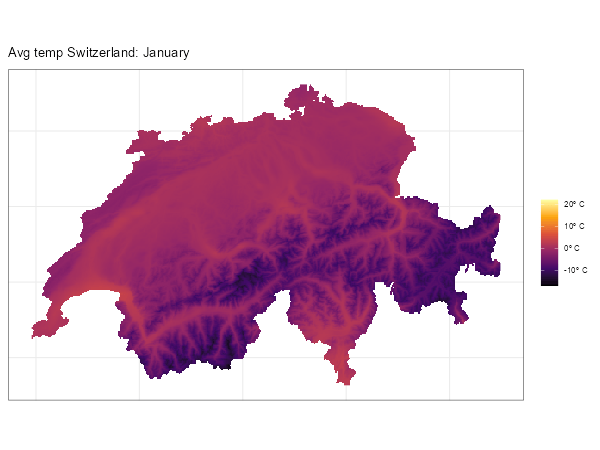

This article collects [frequently asked
questions](https://github.com/dieghernan/tidyterra/discussions) about using
**tidyterra**, with a focus on the integration of **terra** and **ggplot2**. You
can ask for help or search previous questions using the following links.

You can also ask in [Stack Overflow](https://stackoverflow.com/) using the tag
[`tidyterra`](https://stackoverflow.com/questions/tagged/tidyterra).

- Report a bug \[[link](https://github.com/dieghernan/tidyterra/issues)\].
- Ask a question
  \[[link](https://github.com/dieghernan/tidyterra/discussions)\].

### Example data

#### Source

This article uses a sample of **LiDAR for Scotland Phase 5 - DSM** provided by
[The Scottish Remote Sensing Portal](https://remotesensingdata.gov.scot/). These
data are made available under the [Open Government Licence
v3](http://www.nationalarchives.gov.uk/doc/open-government-licence/version/3/).

#### About the file

The file `holyroodpark.tif` represents the DSM[^1] of [Holyrood Park, Edinburgh
(Scotland)](https://en.wikipedia.org/wiki/Holyrood_Park), including [Arthur's
Seat](https://en.wikipedia.org/wiki/Arthur%27s_Seat), an extinct volcano, much
like the well-known [Maungawhau / Mount
Eden](https://en.wikipedia.org/wiki/Maungawhau_/_Mount_Eden) volcano represented
in `datasets::volcano`.

The original file has been cropped and downsampled for demonstration purposes.
`holyroodpark.tif` is available online in the `data-raw` folder at
<https://github.com/dieghernan/tidyterra/tree/main/data-raw>.

## `NA` values are shown in gray {#nas-remove}

This is the default behavior of **ggplot2**. **tidyterra** color scales, such as
`scale_fill_whitebox_c()`, have `na.value = "transparent"` by default, which
prevents `NA` values from being filled[^2].

```{r}
#| label: fig-remove_nas
#| fig-cap: NA values in ggplot2.
#| fig-subcap:
#|   - Default ggplot2 value.
#|   - Plot with transparent NA values.
#|   - NA values mapped with another color.
#| layout-ncol: 1
#| column: page
library(terra)
library(tidyterra)
library(ggplot2)

# Get raster data from Holyrood Park, Edinburgh.
holyrood <- "holyroodpark.tif"

r <- holyrood |>
  rast() |>
  filter(elevation > 80 & elevation < 180)

# Default behavior.
def <- ggplot() +
  geom_spatraster(data = r)

def +
  labs(
    title = "Default in ggplot2",
    subtitle = "NA values in gray"
  )

# Modify with scales.
def +
  scale_fill_continuous(na.value = "transparent") +
  labs(
    title = "Default colors in ggplot2",
    subtitle = "But NA values are not plotted"
  )

# Use a different scale provided by ggplot2.
def +
  scale_fill_viridis_c(na.value = "orange") +
  labs(
    title = "Use any ggplot2 fill scale",
    subtitle = "na.value = 'orange'"
  )
```

## Labeling contours {#label-contour}

Use `geom_spatraster_contour_text()`
[](https://lifecycle.r-lib.org/articles/stages.html#experimental):

```{r}
#| label: fig-textcontour
#| layout-ncol: 1
#| column: page
#| fig-cap: Contour labels with tidyterra.
#| fig-subcap:
#|   - Simple contour labels.
#|   - "Alternative: labeled contours."
library(terra)
library(tidyterra)
library(ggplot2)

holyrood <- "holyroodpark.tif"

r <- rast(holyrood)

ggplot() +
  geom_spatraster_contour_text(data = r) +
  labs(title = "Labeling contours")

# With options and aesthetics.

# Use a labeler function so only selected breaks are labeled.
labeller <- function(labs) {
  # Must return a function.
  function(x) {
    x[!x %in% labs] <- NA
    scales::label_comma(suffix = " m.")(x)
  }
}

# Common labels across the plot.

labs <- c(100, 140, 180, 220)

ggplot(r) +
  geom_spatraster_contour_text(
    data = r,
    aes(
      linewidth = after_stat(level),
      size = after_stat(level),
      color = after_stat(level)
    ),
    breaks = seq(100, 250, 10),
    # Label selected isolines.
    label_format = labeller(labs = labs),
    family = "mono",
    fontface = "bold"
  ) +
  scale_linewidth_continuous(range = c(0.1, 0.5), breaks = labs) +
  scale_color_gradient(low = "grey50", high = "grey10", breaks = labs) +
  scale_size_continuous(range = c(2, 3), breaks = labs) +
  # Integrate scales.
  guides(
    linewidth = guide_legend("meters"),
    size = guide_legend("meters"),
    color = guide_legend("meters")
  ) +
  # Theme and titles.
  theme_bw() +
  theme(text = element_text(family = "mono")) +
  labs(
    title = "Labeling contours",
    subtitle = "With options: black-and-white plot"
  )
```

### Other alternatives

With `fortify.SpatRaster()`, you can use your `SpatRaster` directly with
**metR** (see [Hexagonal grids and other geoms](#fort)). Use `bins`, `binwidth`
or `breaks` to align both labels and lines:

```{r}
#| label: fig-metr
#| fig-cap: "Alternative (metR): contour labeling combining tidyterra and the
#|   **metR** package with customized styling."
library(metR)
br <- seq(100, 250, 10)
labs <- c(100, 140, 180, 220)

# Replicate the previous map with tidyterra and metR.
ggplot(r, aes(x, y)) +
  geom_spatraster_contour(
    data = r,
    aes(
      linewidth = after_stat(level),
      color = after_stat(level)
    ),
    breaks = br,
    # Do not inherit fortified aesthetics.
    inherit.aes = FALSE
  ) +
  geom_text_contour(
    aes(
      z = elevation,
      color = after_stat(level),
      size = after_stat(level)
    ),
    breaks = br,
    # Text options.
    check_overlap = TRUE,
    label.placer = label_placer_minmax(),
    stroke = 0.3,
    stroke.colour = "white",
    family = "mono",
    fontface = "bold",
    key_glyph = "path"
  ) +
  scale_linewidth_continuous(range = c(0.1, 0.5), breaks = labs) +
  scale_color_gradient(low = "grey50", high = "grey10", breaks = labs) +
  scale_size_continuous(range = c(2, 3), breaks = labs) +
  # Integrate scales.
  guides(
    linewidth = guide_legend("meters"),
    size = guide_legend("meters"),
    color = guide_legend("meters")
  ) +
  # Theme and titles.
  theme_bw() +
  theme(text = element_text(family = "mono")) +
  labs(
    title = "Labeling contours",
    subtitle = "tidyterra and metR: black-and-white plot",
    x = "",
    y = ""
  )
```

## Using a different color scale {#use-scale}

Since **tidyterra** builds on **ggplot2**, refer to **ggplot2** documentation on
scales:

```{r}
#| label: fig-greys
#| fig-cap: Hillshade plot using grayscale colors to enhance
#|   terrain relief.
library(terra)
library(tidyterra)
library(ggplot2)

holyrood <- "holyroodpark.tif"

r <- rast(holyrood)

# Hillshade with gray colors.
slope <- terrain(r, "slope", unit = "radians")
aspect <- terrain(r, "aspect", unit = "radians")
hill <- shade(slope, aspect, 10, 340)

ggplot() +
  geom_spatraster(data = hill, show.legend = FALSE) +
  # Use a grayscale palette.
  scale_fill_gradientn(
    colours = grey(0:100 / 100),
    na.value = "transparent"
  ) +
  labs(title = "A hillshade plot with gray colors")
```

## Can I change the default palette of my maps?

Yes, use `options("ggplot2.continuous.fill")` to modify the default colors in
your session.

```{r}
#| label: fig-default
#| layout-ncol: 1
#| column: page
#| fig-cap: Changing default ggplot2 color palettes.
#| fig-subcap:
#|   - Use the new default palette through options.
#|   - Restoring the default palette.
library(terra)
library(tidyterra)
library(ggplot2)

holyrood <- "holyroodpark.tif"

r <- rast(holyrood)

p <- ggplot() +
  geom_spatraster(data = r)

# Set options.
tmp <- getOption("ggplot2.continuous.fill") # store current setting
options(ggplot2.continuous.fill = scale_fill_grass_c)

p

# Restore the previous setting.
options(ggplot2.continuous.fill = tmp)

p
```

## My map tiles are blurry {#blurry-tiles}

Blurriness is typically related to the tile source rather than the package. Most
base tiles are provided in **EPSG:3857**, so verify that your tile uses this CRS
rather than a different one. If your tile is not in **EPSG:3857**, it has likely
been reprojected, which involves resampling and causes blurriness. To avoid
extra resampling, increase the `maxcell` argument and ensure the **ggplot2** map
uses **EPSG:3857** with `ggplot2::coord_sf(crs = 3857)`:

```{r}
#| label: fig-blurrytile
#| fig-cap: "Impact of resampling on tile blurriness."
#| fig-subcap:
#|   - "Plot with resampled raster (EPSG:4326)."
#|   - "Plot with native CRS, not resampled (EPSG:3857)."
#| layout-ncol: 2
#| column: page
library(terra)
library(tidyterra)
library(ggplot2)
library(sf)
library(maptiles)

# Get a tile from a point in sf format.
p <- st_point(c(-3.166011, 55.945235)) |>
  st_sfc(crs = 4326) |>
  st_buffer(500)

tile1 <- get_tiles(
  p,
  provider = "OpenStreetMap",
  zoom = 14,
  cachedir = ".",
  crop = TRUE
)

ggplot() +
  geom_spatraster_rgb(data = tile1) +
  labs(title = "CRS EPSG:4326") +
  theme_void()

st_crs(tile1)$epsg

# The tile was in EPSG:4326.

# Get the tile in EPSG:3857.
p2 <- st_transform(p, 3857)

tile2 <- get_tiles(
  p2,
  provider = "OpenStreetMap",
  zoom = 14,
  cachedir = ".",
  crop = TRUE
)

st_crs(tile2)$epsg

# Now the tile is EPSG:3857.

ggplot() +
  geom_spatraster_rgb(data = tile2, maxcell = Inf) +
  # Force the CRS to EPSG:3857.
  coord_sf(crs = 3857) +
  labs(title = "CRS EPSG:3857") +
  theme_void()
```

## Avoid degree labels on axes {#axis-degrees}

This is the default behavior in **ggplot2**, but you can modify it with the
`datum` argument in `ggplot2::coord_sf()`:

```{r}
#| label: fig-modifydatum
#| layout-ncol: 1
#| column: page
#| fig-cap: Degree labels with ggplot2.
#| fig-subcap:
#|   - "Automatic longitude/latitude axes."
#|   - "Native coordinate system units."
library(terra)
library(tidyterra)
library(ggplot2)
library(sf)

holyrood <- "holyroodpark.tif"

r <- rast(holyrood)

ggplot() +
  geom_spatraster(data = r) +
  labs(
    title = "Axis auto-converted to lon/lat",
    subtitle = paste("But SpatRaster is EPSG:", st_crs(r)$epsg)
  )

# Use datum.

ggplot() +
  geom_spatraster(data = r) +
  coord_sf(datum = pull_crs(r)) +
  labs(
    title = "Axis in the units of the SpatRaster",
    subtitle = paste("EPSG:", st_crs(r)$epsg)
  )
```

## Modify the number of axis breaks {#axis-breaks}

Yes. Use the **scales** package:

```{r}
#| label: fig-breaks
#| layout-ncol: 1
#| column: page
#| fig-cap: Spatial axis breaks with ggplot2.
#| fig-subcap:
#|   - "Default axis breaks."
#|   - "Breaks modified using the **scales** package."

library(terra)
library(tidyterra)
library(ggplot2)
library(sf)

holyrood <- "holyroodpark.tif"

r <- rast(holyrood)

ggplot() +
  geom_spatraster(data = r) +
  labs(title = "Default axis breaks")

# Modify breaks on x and y.
ggplot() +
  geom_spatraster(data = r) +
  scale_y_continuous(breaks = scales::breaks_extended(n = 5)) +
  scale_x_continuous(breaks = scales::breaks_extended(n = 5)) +
  labs(title = "Three breaks on x and y axes with scales::breaks_extended()")
```

## Plotting a `SpatRaster` with color tables

::: callout-note
We omitted the legends in this section's figures to improve readability.
:::

**tidyterra** provides several methods for handling `SpatRaster` objects with
color tables. This example uses `clc_edinburgh.tif`, available online in the
[data-raw folder](https://github.com/dieghernan/tidyterra/tree/main/data-raw).
It contains data from the CORINE Land Cover dataset (2018) for Edinburgh[^3].

```{r}
#| label: fig-coltab
#| fig-cap: "Color tables: native plot with the **terra** package."
library(terra)
library(tidyterra)
library(ggplot2)

# Get a SpatRaster with a color table.
r_coltab <- rast("clc_edinburgh.tif")

has.colors(r_coltab)

r_coltab

# Native handling by terra.
plot(r_coltab, legend = FALSE)
```

```{r}
#| label: fig-tidyterra
#| layout-ncol: 2
#| fig-cap: "Color tables: **tidyterra** methods."
#| fig-subcap:
#|   - "`autoplot()` method."
#|   - "`geom_spatraster()` method."
#|   - "`scale_fill_coltab()` method."
#|   - "Named colors and `scale_fill_manual()` method."

# `autoplot()` method.
autoplot(r_coltab, maxcell = Inf, show.legend = FALSE) +
  labs(title = "autoplot() method")

# `geom_spatraster()` method.
ggplot() +
  geom_spatraster(data = r_coltab, maxcell = Inf, show.legend = FALSE) +
  labs(title = "geom_spatraster() method")

# `scale_fill_coltab()` method.
ggplot() +
  geom_spatraster(
    data = r_coltab,
    use_coltab = FALSE,
    maxcell = Inf,
    show.legend = FALSE
  ) +
  scale_fill_coltab(data = r_coltab) +
  labs(title = "scale_fill_coltab() method")

# Extract named colors and use `scale_fill_manual()`.
cols <- get_coltab_pal(r_coltab)

cols |> head()

# Use the extracted colors.
ggplot() +
  geom_spatraster(
    data = r_coltab,
    use_coltab = FALSE,
    maxcell = Inf,
    show.legend = FALSE
  ) +
  scale_fill_manual(
    values = cols,
    na.value = "transparent",
    na.translate = FALSE
  ) +
  labs(title = "scale_fill_manual() method")
```

## Use with **gganimate** {#gganimate}

Yes. Here is an example, thanks to [\@frzambra](https://github.com/frzambra):

```{r}
#| label: gganimate
#| eval: false
library(gganimate)
library(tidyterra)
library(geodata)
library(ggplot2)

temp <- worldclim_country("che", "tavg", path = ".")

che_cont <- gadm("che", level = 0, path = ".")

temp_m <- crop(temp, che_cont, mask = TRUE)
names(temp_m) <- month.name

anim <- ggplot() +
  geom_spatraster(data = temp_m) +
  scale_fill_viridis_c(
    option = "inferno",
    na.value = "transparent",
    labels = scales::label_number(suffix = "º C")
  ) +
  transition_manual(lyr) +
  theme_bw() +
  theme(
    axis.text = element_blank(),
    axis.ticks = element_blank()
  ) +
  labs(
    title = "Avg temp Switzerland: {current_frame}",
    fill = ""
  )

gganimate::animate(anim, duration = 12, device = "ragg_png")
```

```{r}
#| label: fig-include_gif
#| fig-cap: "Animation of average monthly temperatures."
#| echo: false

```

## North arrows and scale bars

**tidyterra** does not provide north arrows or scale bars directly for
**ggplot2** plots, but you can use **ggspatial** functions
(`ggspatial::annotation_north_arrow()` and `ggspatial::annotation_scale()`):

```{r}
#| label: fig-northarrow
#| fig-cap: "Map with north arrow (top right) and scale bar (bottom left)
#|    annotations added using **ggspatial**."
library(terra)
library(tidyterra)
library(ggplot2)
library(ggspatial)

holyrood <- "holyroodpark.tif"

r <- rast(holyrood)

autoplot(r) +
  annotation_north_arrow(
    which_north = TRUE,
    pad_x = unit(0.8, "npc"),
    pad_y = unit(0.75, "npc"),
    style = north_arrow_fancy_orienteering()
  ) +
  annotation_scale(
    height = unit(0.015, "npc"),
    width_hint = 0.5,
    pad_x = unit(0.07, "npc"),
    pad_y = unit(0.07, "npc"),
    text_cex = 0.8
  )
```

## How to overlay a `SpatRaster` on an RGB tile

Use `geom_spatraster_rgb()` for the RGB `SpatRaster` background tile, then add
your data layers on top:

```{r}
#| label: fig-overlay_cont
#| fig-cap: "Continuous precipitation data overlaid as semi-transparent layer
#|   on RGB satellite imagery."
library(terra)
library(tidyterra)
library(ggplot2)
library(sf)
# Get example data.
library(maptiles)
library(geodata)

# Area of interest.
aoi <- gadm(country = "CHE", path = ".", level = 0) |>
  project("EPSG:3857")

# Tile.
rgb_tile <- get_tiles(
  aoi,
  crop = TRUE,
  provider = "Esri.WorldShadedRelief",
  zoom = 8,
  project = FALSE,
  cachedir = "."
)

# Climate data (mean precipitation).
clim <- worldclim_country("CHE", var = "prec", path = ".") |>
  project(rgb_tile) |>
  mask(aoi) |>
  terra::mean()

# Labels.
cap_lab <- paste0(
  c(
    "Tiles © Esri - Source: Esri",
    "Data: © Copyright 2020-2022, WorldClim.org."
  ),
  collapse = "\n"
)
tit_lab <- "Average precipitation in Switzerland"

ggplot(aoi) +
  geom_spatraster_rgb(data = rgb_tile, alpha = 1) +
  geom_spatraster(data = clim) +
  geom_spatvector(fill = NA) +
  scale_fill_whitebox_c(
    palette = "deep",
    alpha = 0.5,
    labels = scales::label_number(suffix = " mm.")
  ) +
  coord_sf(expand = FALSE) +
  labs(
    title = tit_lab,
    subtitle = "With continuous overlay",
    fill = "Precipitation",
    caption = cap_lab
  )
```

You can create variations with binned legends and filled contours using
`geom_spatraster_contour_filled()`:

```{r}
#| label: fig-overlay_alt
#| layout-ncol: 1
#| column: page
#| fig-cap: Alternative overlay approaches.
#| fig-subcap:
#|   - "Binned precipitation legend."
#|   - "Contour representation."
# Binned legend.
ggplot(aoi) +
  geom_spatraster_rgb(data = rgb_tile, alpha = 1) +
  geom_spatraster(data = clim) +
  geom_spatvector(fill = NA) +
  scale_fill_whitebox_b(
    palette = "deep",
    alpha = 0.5,
    n.breaks = 4,
    labels = scales::label_number(suffix = " mm.")
  ) +
  coord_sf(expand = FALSE) +
  labs(
    title = tit_lab,
    subtitle = "With overlay: binned legend",
    fill = "Precipitation",
    caption = cap_lab
  )

# Filled contour.
ggplot(aoi) +
  geom_spatraster_rgb(data = rgb_tile, alpha = 1) +
  geom_spatraster_contour_filled(data = clim, bins = 4) +
  geom_spatvector(fill = NA) +
  coord_sf(expand = FALSE) +
  scale_fill_whitebox_d(
    palette = "deep",
    alpha = 0.5,
    guide = guide_legend(reverse = TRUE)
  ) +
  labs(
    title = tit_lab,
    subtitle = "With overlay and filled contour",
    fill = "Precipitation (mm)",
    caption = cap_lab
  )
```

## Hexagonal grids and other geoms {#fort}

While `SpatRaster` cells are inherently rectangular, you can create plots with
hexagonal cells using `fortify.SpatRaster()` and `stat_summary_hex()`. The final
plot requires coordinate adjustment with `coord_sf()`:

```{r}
#| label: fig-hex_grid
#| fig-cap: "Elevation data aggregated and visualized as hexagonal grid cells."
library(terra)
library(tidyterra)
library(ggplot2)

holyrood <- "holyroodpark.tif"

r <- rast(holyrood)

# With a hexagonal grid.
ggplot(r, aes(x, y, z = elevation)) +
  stat_summary_hex(
    fun = mean,
    color = NA,
    linewidth = 0,
    # Bin size determines the number of cells displayed.
    bins = 30
  ) +
  coord_sf(crs = pull_crs(r)) +
  labs(
    title = "Hexagonal SpatRaster",
    subtitle = "Using implicit fortify() and stat_summary_hex()",
    x = NULL,
    y = NULL
  )
```

You do not need to call `fortify.SpatRaster()` directly because **ggplot2**
invokes it implicitly when you use `ggplot(data = a_spatraster)`.

Thanks to this extension mechanism, you can use additional geoms and stats from
**ggplot2**:

```{r}
#| label: fig-alt_points
#| fig-cap: "Elevation data represented as points with size and transparency
#|   scaled by elevation values."
# Point plot.
ggplot(r, aes(x, y, z = elevation), maxcell = 1000) +
  geom_point(
    aes(size = elevation, alpha = elevation),
    fill = "darkblue",
    color = "grey50",
    shape = 21
  ) +
  coord_sf(crs = pull_crs(r)) +
  scale_radius(range = c(1, 5)) +
  scale_alpha(range = c(0.01, 1)) +
  labs(
    title = "SpatRaster as points",
    subtitle = "Using implicit fortify()",
    x = NULL,
    y = NULL
  )
```

### **tidyterra** and **metR**

**metR** provides **ggplot2** extensions, primarily for meteorological data
visualization. As shown previously (see [Labeling contours](#label-contour)),
you can combine both packages to create rich, complex plots.

```{r}
#| label: fig-metrdemo
#| fig-cap: "Relief rendering combining tidyterra for raster plotting and
#|   **metR** for terrain relief representation."
# Load libraries and files.
library(terra)
library(tidyterra)
library(ggplot2)
library(metR)

holyrood <- "holyroodpark.tif"

r <- rast(holyrood)

ggplot(r, aes(x, y)) +
  geom_relief(aes(z = elevation)) +
  geom_spatraster(
    data = r,
    inherit.aes = FALSE,
    aes(alpha = after_stat(value))
  ) +
  scale_fill_cross_blended_c(breaks = seq(0, 250, 25)) +
  scale_alpha(range = c(1, 0.25)) +
  guides(alpha = "none", fill = guide_legend(reverse = TRUE)) +
  labs(x = "", y = "", title = "tidyterra and metR: reliefs")
```

[^1]: Digital Surface Model, representing the elevation of the visible surface
    in the corresponding area.

[^2]: `na.value = NA` can also be used for the same purpose in most cases.
    However, when the proportion of non-`NA` cells is small it can produce
    unwanted results. See
    [#120](https://github.com/dieghernan/tidyterra/issues/120).

[^3]: The original file has been cropped, the numeric values have been converted
    to their corresponding labels and factors, and the corresponding color table
    has been added as described in
    <https://collections.sentinel-hub.com/corine-land-cover/readme.html>.
