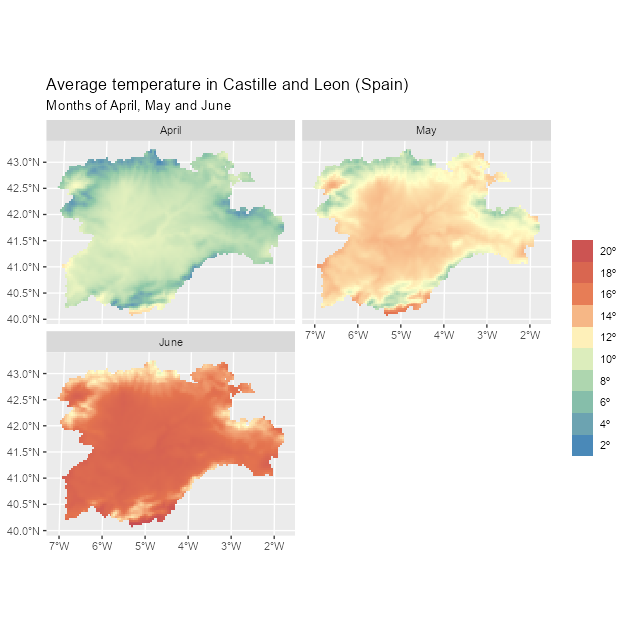
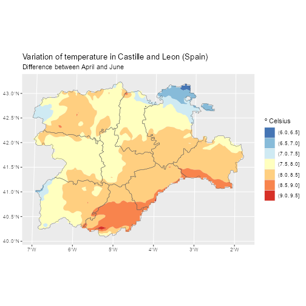

<!-- tidyterra.Rmd is generated from welcome.Rmd.orig. Please edit that file -->


[](https://doi.org/10.21105/joss.05751)

## Summary

**tidyterra** is an **R** [@r-project] package that allows manipulation of
spatial data objects as provided by the **terra** package [@R-terra], using the
verbs of the packages included in the **tidyverse** [@R-tidyverse], such as
**dplyr** [@R-dplyr], **tidyr** [@R-tidyr], or **tibble** [@R-tibble]. This
addition enables users that are already familiar with the **tidyverse** to
approach spatial data manipulation and analysis more easily and much faster.

Furthermore, **tidyterra** extends the functionality of the **ggplot2** package
[@R-ggplot2] by providing additional `geoms` and `stats` [^1] like
`geom_spatraster()` and `geom_spatvector()`, as well as carefully chosen scales
and color palettes specifically designed for map production.

[^1]: The term `geoms` refers to geometric objects, and `stats` refers to
    statistical transformations, following the naming conventions of **ggplot2**

**tidyterra** can manipulate the following classes of **terra** objects:

1.  `SpatVector` objects, which represent vector data such as points, lines, or
    polygon geometries.

2.  `SpatRaster` objects, which represent raster data in the form of a grid
    consisting of equally sized rectangles. Each rectangle can contain one or
    more values.

The first stable version of **tidyterra** was included on CRAN on April 24,
2022, and has been actively used by other packages (such as **ebvcuve**
[@R-ebvcube], **biomod2** [@R-biomod2], **inlabru** [@R-inlabru], **RCzechia**
[@R-rczechia] and **sparrpowR** [@R-sparrpowr]) and cited in academic research
and publications (@bahlburg2023, @moraga2023, @Leonardi2023, @meister2023) ever
since.

## Statement of need

The [**tidyverse**](https://www.tidyverse.org/) is a compilation of **R**
packages that share an underlying design philosophy, grammar, and data
structures. The packages within the tidyverse are widely used by **R** users for
tidying, transforming, and visualizing data.

The **tidyverse** is designed to work with tidy data (*"every column is a
variable, every row is an observation, every cell is a single value"*),
represented in the form of data frames or **tibbles**. However, it is possible
to extend the functionality of **tidyverse** packages to work with new **R**
object classes by registering the corresponding S3 methods [@wickham_s32019].
This means that `dplyr::mutate()` can be adapted to work with any object of
class `foo` by creating the corresponding S3 method `mutate.foo()`.

While other popular packages designed for spatial data handling, such as **sf**
[@R-sf] or **stars** [@R-stars], already provide integration with the
**tidyverse** as part of their infrastructure, **terra** objects lack this
integration natively. Although **terra** offers a wide set of functions for
transforming and visualizing `SpatRaster` and `SpatVector` objects, some users
who are not familiar with this package would need to make an additional effort
to learn that syntax. This may imply an additional challenge during their
initial steps in the field of spatial analysis.

The **tidyterra** package was developed to address this integration gap. By
providing the corresponding S3 methods, data analysts can apply the same syntax
and functions they are already familiar with for rectangular data to the objects
provided by **terra**. This enables users who are not familiar with spatial data
analysis to approach this area more easily.

In addition, **tidyterra** also offers functions for plotting **terra** objects
using the **ggplot2** syntax. Although packages like **rasterVis**
[@R-rastervis] and **ggspatial** [@R-ggspatial] already allow the representation
of `SpatRaster` objects via **ggplot2**, **tidyterra** functions provide
additional support for advanced mapping. This support includes the integration
of faceted maps, contours, and the automatic conversion of spatial layers to the
same CRS[^2] via `ggplot2::coord_sf()`. Furthermore, **tidyterra** also provides
support for `SpatVector` objects, similar to the native support of **sf**
objects in the **ggplot2** package.

[^2]: CRS; Coordinate reference system

Lastly, **tidyterra** provides a collection of color palettes specifically
designed for representing spatial phenomena [@whitebox]. Additionally, it
implements the cross-blended hypsometric tints described by
@Patterson_Jenny_2011.

## A note on performance

The development philosophy of **tidyterra** consists on adapting **terra**
objects to data frame-like structures by performing different data
transformations, that ultimately may impact in the performance of the package.

When manipulating large raster files (i.e. more than 10.000.000 cells), it is
recommended to use the native **terra** syntax, that is specifically designed
for handling this type of files. In the case of plotting, the default behavior
of the geoms provided is to resample `SpatRaster` that presents more than
500.000 cells to speed up the process (as the `terra::plot()` does), however
this upper limit can be modified using the `maxcell` parameter of the geom
function.

Note also that when possible, the help page of each function of **tidyterra**
references its equivalent in **terra**.

## Example of use

**tidyterra** is available on
[**CRAN**](https://CRAN.R-project.org/package=tidyterra), so it can be easily
installed using the following commands in **R**:


``` r
install.packages("tidyterra")
```

The latest developing version is hosted in
[GitHub](https://github.com/dieghernan/tidyterra) and can be installed using the
following command in **R**:


``` r
remotes::install_github("dieghernan/tidyterra")
```

The following example demonstrates how to manipulate a `SpatRaster` object using
the **dplyr** syntax. Additionally, it illustrates how to seamlessly plot a
`SpatRaster` object with **ggplot2** using the `geom_spatraster()` function:


``` r
library(tidyterra)
library(tidyverse) # Load all the packages of tidyverse at once
library(scales) # Additional library for labels

# Temperatures in Castille and Leon (selected months)
rastertemp <- terra::rast(system.file("extdata/cyl_temp.tif",
  package = "tidyterra"
))

# Rename with the tidyverse
rastertemp <- rastertemp %>%
  rename(April = tavg_04, May = tavg_05, June = tavg_06)


# Plot with facets
ggplot() +
  geom_spatraster(data = rastertemp) +
  facet_wrap(~lyr, ncol = 2) +
  scale_fill_whitebox_c(
    palette = "muted",
    labels = label_number(suffix = "º"),
    n.breaks = 12,
    guide = guide_legend(reverse = TRUE)
  ) +
  labs(
    fill = "",
    title = "Average temperature in Castille and Leon (Spain)",
    subtitle = "Months of April, May and June"
  )
```

<div class="figure">

<p class="caption">Faceted map with multi-layer raster file.</p>
</div>

In the following example we combine a common **dplyr** workflow (`mutate()` +
`select()`) and we plot the result. In this case the plot is a contour plot of
the original `SpatRaster` using `geom_spatraster_contour_filled()`and it also
includes an overlay of a `SpatVector` for reference:


``` r
# Compute the variation between April and June and apply a different palette
incr_temp <- rastertemp %>%
  mutate(var = June - April) %>%
  select(Variation = var)

# Overlay an SpatVector
cyl_vect <- terra::vect(system.file("extdata/cyl.gpkg",
  package = "tidyterra"
))

# Contour map with overlay
ggplot() +
  geom_spatraster_contour_filled(data = incr_temp) +
  geom_spatvector(data = cyl_vect, fill = NA) +
  scale_fill_whitebox_d(palette = "bl_yl_rd") +
  theme_grey() +
  labs(
    fill = "º Celsius",
    title = "Variation of temperature in Castille and Leon (Spain)",
    subtitle = "Difference between April and June"
  )
```

<div class="figure">

<p class="caption">Contour map of temperature variation with a SpatVector overlay</p>
</div>

## Additional materials

The package includes extensive documentation available online at
<https://dieghernan.github.io/tidyterra/> including:

-   Details on each function, including (if possible) the equivalent **terra**
    function, in case users prefer to include those on their workflows.
-   Working examples on the use of the functions and creation of plots.
-   Additional articles and vignettes, as well as a complete demo of the
    different color palettes included on the package (see
    [Palettes](https://dieghernan.github.io/tidyterra/articles/palettes.html)).

## Acknowledgements

I would like to thank [Robert J. Hijmans](https://github.com/rhijmans) for his
advice and support in adapting some of the methods, as well as for the
suggestions that helped us improve the functionalities of the package. I am also
thankful to [Dewey Dunnington](https://dewey.dunnington.ca/), Brent Thorne and
the rest of contributors of the **ggspatial** package, which served as a key
reference during the initial stages of the development of **tidyterra**.

**tidyterra** also incorporates some pieces of code adapted from **ggplot2** for
computing contours, which relies on the package **isoband** [@R-isoband]
developed by [Claus O. Wilke](https://clauswilke.com/).

## References
