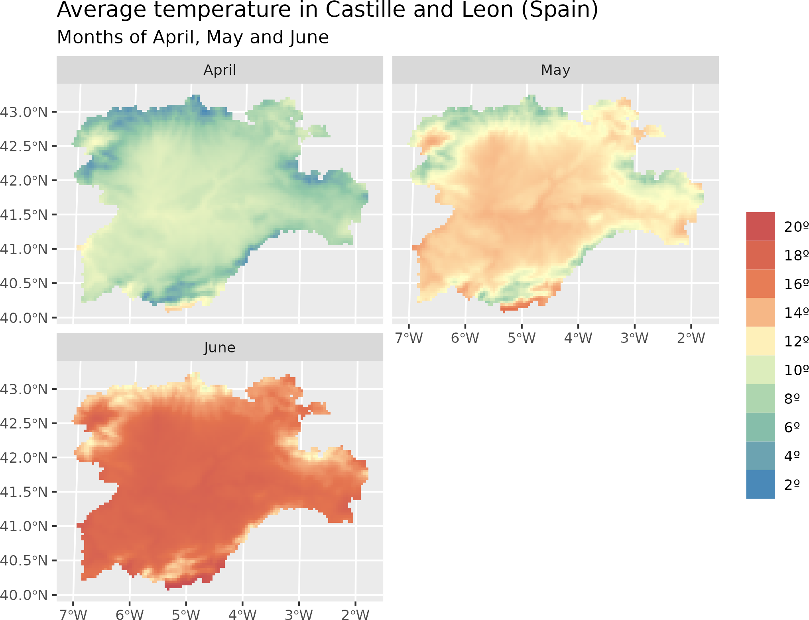

<!-- tidyterra.Rmd is generated from tidyterra.Rmd.orig. Please edit that file -->


# Summary

`tidyterra` is an R [@r-project] package that allows manipulation of spatial
data objects as provided by the `terra` package [@R-terra], using the syntax of
several packages included in the tidyverse [@R-tidyverse], such as `dplyr`
[@R-dplyr], `tidyr` [@R-tidyr], or `tibble` [@R-tibble].

Furthermore, `tidyterra` extends the functionality of the `ggplot2` package
[@R-ggplot2] by providing additional geoms and stats [^1], as well as carefully
chosen scales and color palettes specifically designed for map production.

[^1]: The term "geoms" refers to geometric objects, and "stats" refers to
    statistical transformations, following the naming conventions of `ggplot2`

`tidyterra` can manipulate the following classes of `terra` objects:

1.  `SpatVector` objects, which represent vector data such as points, lines, or
    polygon geometries.

2.  `SpatRaster` objects, which represent raster data in the form of a grid
    consisting of equally sized rectangles. Each rectangle can contain one or
    more values.

The first stable version of `tidyterra` was included on CRAN on April 24, 2022,
and has been actively used by other packages (@R-ebvcube, @R-biomod2,
@R-inlabru, @R-rczechia, @R-sparrpowr) and cited in academic research and
publications (@bahlburg2023, @moraga2023) ever since.

# Statement of need

The [tidyverse](https://www.tidyverse.org/) is a compilation of R packages that
share an underlying design philosophy, grammar, and data structures. The
packages within the tidyverse are widely used by R users for tidying,
transforming, and visualizing data.

The tidyverse is designed to work with tidy data (*"every column is a variable,
every row is an observation, every cell is a single value"*), represented in the
form of data frames or tibbles. However, it is possible to extend the
functionality of tidyverse packages to work with new R object classes by
registering the corresponding S3 methods [@wickham_s32019]. This means that
`dplyr::mutate()` can be adapted to work with any object of class `foo` by
creating the corresponding S3 method `mutate.foo()`.

While other popular packages designed for spatial data handling, such as `sf`
[@R-sf] or `stars` [@R-stars], already provide integration with the tidyverse as
part of their infrastructure, `terra` objects lack this integration natively.
Instead, `terra` offers a wide set of functions with their own syntax for
transforming and visualizing `SpatRaster` and `SpatVector` objects.

The `tidyterra` package was developed to address this integration gap. By
providing the corresponding S3 methods, data analysts can apply the same syntax
and functions they are already familiar with for rectangular data to the objects
provided by `terra.` This enables users who are not familiar with spatial data
analysis to approach this area more easily.

In addition, `tidyterra` also offers functions for plotting `terra` objects
using the `ggplot2` syntax. Although packages like `rasterVis` [@R-rastervis]
and `ggspatial` [@R-ggspatial] already include similar functionality for
`SpatRaster` objects, `tidyterra` functions also support `SpatVector` objects.
Furthermore, `tidyterra` allows users to create faceted maps for multi-layer
raster files and compute contour lines and contour-filled polygons.

Lastly, `tidyterra` provides a collection of color palettes specifically
designed for representing spatial phenomena [@whitebox]. Additionally, it
implements the cross-blended hypsometric tints described by
@Patterson_Jenny_2011.

# A note on performance

The development philosophy of `tidyterra` consists on adapting `terra` objects
to data frame-like structures by performing different data transformations, that
ultimately may impact in the performance of the package.

When working with large raster files (i.e. more than 10.000.000 cells), it is
recommended to use the native `terra` syntax, that is specifically designed for
handling this type of files.

Note also that when possible, the help page of each function of `tidyterra`
references its equivalent in `terra`.

# Examples of use

`tidyterra` is available on
[CRAN](https://CRAN.R-project.org/package=tidyterra), so it can be easily
installed using the following commands in R:


```r
install.packages("tidyterra")
```

The following example demonstrates how to manipulate a `SpatRaster` object using
the `dplyr` syntax. Additionally, it illustrates how to seamlessly plot a
`SpatRaster` object with `ggplot2` using the `geom_spatraster()` function:


```r
library(tidyterra)
library(tidyverse) # Load all the packages of tidyverse at once
library(scales) # Additional library for labels

# Temperatures in Castille and Leon (selected months)
rastertemp <- terra::rast(system.file("extdata/cyl_temp.tif",
  package = "tidyterra"
))

rastertemp
#> class       : SpatRaster
#> dimensions  : 87, 118, 3  (nrow, ncol, nlyr)
#> resolution  : 3881.255, 3881.255  (x, y)
#> extent      : -612335.4, -154347.3, 4283018, 4620687  (xmin, xmax, ymin, ymax)
#> coord. ref. : World_Robinson
#> source      : cyl_temp.tif
#> names       :   tavg_04,   tavg_05,  tavg_06
#> min values  :  1.885463,  5.817587, 10.46338
#> max values  : 13.283829, 16.740898, 21.11378

# Rename with the tidyverse
rastertemp <- rastertemp %>%
  rename(April = tavg_04, May = tavg_05, June = tavg_06)


# Plot with facets
ggplot() +
  geom_spatraster(data = rastertemp) +
  facet_wrap(~lyr, ncol = 2) +
  scale_fill_whitebox_c(
    palette = "muted",
    labels = label_number(suffix = "º"),
    n.breaks = 12,
    guide = guide_legend(reverse = TRUE)
  ) +
  labs(
    fill = "",
    title = "Average temperature in Castille and Leon (Spain)",
    subtitle = "Months of April, May and June"
  )
```

<div class="figure">

<p class="caption"><b>Figure 1:</b> Faceted map with multi-layer raster file.</p>
</div>


```r
# Create maximum differences of two months
variation <- rastertemp %>%
  mutate(diff = June - May) %>%
  select(variation = diff)

# Add also a overlay of a SpatVector
prov <- terra::vect(system.file("extdata/cyl.gpkg", package = "tidyterra"))

ggplot(prov) +
  geom_spatraster(data = variation) +
  geom_spatvector(fill = NA) +
  scale_fill_whitebox_c(
    palette = "deep", direction = -1,
    labels = label_number(suffix = "º"),
    n.breaks = 5
  ) +
  theme_minimal() +
  coord_sf(crs = 25830) +
  labs(
    fill = "variation",
    title = "Variation of temperature in Castille and Leon (Spain)",
    subtitle = "Average temperatures in June vs. May"
  )
```

<div class="figure">

<p class="caption"><b>Figure 2:</b> Mapping a modified `SpatRaster` with an `SpatVector`.</p>
</div>

We present also a basic example of manipulating `SpatVector` objects. In this
example, we classify each province based on the 1833 territorial division of
Spain [@ortiz2011organizacion]:


```r
# Classify the regions into historic regions (1833)
prov_hist <- prov %>%
  mutate(
    historical = ifelse(name %in% c("Leon", "Salamanca", "Zamora"),
      "Region of León",
      "Old Castile"
    ),
    # Reorder levels
    historical = factor(historical,
      levels = c("Region of León", "Old Castile")
    )
  ) %>%
  # Group
  group_by(historical) %>%
  summarise(n_prov = n())


ggplot(prov_hist) +
  geom_spatvector(aes(fill = historical), color = "black") +
  scale_fill_manual(values = c("#a90028", "grey90")) +
  labs(
    fill = "",
    title = "Historic regions of Castille and Leon (Spain)",
    subtitle = "As per the 1833 territorial division of Spain"
  ) +
  theme_minimal()
```

<div class="figure">

<p class="caption"><b>Figure 3:</b> Mapping a modified `SpatVector`.</p>
</div>

# Acknowledgements

I would like to thank Robert J. Hijmans for his advice and support in adapting
some of the methods, as well as for the suggestions that helped us improve the
functionalities of the package. I am also thankful to Dewey Dunnington, Brent
Thorne, and the rest of contributors of the `ggspatial` package, which served as
a key reference during the initial stages of the development of `tidyterra`.

`tidyterra` also incorporates some pieces of code adapted from `ggplot2` for
computing contours, which relies on the package `isoband` [@R-isoband] developed
by Claus O. Wilke.

# References
