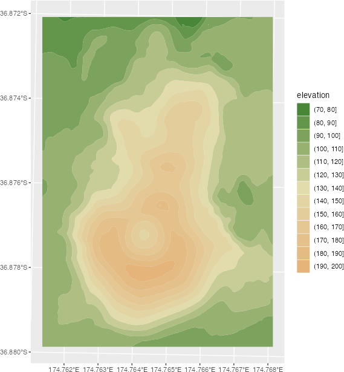
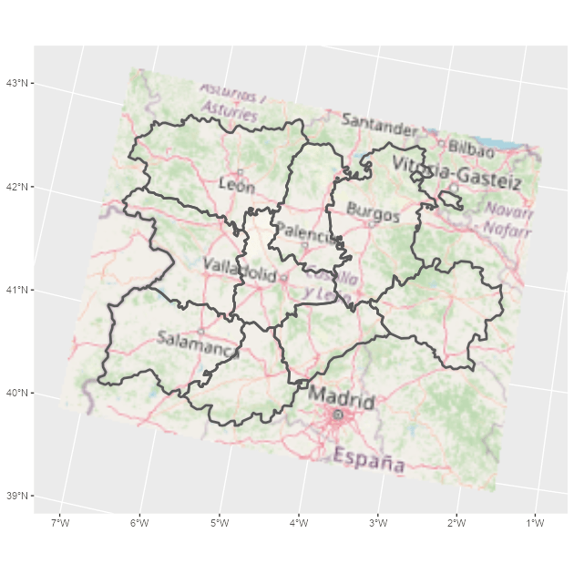
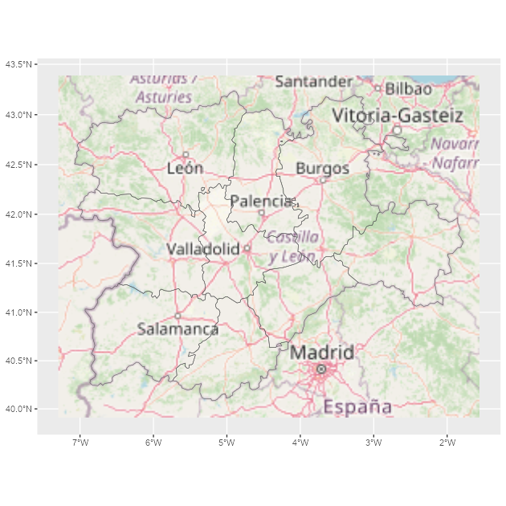

## Welcome to {tidyterra}

**tidyterra** is a package that add common methods from the
[tidyverse](https://www.tidyverse.org/) for SpatRaster and SpatVectors objects
created with the [{terra}](https://CRAN.R-project.org/package=terra) package. It
also adds specific `geom_spat*()` functions for plotting these kind of objects
with [{ggplot2}](https://ggplot2.tidyverse.org/).

### Why {tidyterra}?

Spat\* objects are not like regular data frames. They are a different type of
objects, implemented via the [S4 object system](http://adv-r.had.co.nz/S4.html),
and have their own syntax and computation methods, implemented on the {terra}
package.

By implementing tidyverse methods for these objects, and more specifically
{dplyr} and {tidyr} methods, a use**R** can now work more easily with Spat\*,
just like (s)he would do with tabular data.

**Note that** in terms of performance, {terra} is much more optimized for
working for this kind of objects, so it is **recommended** also to learn a bit
of {terra} syntax. Each function of {tidyterra} refers (when possible) to the
corresponding equivalent on {terra}.

## A note for advanced {terra} users

As previously mentioned, {tidyterra} is not optimized in terms of performance.
Specially when working with `filter()` and `mutate()` methods, it can be slow.

As a rule of thumb, {tidyterra} can handle objects with less than 10.000.000
slots of information(i.e., `terra::ncell(a_rast) * terra::nlyr(a_rast) < 10e6`).

## Get started with {tidyterra}

Load {tidyterra} with additional libraries of the {tidyverse}:


```r
library(tidyterra)
library(dplyr)
library(tidyr)
```

Currently, the following methods are available:

| tidyverse method      | SpatVector                         | SpatRaster                    |
|------------------------|------------------------------------|--------------------|
| `tibble::as_tibble()` | ✔️                                 | ✔️                            |
| `dplyr::filter()`     | ✔️                                 | ✔️                            |
| `dplyr::mutate()`     | ✔️                                 | ✔️                            |
| `dplyr::pull()`       | ✔️                                 | ✔️                            |
| `dplyr::relocate()`   | ✔️                                 | ✔️                            |
| `dplyr::rename()`     | ✔️                                 | ✔️                            |
| `dplyr::select()`     | ✔️                                 | ✔️                            |
| `dplyr::slice()`      | ✔️                                 | ✔️                            |
| `dplyr::transmute()`  | ✔️                                 | ✔️                            |
| `tidyr::drop_na()`    | ✔️                                 | ✔️ (questioned)               |
| `tidyr::replace_na()` | ✔️                                 | ✔️                            |
| `ggplot2::autoplot()` | ✔️                                 | ✔️                            |
| `ggplot2::fortify()`  | ✔️ to **sf** with `sf::st_as_sf()` | ✔️ To tibble with coordinates |

Let's see some of them in action:


```r
library(terra)
f <- system.file("extdata/cyl_temp.tif", package = "tidyterra")

temp <- rast(f)

temp
#> class       : SpatRaster 
#> dimensions  : 89, 116, 3  (nrow, ncol, nlyr)
#> resolution  : 3856.617, 3856.617  (x, y)
#> extent      : 2893583, 3340950, 2019451, 2362690  (xmin, xmax, ymin, ymax)
#> coord. ref. : ETRS89-extended / LAEA Europe (EPSG:3035) 
#> source      : cyl_temp.tif 
#> names       :   tavg_04,   tavg_05,   tavg_06 
#> min values  :  0.565614,  4.294102,  8.817221 
#> max values  : 13.283829, 16.740898, 21.113781

mod <- temp %>%
  select(-1) %>%
  mutate(newcol = tavg_06 - tavg_05) %>%
  relocate(newcol, .before = 1) %>%
  replace_na(list(newcol = 3)) %>%
  rename(difference = newcol)

mod
#> class       : SpatRaster 
#> dimensions  : 89, 116, 3  (nrow, ncol, nlyr)
#> resolution  : 3856.617, 3856.617  (x, y)
#> extent      : 2893583, 3340950, 2019451, 2362690  (xmin, xmax, ymin, ymax)
#> coord. ref. : ETRS89-extended / LAEA Europe (EPSG:3035) 
#> sources     : memory  
#>               memory  
#>               memory  
#> names       : difference,   tavg_05,   tavg_06 
#> min values  :   2.786910,  4.294102,  8.817221 
#> max values  :   5.408157, 16.740898, 21.113781
```

On the previous example, we had:

-   Eliminated the first layer of the raster `tavg_04`.

-   Created a new layer `newcol` as the difference of the layers `tavg_05` and
    `tavg_06.`

-   Relocated `newcol`as the first layer of the SpatRaster

-   Replaced the `NA` cells on `newcol` with `3`.

-   Renamed `newcol` to difference.

In all the process, the essential properties of the SpatRaster (number of cells,
columns and rows, extent, resolution and coordinate reference system) have not
been modified. Other methods as `filter()`, `slice()` or `drop_na()` can modify
these properties, as they would do when applied to a data frame (number of rows
would be modified on that case).

## Plotting with {ggplot2}

### SpatRasters

{tidyterra} provides several `geom_*` for SpatRasters. When the SpatRaster has
the CRS informed (i.e. `terra::crs(a_rast) != ""`), the geom uses
`ggplot2::coord_sf()`, and may be also reprojected for adjusting the coordinates
to other spatial layers:


```r

library(ggplot2)

# A faceted SpatRaster

ggplot() +
  geom_spatraster(data = temp) +
  facet_wrap(~lyr) +
  scale_fill_whitebox_c(
    palette = "muted",
    na.value = "white"
  )
```


```r


# Contour lines for a specific layer

f_volcano <- system.file("extdata/volcano2.tif", package = "tidyterra")
volcano2 <- rast(f_volcano)

ggplot() +
  geom_spatraster(data = volcano2) +
  geom_spatraster_contour(data = volcano2, breaks = seq(80, 200, 5)) +
  scale_fill_whitebox_c() +
  coord_sf(expand = FALSE) +
  labs(fill = "elevation")
```


```r


# Contour filled

ggplot() +
  geom_spatraster_contour_filled(data = volcano2) +
  scale_fill_whitebox_d(palette = "atlas") +
  labs(fill = "elevation")
```



With {tidyterra} you can also plot RGB SpatRasters to add imagery to your plots:


```r

# Read a vector

f_v <- system.file("extdata/cyl.gpkg", package = "tidyterra")
v <- vect(f_v)

# Read a tile
f_rgb <- system.file("extdata/cyl_tile.tif", package = "tidyterra")

r_rgb <- rast(f_rgb)

rgb_plot <- ggplot(v) +
  geom_spatraster_rgb(data = r_rgb) +
  geom_spatvector(fill = NA, size = 1)

rgb_plot
```



```r
# Change CRS automatically

rgb_plot +
  coord_sf(crs = 3035)
```



{tidyterra} provides selected scales that are suitable for creating hypsometric
and bathymetric maps:


```r

asia <- rast(system.file("extdata/asia.tif", package = "tidyterra"))

asia
#> class       : SpatRaster 
#> dimensions  : 232, 432, 1  (nrow, ncol, nlyr)
#> resolution  : 22550.66, 22512.94  (x, y)
#> extent      : 7619120, 17361007, -1304745, 3918256  (xmin, xmax, ymin, ymax)
#> coord. ref. : WGS 84 / Pseudo-Mercator (EPSG:3857) 
#> source      : asia.tif 
#> name        : file44bc291153f2 
#> min value   :        -10071.50 
#> max value   :          6064.73

ggplot() +
  geom_spatraster(data = asia) +
  scale_fill_hypso_tint_c(
    palette = "gmt_globe",
    labels = scales::label_number(),
    breaks = c(-10000, -5000, 0, 2500, 5000, 8000),
    guide = guide_colorbar(
      direction = "horizontal",
      title.position = "top",
      barwidth = 20
    )
  ) +
  labs(
    fill = "elevation (m)",
    title = "Hypsometric map of Asia"
  ) +
  theme_minimal() +
  theme(legend.position = "bottom")
```


### SpatVectors

{tidyterra} allows you to plot SpatVectors with {ggplot2} using the
`geom_spatvector()` functions:


```r
lux <- system.file("ex/lux.shp", package = "terra")

v_lux <- terra::vect(lux)

ggplot(v_lux) +
  geom_spatvector(aes(fill = POP)) +
  geom_spatvector_text(aes(label = NAME_2), color = "grey90") +
  scale_fill_binned(labels = scales::number_format()) +
  coord_sf(crs = 3857)
```


The underlying implementation is to take advantage of the conversion
`terra::vect()/sf::st_as_sf()` (see [**About SpatVectors**](#about)) and use
`ggplot2::geom_sf()` as an endpoint for creating the layer.

### About SpatVectors {#about}

SpatVector objects are vector data. This means that they are a set of individual
points with geographic information (i.e. location of restaurants), that can be
also grouped to form lines (i.e. a river) and, when these lines forms a closed
polygon, a spatial polygon (i.e. a country).

{terra} can handle vector files on the S4 system. There is other alternative,
the {sf} package, that represents the same information on a tabular way. You can
convert easily between the two packages like this:


```r
lux <- system.file("ex/lux.shp", package = "terra") %>%
  terra::vect()


terra::plot(lux, main = "SpatVector", axes = TRUE)
```


```r


# To sf
sfobj <- sf::st_as_sf(lux)
head(sfobj, 3)
#> Simple feature collection with 3 features and 6 fields
#> Geometry type: POLYGON
#> Dimension:     XY
#> Bounding box:  xmin: 5.746118 ymin: 49.69933 xmax: 6.315773 ymax: 50.18162
#> Geodetic CRS:  WGS 84
#>   ID_1   NAME_1 ID_2   NAME_2 AREA   POP                       geometry
#> 1    1 Diekirch    1 Clervaux  312 18081 POLYGON ((6.026519 50.17767...
#> 2    1 Diekirch    2 Diekirch  218 32543 POLYGON ((6.178368 49.87682...
#> 3    1 Diekirch    3  Redange  259 18664 POLYGON ((5.881378 49.87015...

plot(sfobj$geometry, main = "sf", axes = TRUE)
```


```r

# Back to terra

lux2 <- terra::vect(sfobj)

lux2
#>  class       : SpatVector 
#>  geometry    : polygons 
#>  dimensions  : 12, 6  (geometries, attributes)
#>  extent      : 5.74414, 6.528252, 49.44781, 50.18162  (xmin, xmax, ymin, ymax)
#>  coord. ref. : lon/lat WGS 84 (EPSG:4326) 
#>  names       :  ID_1   NAME_1  ID_2   NAME_2  AREA   POP
#>  type        : <num>    <chr> <num>    <chr> <num> <int>
#>  values      :     1 Diekirch     1 Clervaux   312 18081
#>                    1 Diekirch     2 Diekirch   218 32543
#>                    1 Diekirch     3  Redange   259 18664
```

On that sense, {sf} already has its own implementation of {tidyverse} methods.
Since converting SpatVector to {sf} it is straightforward with no loss of
information, {tidyterra} is specially focused on SpatRasters. See an example of
how to work with {terra} + {sf} + {dplyr}:


```r
library(dplyr)
library(terra)
library(sf)

lux_summ <- lux2 %>%
  # to sf
  st_as_sf() %>%
  # dplyr
  group_by(ID_1) %>%
  summarise(TOTPOP = sum(POP)) %>%
  # back to terra
  vect()

lux_summ
#>  class       : SpatVector 
#>  geometry    : polygons 
#>  dimensions  : 3, 2  (geometries, attributes)
#>  extent      : 5.74414, 6.528252, 49.44781, 50.18162  (xmin, xmax, ymin, ymax)
#>  coord. ref. : lon/lat WGS 84 (EPSG:4326) 
#>  names       :  ID_1 TOTPOP
#>  type        : <num>  <int>
#>  values      :     1  91186
#>                    2  71093
#>                    3 439726

terra::plot(lux_summ, "TOTPOP")
```


