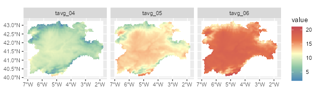
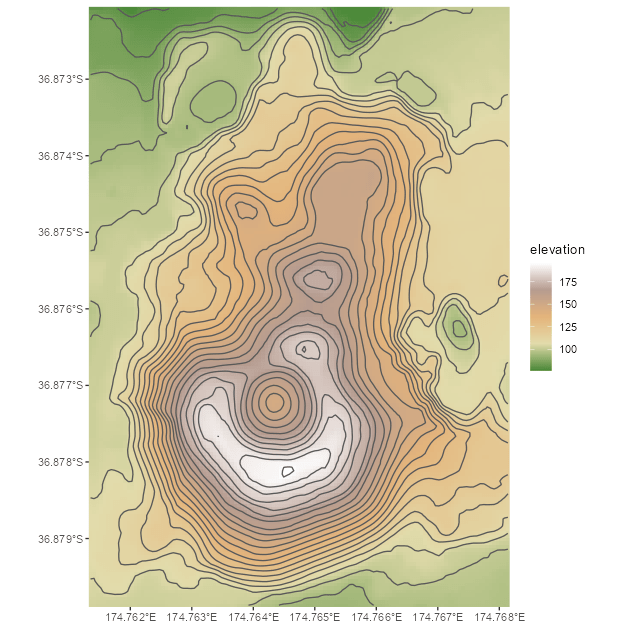
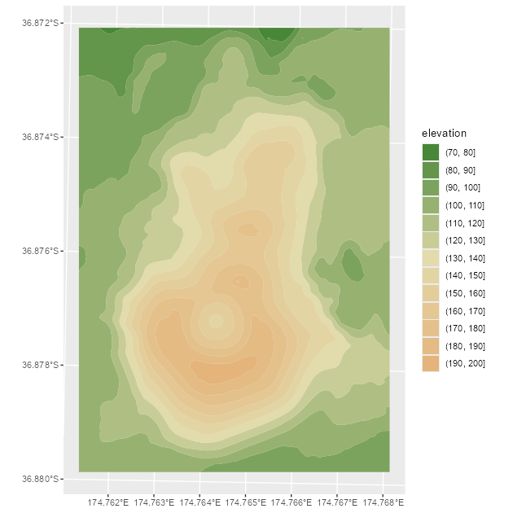
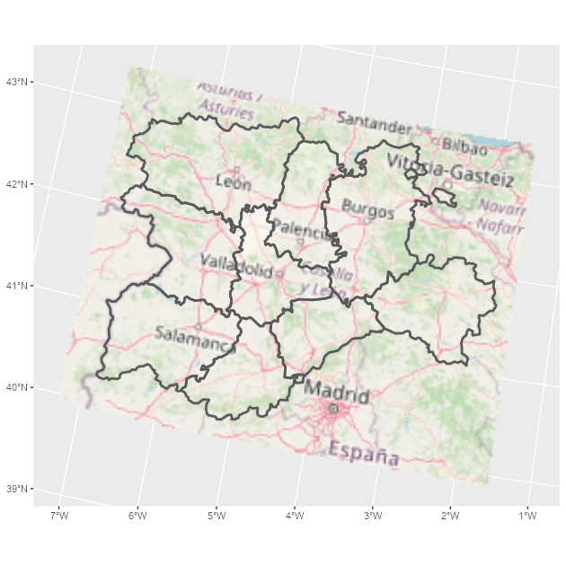
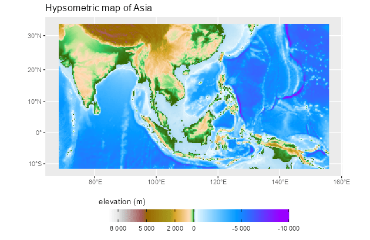

<!-- tidyterra.qmd is generated from tidyterra.qmd.orig. Please edit that file -->


## tidyterra

**tidyterra** provides methods from **tidyverse** packages for `SpatRaster` and
`SpatVector` objects created with
[**terra**](https://CRAN.R-project.org/package=terra). It also provides
`geom_spat*()` geoms and scales for plotting those objects with
[**ggplot2**](https://ggplot2.tidyverse.org/).

### Why tidyterra?

`Spat*` objects differ from regular data frames: they are S4 objects with their
own syntax and computational methods (implemented in **terra**). By providing
**tidyverse** verbs, especially **dplyr** and **tidyr** methods, **tidyterra**
lets users manipulate `Spat*` objects in a style familiar from tabular data
workflows.

**terra** is generally faster. Learning some **terra** syntax is recommended
because **tidyterra** functions call the corresponding **terra** equivalents
when possible.

## A note for advanced **terra** users

**tidyterra** is not optimized for performance. Operations such as `filter()`
and `mutate()` can be slower than their **terra** counterparts.

As a rule of thumb, **tidyterra** is most suitable for objects with fewer than
10,000,000 data slots, for example
`terra::ncell(a_rast) * terra::nlyr(a_rast) < 1e7`.

## Get started with tidyterra

Load **tidyterra** together with core tidyverse packages:


``` r
library(tidyterra)
#> 
#> Adjuntando el paquete: 'tidyterra'
#> The following object is masked from 'package:stats':
#> 
#>     filter
library(dplyr)
#> 
#> Adjuntando el paquete: 'dplyr'
#> The following objects are masked from 'package:stats':
#> 
#>     filter, lag
#> The following objects are masked from 'package:base':
#> 
#>     intersect, setdiff, setequal, union
library(tidyr)
```

The following methods are available:

| tidyverse method | `SpatVector` | `SpatRaster` |
|----|----|----|
| `tibble::as_tibble()` | ✔️ | ✔️ |
| `dplyr::select()` | ✔️ | ✔️ Select layers |
| `dplyr::mutate()` | ✔️ | ✔️ Create or modify layers |
| `dplyr::transmute()` | ✔️ | ✔️ |
| `dplyr::filter()` | ✔️ | ✔️ Modify cell values and optionally remove outer cells. |
| `dplyr::filter_out()` | ✔️ |  |
| `dplyr::slice()` | ✔️ | ✔️ Additional methods for slicing by row and column. |
| `dplyr::pull()` | ✔️ | ✔️ |
| `dplyr::rename()` | ✔️ | ✔️ |
| `dplyr::relocate()` | ✔️ | ✔️ |
| `dplyr::distinct()` | ✔️ |  |
| `dplyr::arrange()` | ✔️ |  |
| `dplyr::glimpse()` | ✔️ | ✔️ |
| `dplyr::inner_join()` family | ✔️ |  |
| `dplyr::nest_join()` | ✔️ |  |
| `dplyr::cross_join()` | ✔️ |  |
| `dplyr::summarise()` | ✔️ |  |
| `dplyr::reframe()` | ✔️ |  |
| `dplyr::group_by()` family | ✔️ |  |
| `dplyr::rowwise()` | ✔️ |  |
| `dplyr::count()`, `tally()` | ✔️ |  |
| `dplyr::add_count()` | ✔️ |  |
| `dplyr::rows_*()` | ✔️ |  |
| `dplyr::bind_cols()` / `dplyr::bind_rows()` | ✔️ as `bind_spat_cols()` / `bind_spat_rows()` |  |
| `tidyr::drop_na()` | ✔️ | ✔️ Remove cell values with `NA` on any layer and outer cells with `NA`. |
| `tidyr::complete()` | ✔️ |  |
| `tidyr::expand()` | ✔️ |  |
| `tidyr::replace_na()` | ✔️ | ✔️ |
| `tidyr::fill()` | ✔️ |  |
| `tidyr::nest()` | ✔️ |  |
| `tidyr::pivot_longer()` | ✔️ |  |
| `tidyr::pivot_wider()` | ✔️ |  |
| `tidyr::uncount()` | ✔️ |  |
| `tidyr::unite()` | ✔️ | ✔️ Create a categorical layer. |
| `ggplot2::autoplot()` | ✔️ | ✔️ |
| `ggplot2::fortify()` | ✔️ to **sf** through `sf::st_as_sf()` | To a **tibble** with coordinates. |
| `ggplot2::geom_*()` | ✔️ `geom_spatvector()` | ✔️ `geom_spatraster()` and `geom_spatraster_rgb()`. |
| `generics::tidy()` | ✔️ | ✔️ |
| `generics::glance()` | ✔️ | ✔️ |
| `generics::required_pkgs()` | ✔️ | ✔️ |

The following sections show some of these methods in action.

### `SpatRaster` objects

This example uses a `SpatRaster`:


``` r
library(terra)
f <- system.file("extdata/cyl_temp.tif", package = "tidyterra")

temp <- rast(f)

temp
#> class       : SpatRaster
#> size        : 87, 118, 3  (nrow, ncol, nlyr)
#> resolution  : 3881.255, 3881.255  (x, y)
#> extent      : -612335.4, -154347.3, 4283018, 4620687  (xmin, xmax, ymin, ymax)
#> coord. ref. : World_Robinson (ESRI:54030)
#> source      : cyl_temp.tif
#> names       :   tavg_04,   tavg_05,   tavg_06
#> min values  :  1.885463,  5.817587, 10.463377
#> max values  : 13.283829, 16.740898, 21.113781

mod <- temp |>
  select(-1) |>
  mutate(newcol = tavg_06 - tavg_05) |>
  relocate(newcol, .before = 1) |>
  replace_na(list(newcol = 3)) |>
  rename(difference = newcol)

mod
#> class       : SpatRaster
#> size        : 87, 118, 3  (nrow, ncol, nlyr)
#> resolution  : 3881.255, 3881.255  (x, y)
#> extent      : -612335.4, -154347.3, 4283018, 4620687  (xmin, xmax, ymin, ymax)
#> coord. ref. : World_Robinson (ESRI:54030)
#> source(s)   : memory
#> names       : difference,   tavg_05,   tavg_06
#> min values  :   2.817647,  5.817587, 10.463377
#> max values  :   5.307511, 16.740898, 21.113781
```

In this example we:

- Removed the first layer (`tavg_04`).
- Created a new layer `newcol` as the difference between `tavg_06` and
  `tavg_05`.
- Relocated `newcol` to be the first layer.
- Replaced `NA` values in `newcol` with `3`.
- Renamed `newcol` to `difference`.

Throughout these steps, core properties of the `SpatRaster`, including number of
cells, rows, columns, extent, resolution and CRS, remain unchanged. Other verbs
such as `filter()`, `slice()` or `drop_na()` may alter these properties in a
manner analogous to row operations on data frames.

### `SpatVector` objects

Most **dplyr** and **tidyr** verbs work with `SpatVector` objects, so you can
arrange, group and summarize their attributes.


``` r
lux <- system.file("ex/lux.shp", package = "terra")

v_lux <- vect(lux)

v_lux |>
  # Create categories.
  mutate(gr = cut(POP / 1000, 5)) |>
  group_by(gr) |>
  # Summarize by group.
  summarise(
    n = n(),
    tot_pop = sum(POP),
    mean_area = mean(AREA)
  ) |>
  # Arrange groups.
  arrange(desc(gr))
#> class       : SpatVector
#> geometry    : polygons
#> dimensions  : 3, 4  (geometries, attributes)
#> extent      : 5.74414, 6.528252, 49.44781, 50.18162  (xmin, xmax, ymin, ymax)
#> coord. ref. : lon/lat WGS 84 (EPSG:4326)
#> names       :          gr     n tot_pop mean_area
#> type        :      <fact> <int>   <num>     <num>
#> values      :   (147,183]     2  359427       244
#>               (40.7,76.1]     1   48187       185
#>               (4.99,40.7]     9  194391   209.778
```

As with `SpatRaster`, essential properties such as geometry and CRS are
preserved during these operations.

## Plotting with ggplot2

### `SpatRaster` objects

When a `SpatRaster` has a CRS defined (`terra::crs(a_rast) != ""`), the geom
uses `ggplot2::coord_sf()` and can reproject the raster to match other spatial
layers.


``` r
library(ggplot2)

# Facet a SpatRaster object.

ggplot() +
  geom_spatraster(data = temp) +
  facet_wrap(~lyr) +
  scale_fill_whitebox_c(
    palette = "muted",
    na.value = "white"
  )
```

<div class="figure">

<p class="caption">Faceted map using a SpatRaster object.</p>
</div>


``` r
# Contour lines for a specific layer.

f_volcano <- system.file("extdata/volcano2.tif", package = "tidyterra")
volcano2 <- rast(f_volcano)

ggplot() +
  geom_spatraster(data = volcano2) +
  geom_spatraster_contour(data = volcano2, breaks = seq(80, 200, 5)) +
  scale_fill_whitebox_c() +
  coord_sf(expand = FALSE) +
  labs(fill = "elevation")
```

<div class="figure">

<p class="caption">Contour line plot for a SpatRaster object.</p>
</div>


``` r
# Filled contours.

ggplot() +
  geom_spatraster_contour_filled(data = volcano2) +
  scale_fill_whitebox_d(palette = "atlas") +
  labs(fill = "elevation")
```

<div class="figure">

<p class="caption">Filled contour plot for a SpatRaster object.</p>
</div>

**tidyterra** also supports RGB `SpatRaster` objects for imagery:


``` r
# Read a vector.

f_v <- system.file("extdata/cyl.gpkg", package = "tidyterra")
v <- vect(f_v)

# Read a tile.
f_rgb <- system.file("extdata/cyl_tile.tif", package = "tidyterra")

r_rgb <- rast(f_rgb)

rgb_plot <- ggplot(v) +
  geom_spatraster_rgb(data = r_rgb) +
  geom_spatvector(fill = NA, size = 1)

rgb_plot
```

<div class="figure">

<p class="caption">Map combining an RGB SpatRaster object and a SpatVector object.</p>
</div>

**tidyterra** includes color scales and hypsometric tints suitable for
topographic and bathymetric maps:


``` r
asia <- rast(system.file("extdata/asia.tif", package = "tidyterra"))

asia
#> class       : SpatRaster
#> size        : 164, 306, 1  (nrow, ncol, nlyr)
#> resolution  : 31836.23, 31847.57  (x, y)
#> extent      : 7619120, 1.736101e+07, -1304745, 3918256  (xmin, xmax, ymin, ymax)
#> coord. ref. : WGS 84 / Pseudo-Mercator (EPSG:3857)
#> source      : asia.tif
#> name        : file44bc291153f2
#> min value   :     -9558.467773
#> max value   :      5801.927246

ggplot() +
  geom_spatraster(data = asia) +
  scale_fill_hypso_tint_c(
    palette = "gmt_globe",
    labels = scales::label_number(),
    # Further refinements
    breaks = c(-10000, -5000, 0, 2000, 5000, 8000),
    guide = guide_colorbar(reverse = TRUE)
  ) +
  labs(
    fill = "elevation (m)",
    title = "Hypsometric map of Asia"
  ) +
  theme(
    legend.position = "bottom",
    legend.title.position = "top",
    legend.key.width = rel(3),
    legend.ticks = element_line(colour = "black", linewidth = 0.3),
    legend.direction = "horizontal"
  )
```

<div class="figure">

<p class="caption">Map of Asia including hypsometric tints.</p>
</div>

### `SpatVector` objects

Plot `SpatVector` objects with `geom_spatvector()`:


``` r
lux <- system.file("ex/lux.shp", package = "terra")

v_lux <- terra::vect(lux)

ggplot(v_lux) +
  geom_spatvector(aes(fill = POP), color = "white") +
  geom_spatvector_text(aes(label = NAME_2), color = "grey90") +
  scale_fill_binned(labels = scales::number_format()) +
  coord_sf(crs = 3857)
```

<div class="figure">

<p class="caption">Choropleth map with a SpatVector object.</p>
</div>

Internally, **tidyterra** converts `terra::vect()` output to **sf** with
`sf::st_as_sf()` and then uses `ggplot2::geom_sf()` to render the layer.

You can also aggregate `SpatVector` objects easily:


``` r
# Dissolve by group.
v_lux |>
  # Create categories.
  mutate(gr = cut(POP / 1000, 5)) |>
  group_by(gr) |>
  # Summarize by group.
  summarise(
    n = n(),
    tot_pop = sum(POP),
    mean_area = mean(AREA)
  ) |>
  ggplot() +
  geom_spatvector(aes(fill = tot_pop), color = "black") +
  geom_spatvector_label(aes(label = gr)) +
  coord_sf(crs = 3857)
```

<div class="figure">

<p class="caption">Dissolving SpatVector objects by group.</p>
</div>

``` r

# Repeat while keeping internal boundaries.
v_lux |>
  # Create categories.
  mutate(gr = cut(POP / 1000, 5)) |>
  group_by(gr) |>
  # Summarize by group without dissolving.
  summarise(
    n = n(),
    tot_pop = sum(POP),
    mean_area = mean(AREA),
    .dissolve = FALSE
  ) |>
  ggplot() +
  geom_spatvector(aes(fill = tot_pop), color = "black") +
  geom_spatvector_label(aes(label = gr)) +
  coord_sf(crs = 3857)
```

<div class="figure">

<p class="caption">Dissolving SpatVector objects by group, keeping internal boundaries.</p>
</div>
