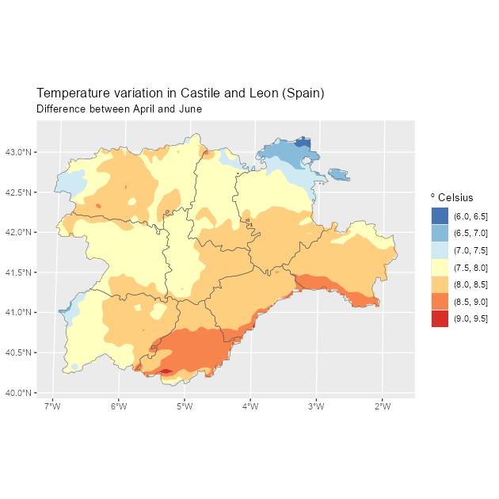

<!-- tidyterra.qmd is generated from tidyterra.qmd.orig. Please edit that file -->


[{fig-alt="DOI"}](https://doi.org/10.21105/joss.05751)

## Summary

**tidyterra** is an **R** [@r-project] package that lets users manipulate
`SpatRaster` and `SpatVector` objects provided by the **terra** package
[@R-terra], using verbs from packages in the **tidyverse** [@R-tidyverse], such
as **dplyr** [@R-dplyr], **tidyr** [@R-tidyr] or **tibble** [@R-tibble]. This
makes spatial data manipulation and analysis more approachable for users already
familiar with the **tidyverse**.

**tidyterra** also extends the functionality of the **ggplot2** package
[@R-ggplot2] by providing additional geoms and stats,[^1] such as
`geom_spatraster()` and `geom_spatvector()`, as well as carefully chosen scales
and color palettes specifically designed for map production.

**tidyterra** can manipulate the following classes of **terra** objects:

1.  `SpatVector` objects, which represent vector data such as points, lines or
    polygon geometries.

2.  `SpatRaster` objects, which represent raster data in the form of a grid
    consisting of equally sized rectangles. Each rectangle can contain one or
    more values.

The first stable version of **tidyterra** was released on **CRAN** on April 24,
2022. Since then, it has been actively used by other packages, such as
**ebvcube** [@R-ebvcube], **biomod2** [@R-biomod2], **inlabru** [@R-inlabru],
**RCzechia** [@R-rczechia] and **sparrpowR** [@R-sparrpowr]. It has also been
cited in academic research and publications (@bahlburg2023, @moraga2023,
@Leonardi2023, @meister2023).

## Statement of need

The [**tidyverse**](https://tidyverse.org/) is a collection of **R** packages
that share an underlying design philosophy, grammar and data structures. The
packages within the tidyverse are widely used by **R** users for tidying,
transforming and plotting data.

The **tidyverse** is designed to work with tidy data (*"every column is a
variable, every row is an observation, every cell is a single value"*),
represented in the form of data frames or **tibbles**. However, it is possible
to extend the functionality of **tidyverse** packages to work with new **R**
object classes by registering the corresponding S3 methods [@wickham_s32019].
This means that `dplyr::mutate()` can be adapted to work with any object of
class `foo` by creating the corresponding S3 method `mutate.foo()`.

While other popular packages designed for spatial data handling, such as **sf**
[@R-sf] or **stars** [@R-stars], already provide integration with the
**tidyverse** as part of their infrastructure, **terra** objects lack this
integration natively. Although **terra** offers a wide range of functions for
transforming and plotting `SpatRaster` and `SpatVector` objects, some users who
are not familiar with this package may need to make an additional effort to
learn that syntax. This may imply an additional challenge during their initial
steps in the field of spatial analysis.

The **tidyterra** package was developed to address this integration gap. By
providing the corresponding S3 methods, users can apply the same syntax and
functions they are already familiar with for rectangular data to the objects
provided by **terra**. This enables users who are not familiar with spatial data
analysis to approach this area more easily.

In addition, **tidyterra** offers functions for plotting **terra** objects using
the **ggplot2** syntax. Although packages like **rasterVis** [@R-rastervis] and
**ggspatial** [@R-ggspatial] already support plotting `SpatRaster` objects with
**ggplot2**, **tidyterra** functions provide additional support for advanced
mapping. This support includes faceted maps, contours and automatic conversion
of spatial layers to the same CRS[^2] through `ggplot2::coord_sf()`.
**tidyterra** also provides support for `SpatVector` objects, similar to the
native support of **sf** objects in **ggplot2**.

Finally, **tidyterra** provides a collection of color palettes specifically
designed for representing spatial phenomena [@whitebox]. It also implements the
cross-blended hypsometric tints described by @Patterson_Jenny_2011.

## A note on performance

The development philosophy of **tidyterra** is to adapt **terra** objects to
data frame-like structures by performing data transformations, which can affect
performance.

When manipulating large `SpatRaster` objects (i.e. more than 10,000,000 data
slots), it is recommended to use native **terra** syntax, which is specifically
designed for handling this type of data. For plotting, the geoms resample
`SpatRaster` objects with more than 500,000 cells by default to speed up
rendering, as `terra::plot()` does. You can override this upper limit with the
geom's `maxcell` argument.

When possible, each **tidyterra** help page references its equivalent **terra**
function.

## Example of use

**tidyterra** is available on
[**CRAN**](https://CRAN.R-project.org/package=tidyterra) and can be installed
easily from **R** with:


``` r
install.packages("tidyterra")
```

The latest development version is hosted on
[GitHub](https://github.com/dieghernan/tidyterra) and can be installed from
**R** with:


``` r
remotes::install_github("dieghernan/tidyterra")
```

The following example demonstrates how to manipulate a `SpatRaster` object using
the **dplyr** syntax. It also shows how to plot a `SpatRaster` object with
**ggplot2** using the `geom_spatraster()` function:


``` r
library(tidyterra)
library(tidyverse) # Load all tidyverse packages at once.
library(scales) # Additional package for labels.

# Temperatures in Castile and Leon (selected months).
rastertemp <- terra::rast(system.file(
  "extdata/cyl_temp.tif",
  package = "tidyterra"
))

# Rename with the tidyverse.
rastertemp <- rastertemp |>
  rename(April = tavg_04, May = tavg_05, June = tavg_06)

# Plot with facets.
ggplot() +
  geom_spatraster(data = rastertemp) +
  facet_wrap(~lyr, ncol = 2) +
  scale_fill_whitebox_c(
    palette = "muted",
    labels = label_number(suffix = "º"),
    n.breaks = 12,
    guide = guide_legend(reverse = TRUE)
  ) +
  labs(
    fill = "",
    title = "Average temperature in Castile and Leon (Spain)",
    subtitle = "Months of April, May and June"
  )
```

<div class="figure">

<p class="caption">Faceted map with a multi-layer SpatRaster object.</p>
</div>

In the following example, we combine a common **dplyr** workflow (`mutate()` +
`select()`) and plot the result. In this case, the plot is a contour plot of the
original `SpatRaster` using `geom_spatraster_contour_filled()` and includes an
overlay of a `SpatVector` for reference:


``` r
# Compute the variation between April and June and apply a different palette.
incr_temp <- rastertemp |>
  mutate(var = June - April) |>
  select(Variation = var)

# Overlay a SpatVector.
cyl_vect <- terra::vect(system.file("extdata/cyl.gpkg", package = "tidyterra"))

# Contour map with overlay.
ggplot() +
  geom_spatraster_contour_filled(data = incr_temp) +
  geom_spatvector(data = cyl_vect, fill = NA) +
  scale_fill_whitebox_d(palette = "bl_yl_rd") +
  theme_grey() +
  labs(
    fill = "º Celsius",
    title = "Temperature variation in Castile and Leon (Spain)",
    subtitle = "Difference between April and June"
  )
```

<div class="figure">

<p class="caption">Contour map of temperature variation with a SpatVector overlay.</p>
</div>

## Additional materials

The package includes extensive documentation available online at
<https://dieghernan.github.io/tidyterra/> including:

- Details on each function, including the equivalent **terra** function when
  available, for users who prefer to include those functions in their workflows.
- Working examples using the functions and creating plots.
- Additional articles and vignettes, including a complete demo of the different
  color palettes included in the package (see
  [Palettes](https://dieghernan.github.io/tidyterra/articles/palettes.html)).

## Acknowledgements {.appendix}

I would like to thank [Robert J. Hijmans](https://github.com/rhijmans) for his
advice and support in adapting some of the methods and for the suggestions that
helped us improve the package features. I am also thankful to [Dewey
Dunnington](https://dewey.dunnington.ca/), Brent Thorne and the rest of the
contributors to the **ggspatial** package, which served as a key reference
during the initial stages of the development of **tidyterra**.

**tidyterra** also incorporates some pieces of code adapted from **ggplot2** for
computing contours, which relies on the package **isoband** [@R-isoband]
developed by [Claus O. Wilke](https://clauswilke.com/).

## References

[^1]: The term geoms refers to geometric objects and stats refers to statistical
    transformations, following **ggplot2** naming conventions.

[^2]: CRS stands for coordinate reference system.
