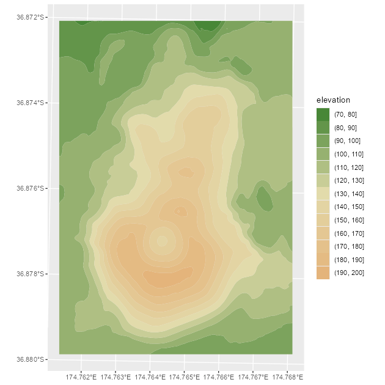

<!-- welcome.Rmd is generated from welcome.Rmd.orig. Please edit that file -->


## Welcome to {tidyterra}

**tidyterra** is a package that adds common methods from the
[**tidyverse**](https://www.tidyverse.org/) for `SpatRaster` and `SpatVectors`
objects created with the [**terra**](https://CRAN.R-project.org/package=terra)
package. It also adds specific `geom_spat*()` functions for plotting these kind
of objects with [**ggplot2**](https://ggplot2.tidyverse.org/).

### Why **tidyterra**?

`Spat*` objects are not like regular data frames. They are a different type of
objects, implemented via the [S4 object system](http://adv-r.had.co.nz/S4.html),
and have their own syntax and computation methods, implemented on the **terra**
package.

By implementing **tidyverse** methods for these objects, and more specifically
**dplyr** and **tidyr** methods, a use**R** can now work more easily with
`Spat*` objects, just like (s)he would do with tabular data.

**Note that** in terms of performance, **terra** is much more optimized for
working for this kind of objects, so it is **recommended** also to learn a bit
of **terra** syntax. Each function of **tidyterra** refers (when possible) to
the corresponding equivalent on **terra**.

## A note for advanced **terra** users

As previously mentioned, **tidyterra** is not optimized in terms of performance.
Specially when working with `filter()` and `mutate()` methods, it can be slow.

As a rule of thumb, **tidyterra** can handle objects with less than 10.000.000
slots of information (i.e.,
`terra::ncell(a_rast) * terra::nlyr(a_rast) < 10e6`).

## Get started with **tidyterra**

Load **tidyterra** with additional libraries of the **tidyverse**:


``` r
library(tidyterra)
library(dplyr)
library(tidyr)
```

Currently, the following methods are available:

| tidyverse method                            | `SpatVector`                                  | `SpatRaster`                                                                                   |
|---------------------|-----------------------|------------------------------------|
| `tibble::as_tibble()`                       | ✔️                                            | ✔️                                                                                             |
| `dplyr::select()`                           | ✔️                                            | ✔️ Select layers                                                                               |
| `dplyr::mutate()`                           | ✔️                                            | ✔️ Create /modify layers                                                                       |
| `dplyr::transmute()`                        | ✔️                                            | ✔️                                                                                             |
| `dplyr::filter()`                           | ✔️                                            | ✔️ Modify cells values and (additionally) remove outer cells.                                  |
| `dplyr::slice()`                            | ✔️                                            | ✔️ Additional methods for slicing by row and column.                                           |
| `dplyr::pull()`                             | ✔️                                            | ✔️                                                                                             |
| `dplyr::rename()`                           | ✔️                                            | ✔️                                                                                             |
| `dplyr::relocate()`                         | ✔️                                            | ✔️                                                                                             |
| `dplyr::distinct()`                         | ✔️                                            |                                                                                                |
| `dplyr::arrange()`                          | ✔️                                            |                                                                                                |
| `dplyr::glimpse()`                          | ✔️                                            | ✔️                                                                                             |
| `dplyr::inner_join()` family                | ✔️                                            |                                                                                                |
| `dplyr::summarise()`                        | ✔️                                            |                                                                                                |
| `dplyr::group_by()` family                  | ✔️                                            |                                                                                                |
| `dplyr::rowwise()`                          | ✔️                                            |                                                                                                |
| `dplyr::count()`, `tally()`                 | ✔️                                            |                                                                                                |
| `dplyr::bind_cols()` / `dplyr::bind_rows()` | ✔️ as `bind_spat_cols()` / `bind_spat_rows()` |                                                                                                |
| `tidyr::drop_na()`                          | ✔️                                            | ✔️ Remove cell values with `NA` on any layer. Additionally, outer cells with `NA` are removed. |
| `tidyr::replace_na()`                       | ✔️                                            | ✔️                                                                                             |
| `tidyr::fill()`                             | ✔️                                            |                                                                                                |
| `tidyr::pivot_longer()`                     | ✔️                                            |                                                                                                |
| `tidyr::pivot_wider()`                      | ✔️                                            |                                                                                                |
| `ggplot2::autoplot()`                       | ✔️                                            | ✔️                                                                                             |
| `ggplot2::fortify()`                        | ✔️ to **sf** via `sf::st_as_sf()`             | To a **tibble** with coordinates.                                                              |
| `ggplot2::geom_*()`                         | ✔️ `geom_spatvector()`                        | ✔️ `geom_spatraster()` and `geom_spatraster_rgb()`.                                            |

Let's see some of them in action:

### `SpatRasters`

See an example with `SpatRaster` objects:


``` r
library(terra)
f <- system.file("extdata/cyl_temp.tif", package = "tidyterra")

temp <- rast(f)

temp
#> class       : SpatRaster 
#> dimensions  : 87, 118, 3  (nrow, ncol, nlyr)
#> resolution  : 3881.255, 3881.255  (x, y)
#> extent      : -612335.4, -154347.3, 4283018, 4620687  (xmin, xmax, ymin, ymax)
#> coord. ref. : World_Robinson 
#> source      : cyl_temp.tif 
#> names       :   tavg_04,   tavg_05,  tavg_06 
#> min values  :  1.885463,  5.817587, 10.46338 
#> max values  : 13.283829, 16.740898, 21.11378

mod <- temp %>%
  select(-1) %>%
  mutate(newcol = tavg_06 - tavg_05) %>%
  relocate(newcol, .before = 1) %>%
  replace_na(list(newcol = 3)) %>%
  rename(difference = newcol)

mod
#> class       : SpatRaster 
#> dimensions  : 87, 118, 3  (nrow, ncol, nlyr)
#> resolution  : 3881.255, 3881.255  (x, y)
#> extent      : -612335.4, -154347.3, 4283018, 4620687  (xmin, xmax, ymin, ymax)
#> coord. ref. : World_Robinson 
#> source(s)   : memory
#> names       : difference,   tavg_05,  tavg_06 
#> min values  :   2.817647,  5.817587, 10.46338 
#> max values  :   5.307511, 16.740898, 21.11378
```

On the previous example, we had:

-   Eliminated the first layer of the raster `tavg_04`.

-   Created a new layer `newcol` as the difference of the layers `tavg_05` and
    `tavg_06`.

-   Relocated `newcol` as the first layer of the `SpatRaster`.

-   Replaced the `NA` cells on `newcol` with `3`.

-   Renamed `newcol` to difference.

In all the process, the essential properties of the `SpatRaster` (number of
cells, columns and rows, extent, resolution and coordinate reference system)
have not been modified. Other methods as `filter()`, `slice()` or `drop_na()`
can modify these properties, as they would do when applied to a data frame
(number of rows would be modified on that case).

### `SpatVectors`

`tidyterra >= 0.4.0` provides support to `SpatVectors` for most of the **dplyr**
and **tidyr** methods, so it is possible to arrange, group and summarise
information of `SpatVectors`.


``` r
lux <- system.file("ex/lux.shp", package = "terra")

v_lux <- vect(lux)

v_lux %>%
  # Create categories
  mutate(gr = cut(POP / 1000, 5)) %>%
  group_by(gr) %>%
  # Summary
  summarise(
    n = n(),
    tot_pop = sum(POP),
    mean_area = mean(AREA)
  ) %>%
  # Arrange
  arrange(desc(gr))
#>  class       : SpatVector 
#>  geometry    : polygons 
#>  dimensions  : 3, 4  (geometries, attributes)
#>  extent      : 5.74414, 6.528252, 49.44781, 50.18162  (xmin, xmax, ymin, ymax)
#>  coord. ref. : lon/lat WGS 84 (EPSG:4326) 
#>  names       :          gr     n   tot_pop mean_area
#>  type        :      <fact> <int>     <num>     <num>
#>  values      :   (147,183]     2 3.594e+05       244
#>                (40.7,76.1]     1 4.819e+04       185
#>                (4.99,40.7]     9 1.944e+05     209.8
```

As in the case of `SpatRaster`, basic properties as the geometry and the CRS are
preserved.

## Plotting with **ggplot2**

### `SpatRasters`

**tidyterra** provides several `geom_*` for `SpatRasters`. When the `SpatRaster`
has the CRS informed (i.e. `terra::crs(a_rast) != ""`), the geom uses
`ggplot2::coord_sf()`, and may be also reprojected for adjusting the coordinates
to other spatial layers:


``` r
library(ggplot2)

# A faceted SpatRaster

ggplot() +
  geom_spatraster(data = temp) +
  facet_wrap(~lyr) +
  scale_fill_whitebox_c(
    palette = "muted",
    na.value = "white"
  )
```

<div class="figure">

<p class="caption">A faceted SpatRaster</p>
</div>


``` r
# Contour lines for a specific layer

f_volcano <- system.file("extdata/volcano2.tif", package = "tidyterra")
volcano2 <- rast(f_volcano)

ggplot() +
  geom_spatraster(data = volcano2) +
  geom_spatraster_contour(data = volcano2, breaks = seq(80, 200, 5)) +
  scale_fill_whitebox_c() +
  coord_sf(expand = FALSE) +
  labs(fill = "elevation")
```

<div class="figure">

<p class="caption">Contour lines plot for a SpatRaster</p>
</div>


``` r
# Contour filled

ggplot() +
  geom_spatraster_contour_filled(data = volcano2) +
  scale_fill_whitebox_d(palette = "atlas") +
  labs(fill = "elevation")
```

<div class="figure">

<p class="caption">Contour filled plot for a SpatRaster</p>
</div>

With **tidyterra** you can also plot RGB `SpatRasters` to add imagery to your
plots:


``` r
# Read a vector

f_v <- system.file("extdata/cyl.gpkg", package = "tidyterra")
v <- vect(f_v)

# Read a tile
f_rgb <- system.file("extdata/cyl_tile.tif", package = "tidyterra")

r_rgb <- rast(f_rgb)

rgb_plot <- ggplot(v) +
  geom_spatraster_rgb(data = r_rgb) +
  geom_spatvector(fill = NA, size = 1)

rgb_plot
```

<div class="figure">

<p class="caption">Plotting a RGB SpatRaster</p>
</div>

**tidyterra** provides selected scales that are suitable for creating
hypsometric and bathymetric maps:


``` r
asia <- rast(system.file("extdata/asia.tif", package = "tidyterra"))

asia
#> class       : SpatRaster 
#> dimensions  : 164, 306, 1  (nrow, ncol, nlyr)
#> resolution  : 31836.23, 31847.57  (x, y)
#> extent      : 7619120, 17361007, -1304745, 3918256  (xmin, xmax, ymin, ymax)
#> coord. ref. : WGS 84 / Pseudo-Mercator (EPSG:3857) 
#> source      : asia.tif 
#> name        : file44bc291153f2 
#> min value   :        -9558.468 
#> max value   :         5801.927

ggplot() +
  geom_spatraster(data = asia) +
  scale_fill_hypso_tint_c(
    palette = "gmt_globe",
    labels = scales::label_number(),
    # Further refinements
    breaks = c(-10000, -5000, 0, 2000, 5000, 8000),
    guide = guide_colorbar(reverse = TRUE)
  ) +
  labs(
    fill = "elevation (m)",
    title = "Hypsometric map of Asia"
  ) +
  theme(
    legend.position = "bottom",
    legend.title.position = "top",
    legend.key.width = rel(3),
    legend.ticks = element_line(colour = "black", linewidth = 0.3),
    legend.direction = "horizontal"
  )
```

<div class="figure">

<p class="caption">Hypsometric tints</p>
</div>

### `SpatVectors`

**tidyterra** allows you to plot `SpatVectors` with **ggplot2** using the
`geom_spatvector()` functions:


``` r
lux <- system.file("ex/lux.shp", package = "terra")

v_lux <- terra::vect(lux)

ggplot(v_lux) +
  geom_spatvector(aes(fill = POP), color = "white") +
  geom_spatvector_text(aes(label = NAME_2), color = "grey90") +
  scale_fill_binned(labels = scales::number_format()) +
  coord_sf(crs = 3857)
```

<div class="figure">

<p class="caption">Plotting SpatVectors</p>
</div>

The underlying implementation is to take advantage of the conversion
`terra::vect()/sf::st_as_sf()` and use `ggplot2::geom_sf()` as an endpoint for
creating the layer.

With **tidyterra** we can also aggregate `SpatVectors` at our convenience:


``` r
# Dissolving
v_lux %>%
  # Create categories
  mutate(gr = cut(POP / 1000, 5)) %>%
  group_by(gr) %>%
  # Summary
  summarise(
    n = n(),
    tot_pop = sum(POP),
    mean_area = mean(AREA)
  ) %>%
  ggplot() +
  geom_spatvector(aes(fill = tot_pop), color = "black") +
  geom_spatvector_label(aes(label = gr)) +
  coord_sf(crs = 3857)
```

<div class="figure">

<p class="caption">Union of SpatVectors</p>
</div>

``` r


# Same but keeping internal boundaries
v_lux %>%
  # Create categories
  mutate(gr = cut(POP / 1000, 5)) %>%
  group_by(gr) %>%
  # Summary without dissolving
  summarise(
    n = n(),
    tot_pop = sum(POP),
    mean_area = mean(AREA),
    .dissolve = FALSE
  ) %>%
  ggplot() +
  geom_spatvector(aes(fill = tot_pop), color = "black") +
  geom_spatvector_label(aes(label = gr)) +
  coord_sf(crs = 3857)
```

<div class="figure">

<p class="caption">Union of SpatVector keeping the inner borders</p>
</div>
