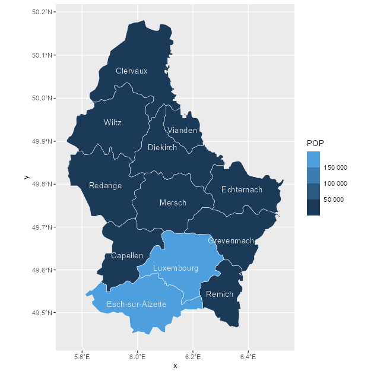
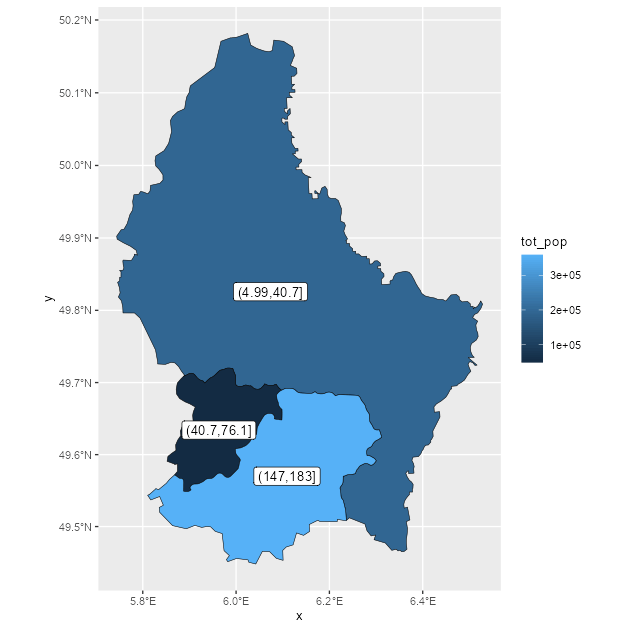
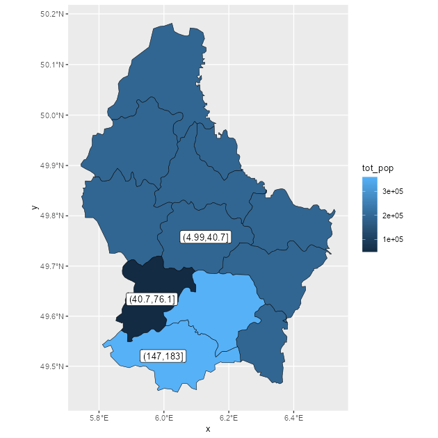

<!-- welcome.qmd is generated from welcome.qmd.orig. Please edit that file -->


## The tidyterra package

**tidyterra** adds common tidyverse methods for `SpatRaster` and `SpatVector`
objects from the [**terra**](https://CRAN.R-project.org/package=terra) package,
and provides `geom_spat*()` geoms for plotting these objects with
[**ggplot2**](https://ggplot2.tidyverse.org/).

### Why tidyterra?

`Spat*` objects differ from regular data frames: they are S4 objects with their
own syntax and computational methods (implemented in **terra**). By providing
tidyverse verbs—especially **dplyr** and **tidyr** methods—**tidyterra** lets
users manipulate `Spat*` objects in a style similar to working with tabular data.

Note: **terra** is generally faster. Learning some **terra** syntax is
recommended because **tidyterra** functions call, where possible, the
corresponding **terra** equivalents.

## A note for advanced terra users

**tidyterra** is not optimized for performance. Operations such as `filter()`
and `mutate()` can be slower than their **terra** counterparts.

As a rule of thumb, **tidyterra** is most suitable for objects with fewer than
1e7 "slots" (i.e., `terra::ncell(a_rast) * terra::nlyr(a_rast) < 1e7`).

## Get started with tidyterra

Load **tidyterra** together with core tidyverse packages:


``` r
library(tidyterra)
library(dplyr)
library(tidyr)
```

Currently, the following methods are available:

| tidyverse method | `SpatVector` | `SpatRaster` |
|---------------------|---------------------|--------------------------------------|
| `tibble::as_tibble()` | ✔️ | ✔️ |
| `dplyr::select()` | ✔️ | ✔️ Select layers |
| `dplyr::mutate()` | ✔️ | ✔️ Create/modify layers |
| `dplyr::transmute()` | ✔️ | ✔️ |
| `dplyr::filter()` | ✔️ | ✔️ Modify cell values and (optionally) remove outer cells. |
| `dplyr::filter_out()` | ✔️ |  |
| `dplyr::slice()` | ✔️ | ✔️ Additional methods for slicing by row and column. |
| `dplyr::pull()` | ✔️ | ✔️ |
| `dplyr::rename()` | ✔️ | ✔️ |
| `dplyr::relocate()` | ✔️ | ✔️ |
| `dplyr::distinct()` | ✔️ |  |
| `dplyr::arrange()` | ✔️ |  |
| `dplyr::glimpse()` | ✔️ | ✔️ |
| `dplyr::inner_join()` family | ✔️ |  |
| `dplyr::summarise()` | ✔️ |  |
| `dplyr::group_by()` family | ✔️ |  |
| `dplyr::rowwise()` | ✔️ |  |
| `dplyr::count()`, `tally()` | ✔️ |  |
| `dplyr::add_count()` | ✔️ |  |
| `dplyr::bind_cols()` / `dplyr::bind_rows()` | ✔️ as `bind_spat_cols()` / `bind_spat_rows()` |  |
| `tidyr::drop_na()` | ✔️ | ✔️ Remove cell values with `NA` on any layer. Additionally, outer cells with `NA` are removed. |
| `tidyr::replace_na()` | ✔️ | ✔️ |
| `tidyr::fill()` | ✔️ |  |
| `tidyr::pivot_longer()` | ✔️ |  |
| `tidyr::pivot_wider()` | ✔️ |  |
| `ggplot2::autoplot()` | ✔️ | ✔️ |
| `ggplot2::fortify()` | ✔️ to **sf** via `sf::st_as_sf()` | To a **tibble** with coordinates. |
| `ggplot2::geom_*()` | ✔️ `geom_spatvector()` | ✔️ `geom_spatraster()` and `geom_spatraster_rgb()`. |
| `generics::tidy()` | ✔️ | ✔️ |
| `generics::glance()` | ✔️ | ✔️ |
| `generics::required_pkgs()` | ✔️ | ✔️ |

Let's see some of these methods in action.

### `SpatRasters`

Example using a `SpatRaster`:


``` r
library(terra)
f <- system.file("extdata/cyl_temp.tif", package = "tidyterra")

temp <- rast(f)
#> Error:
#> ! [rast] filename is empty. Provide a valid filename

temp
#> Error:
#> ! objeto 'temp' no encontrado

mod <- temp |>
  select(-1) |>
  mutate(newcol = tavg_06 - tavg_05) |>
  relocate(newcol, .before = 1) |>
  replace_na(list(newcol = 3)) |>
  rename(difference = newcol)
#> Error:
#> ! objeto 'temp' no encontrado

mod
#> Error:
#> ! objeto 'mod' no encontrado
```

In this example we:

-   Removed the first layer (`tavg_04`).
-   Created a new layer `newcol` as the difference between `tavg_06` and
    `tavg_05`.
-   Relocated `newcol` to be the first layer.
-   Replaced `NA` values in `newcol` with `3`.
-   Renamed `newcol` to `difference`.

Throughout these steps, core properties of the `SpatRaster` (number of cells,
rows and columns, extent, resolution, and CRS) remain unchanged. Other verbs
such as `filter()`, `slice()`, or `drop_na()` may alter these properties in a
manner analogous to how row operations affect data frames.

### `SpatVectors`

Since **tidyterra** version 0.4.0, most **dplyr** and **tidyr** verbs work with
`SpatVector` objects, so you can arrange, group, and summarise their attributes.


``` r
lux <- system.file("ex/lux.shp", package = "terra")

v_lux <- vect(lux)

v_lux |>
  # Create categories
  mutate(gr = cut(POP / 1000, 5)) |>
  group_by(gr) |>
  # Summary
  summarise(
    n = n(),
    tot_pop = sum(POP),
    mean_area = mean(AREA)
  ) |>
  # Arrange
  arrange(desc(gr))
#>  class       : SpatVector 
#>  geometry    : polygons 
#>  dimensions  : 3, 4  (geometries, attributes)
#>  extent      : 5.74414, 6.528252, 49.44781, 50.18162  (xmin, xmax, ymin, ymax)
#>  coord. ref. : lon/lat WGS 84 (EPSG:4326) 
#>  names       :          gr     n   tot_pop mean_area
#>  type        :      <fact> <int>     <num>     <num>
#>  values      :   (147,183]     2 3.594e+05       244
#>                (40.7,76.1]     1 4.819e+04       185
#>                (4.99,40.7]     9 1.944e+05     209.8
```

As with `SpatRaster`, essential properties such as geometry and CRS are
preserved during these operations.

## Plotting with ggplot2

### `SpatRasters`

When a `SpatRaster` has a CRS defined (`terra::crs(a_rast) != ""`), the geom
uses `ggplot2::coord_sf()` and can be reprojected to match other spatial layers.


``` r
library(ggplot2)

# A faceted SpatRaster

ggplot() +
  geom_spatraster(data = temp) +
  facet_wrap(~lyr) +
  scale_fill_whitebox_c(
    palette = "muted",
    na.value = "white"
  )
#> Error:
#> ! objeto 'temp' no encontrado
```


``` r
# Contour lines for a specific layer

f_volcano <- system.file("extdata/volcano2.tif", package = "tidyterra")
volcano2 <- rast(f_volcano)
#> Error:
#> ! [rast] filename is empty. Provide a valid filename

ggplot() +
  geom_spatraster(data = volcano2) +
  geom_spatraster_contour(data = volcano2, breaks = seq(80, 200, 5)) +
  scale_fill_whitebox_c() +
  coord_sf(expand = FALSE) +
  labs(fill = "elevation")
#> Error in `geom_spatraster()`:
#> ! `tidyterra::geom_spatraster()` only works with <SpatRaster> objects, not
#>   <matrix/array>. See `?terra::vect()`
```


``` r
# Contour filled

ggplot() +
  geom_spatraster_contour_filled(data = volcano2) +
  scale_fill_whitebox_d(palette = "atlas") +
  labs(fill = "elevation")
#> Error in `geom_spatraster_contour_filled()`:
#> ! `tidyterra::geom_spatraster_contour_filled()` only works with <SpatRaster>
#>   objects, not <matrix/array>. See `?terra::vect()`
```

tidyterra also supports RGB `SpatRasters` for imagery:


``` r
# Read a vector

f_v <- system.file("extdata/cyl.gpkg", package = "tidyterra")
v <- vect(f_v)
#> Error:
#> ! [vect] file does not exist:

# Read a tile
f_rgb <- system.file("extdata/cyl_tile.tif", package = "tidyterra")

r_rgb <- rast(f_rgb)
#> Error:
#> ! [rast] filename is empty. Provide a valid filename

rgb_plot <- ggplot(v) +
  geom_spatraster_rgb(data = r_rgb) +
  geom_spatvector(fill = NA, size = 1)
#> Error:
#> ! objeto 'v' no encontrado

rgb_plot
#> Error:
#> ! objeto 'rgb_plot' no encontrado
```

**tidyterra** includes color scales suitable for hypsometric and bathymetric
maps:


``` r
asia <- rast(system.file("extdata/asia.tif", package = "tidyterra"))
#> Error:
#> ! [rast] filename is empty. Provide a valid filename

asia
#> Error:
#> ! objeto 'asia' no encontrado

ggplot() +
  geom_spatraster(data = asia) +
  scale_fill_hypso_tint_c(
    palette = "gmt_globe",
    labels = scales::label_number(),
    # Further refinements
    breaks = c(-10000, -5000, 0, 2000, 5000, 8000),
    guide = guide_colorbar(reverse = TRUE)
  ) +
  labs(
    fill = "elevation (m)",
    title = "Hypsometric map of Asia"
  ) +
  theme(
    legend.position = "bottom",
    legend.title.position = "top",
    legend.key.width = rel(3),
    legend.ticks = element_line(colour = "black", linewidth = 0.3),
    legend.direction = "horizontal"
  )
#> Error:
#> ! objeto 'asia' no encontrado
```

### `SpatVectors`

Plot `SpatVectors` with `geom_spatvector()`:


``` r
lux <- system.file("ex/lux.shp", package = "terra")

v_lux <- terra::vect(lux)

ggplot(v_lux) +
  geom_spatvector(aes(fill = POP), color = "white") +
  geom_spatvector_text(aes(label = NAME_2), color = "grey90") +
  scale_fill_binned(labels = scales::number_format()) +
  coord_sf(crs = 3857)
```

<div class="figure">

<p class="caption">Choropleth map with a SpatVector object</p>
</div>

Implementation-wise, **tidyterra** converts `terra::vect()` output to **sf** via
`sf::st_as_sf()` and then uses `ggplot2::geom_sf()` to render the layer.

You can also aggregate `SpatVectors` easily:


``` r
# Dissolving
v_lux |>
  # Create categories
  mutate(gr = cut(POP / 1000, 5)) |>
  group_by(gr) |>
  # Summary
  summarise(
    n = n(),
    tot_pop = sum(POP),
    mean_area = mean(AREA)
  ) |>
  ggplot() +
  geom_spatvector(aes(fill = tot_pop), color = "black") +
  geom_spatvector_label(aes(label = gr)) +
  coord_sf(crs = 3857)
```

<div class="figure">

<p class="caption">Dissolving SpatVectors by group</p>
</div>

``` r

# Same but keeping internal boundaries
v_lux |>
  # Create categories
  mutate(gr = cut(POP / 1000, 5)) |>
  group_by(gr) |>
  # Summary without dissolving
  summarise(
    n = n(),
    tot_pop = sum(POP),
    mean_area = mean(AREA),
    .dissolve = FALSE
  ) |>
  ggplot() +
  geom_spatvector(aes(fill = tot_pop), color = "black") +
  geom_spatvector_label(aes(label = gr)) +
  coord_sf(crs = 3857)
```

<div class="figure">

<p class="caption">Dissolving SpatVectors by group (keeping internal boundaries)</p>
</div>
